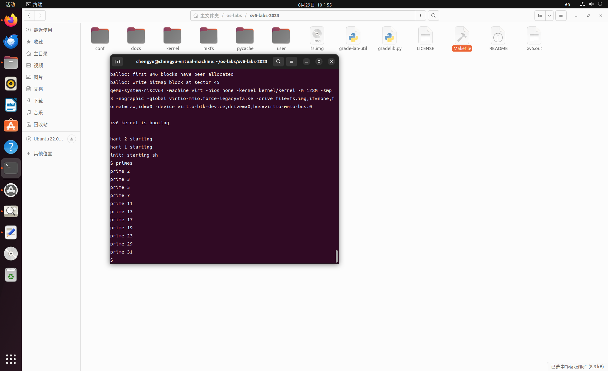

# Lab1: Xv6 and Unix utilities

[TOC]

## github仓库地址

https://github.com/kiy-00/xv6-labs-2023.git

 ## 初识xv6

### xv6与Unix

**xv6 是 Unix 第六版 (v6) 的重新实现**，由Dennis Ritchie 和 Ken Thompson 设计。xv6 的设计大致遵循了v6的结构和风格，但使用了现代的RISC-V多处理器和ANSI C语言进行实现。它不仅模仿了Unix的内部设计，还保留了Unix操作系统的基本接口，这些接口由系统调用提供，为用户程序提供服务。

### 项目结构概览

在xv6项目中，Git仓库的不同分支通常对应着不同的实验或功能模块。每个分支可能包含某些特定的代码，用于完成与该分支相关的实验或功能。以下是这些分支可能的作用解释：

#### 分支说明

1. **`util`**: 这个分支是默认的分支，是用于实验“xv6 and Unix utilities”的分支。它包含了一些基本的用户空间工具和系统调用的实现。
2. **`cow`**: 这个分支可能涉及写时复制（Copy-On-Write）技术的实现。在操作系统中，写时复制是一种优化技术，用于在进程之间共享内存，同时在写操作时提供独立的副本。
3. **`debugging-demo`**: 这个分支可能是一个用于展示如何调试xv6系统的示例代码。它可能包含一些特定的调试工具或代码注释，用于帮助开发者理解和调试内核。
4. **`fs`**: 这个分支可能与文件系统相关，包含文件系统的实现或实验代码。在操作系统中，文件系统管理数据的存储和访问。
5. **`lock`**: 这个分支可能涉及锁机制的实现，用于多线程或多进程环境下的同步控制。锁可以防止竞争条件，确保多个进程或线程在共享资源时不会发生冲突。
6. **`mmap`**: 这个分支可能涉及内存映射（Memory Mapping）技术的实现。内存映射允许进程将文件或设备的内容映射到内存地址空间中。
7. **`net`**: 这个分支可能涉及网络相关的实现或实验代码。它可能包括网络栈的实现或简单的网络协议支持。
8. **`pgtbl`**: 这个分支可能涉及页表（Page Table）的实现或相关实验。页表是操作系统用于管理虚拟内存的一种数据结构。
9. **`riscv`**: 这个分支可能与RISC-V架构相关。RISC-V是一种开源的指令集架构，xv6在不同的实验中可能会支持不同的硬件架构。
10. **`syscall`**: 这个分支可能涉及系统调用的实现。系统调用是用户空间程序与内核交互的接口。
11. **`thread`**: 这个分支可能涉及线程的实现或相关实验。线程是轻量级的进程，可以共享同一个进程的资源。
12. **`traps`**: 这个分支可能涉及中断和异常处理机制的实现。在操作系统中，陷阱（Traps）通常指中断、异常或系统调用等事件的处理。

可以在不同的分支下运行xv6，不过每个分支可能包含不同的代码和功能集，具体取决于该分支的用途或实验内容。

#### 各个分支的运行方法：

1. **切换到目标分支**：首先，需要使用Git切换到想要探索或运行的分支。例如，假设切换到`cow`分支：

   ```bash
   git checkout cow
   ```

2. **编译并运行xv6**：在切换到目标分支后，可以使用以下命令编译并运行xv6：

   ```bash
   make qemu
   ```

每个分支可能会有不同的实验内容或功能实现，所以在不同分支下运行xv6可能会有不同的表现和输出。例如，在`thread`分支下，可能会测试线程相关的功能，而在`fs`分支下，可能会测试文件系统相关的功能。

### 操作系统接口

内核提供的一系列系统调用就是用户程序可见的操作系统接口，xv6 内核提供了 Unix 传统系统调用的一部分，它们是：

| 系统调用                  | 描述                               |
| ------------------------- | ---------------------------------- |
| fork()                    | 创建进程                           |
| exit()                    | 结束当前进程                       |
| wait()                    | 等待子进程结束                     |
| kill(pid)                 | 结束 pid 所指进程                  |
| getpid()                  | 获得当前进程 pid                   |
| sleep(n)                  | 睡眠 n 秒                          |
| exec(filename, *argv)     | 加载并执行一个文件                 |
| sbrk(n)                   | 为进程内存空间增加 n 字节          |
| open(filename, flags)     | 打开文件，flags 指定读/写模式      |
| read(fd, buf, n)          | 从文件中读 n 个字节到 buf          |
| write(fd, buf, n)         | 从 buf 中写 n 个字节到文件         |
| close(fd)                 | 关闭打开的 fd                      |
| dup(fd)                   | 复制 fd                            |
| pipe( p)                  | 创建管道， 并把读和写的 fd 返回到p |
| chdir(dirname)            | 改变当前目录                       |
| mkdir(dirname)            | 创建新的目录                       |
| mknod(name, major, minor) | 创建设备文件                       |
| fstat(fd)                 | 返回文件信息                       |
| link(f1, f2)              | 给 f1 创建一个新名字(f2)           |
| unlink(filename)          | 删除文件                           |

#### fork()

“一个 xv6 进程由两部分组成，一部分是用户内存空间（指令，数据，栈），另一部分是仅对内核可见的进程状态。xv6 提供了分时特性：它在可用 CPU 之间不断切换，决定哪一个等待中的进程被执行。当一个进程不在执行时，xv6 保存它的 CPU 寄存器，当他们再次被执行时恢复这些寄存器的值。内核将每个进程和一个 **pid** (process identifier) 关联起来。

一个进程可以通过系统调用 `fork` 来创建一个新的进程。`fork` 创建的新进程被称为**子进程**，子进程的内存内容同创建它的进程（父进程）一样。`fork` 函数在父进程、子进程中都返回（一次调用两次返回）。对于父进程它返回子进程的 pid，对于子进程它返回 0。”

```scss
+-----------+                      +-----------+
| Parent    |                      | Child     |
| Process   |                      | Process   |
|           |     fork() ----->    |           |
| (PID=100) |                      | (PID=101) |
+-----------+                      +-----------+
     |                                  |
     v                                  v
   (fork)                             (fork)
   returns                           returns
   child PID                         0
   (101)
```

##### 1. fork的实现机制

当一个进程调用 `fork` 时，操作系统内核会执行一系列步骤来创建一个新的进程，即子进程。操作系统在创建子进程的过程中，会复制父进程的进程控制块（PCB）和内存空间，使得子进程成为父进程的几乎完全复制品。然而，操作系统内核可以对子进程进行一些定制化处理，其中之一就是设置 `fork` 的返回值。

##### 2. fork返回值的设置

`fork` 的返回值是由操作系统内核在创建子进程时直接控制的。在以下过程中，操作系统设置了 `fork` 的返回值：

1. **父进程的返回值**：
   - 对于父进程，`fork` 的返回值是子进程的PID。操作系统在创建子进程时，知道新进程的PID，因此可以直接将这个值返回给父进程。
2. **子进程的返回值**：
   - 在创建子进程时，操作系统复制了父进程的内存和执行状态。但是，为了让子进程能够正确识别自身是新创建的子进程，而不是继续执行的父进程，操作系统将 `fork` 函数在子进程中的返回值设为 `0`。==这是通过修改子进程的寄存器状态来实现的==。

##### 3. 技术实现细节

在现代操作系统（如Linux）中，当 `fork` 被调用时，内核会执行如下操作：

- **复制父进程状态**：内核首先复制父进程的所有上下文，包括寄存器、内存映射、打开的文件描述符等。这使得子进程成为父进程的“克隆”。
- **设置子进程的返回值**：内核在完成复制后，会检查当前正在运行的进程（即刚创建的子进程）的上下文，并将寄存器中存储的 `fork` 函数的返回值设为 `0`。这是因为在C语言中，函数的返回值通常是通过寄存器传递的。
- **恢复执行**：当子进程开始运行时，它的程序计数器（PC）会指向 `fork` 调用之后的指令，但由于内核已经将其返回值设为 `0`，所以子进程的执行逻辑会根据 `fork` 返回 `0` 这个条件来执行与父进程不同的代码路径。

##### 4. 为什么这么做是安全且有效的？

操作系统内核有完全的控制权来决定如何管理和调度进程。通过直接操作子进程的执行上下文，内核可以轻松设置 `fork` 的返回值，这不仅是安全的，而且是操作系统正常工作的基本要求。因为内核在执行这些操作时，运行在特权模式下（内核态），它可以直接访问和修改进程的所有状态信息。

```c
int pid;
pid = fork();
if(pid > 0){
    printf("parent: child=%d\n", pid);
    pid = wait();
    printf("child %d is done\n", pid);
} else if(pid == 0){
    printf("child: exiting\n");
    exit();
} else {
    printf("fork error\n");
}
```

##### 5. 两种可能的输出顺序

1. **情况1：父进程先输出，然后子进程输出**

   - 假设父进程在子进程之前获得CPU时间片并执行 `printf("parent: child=%d\n", pid);`。此时父进程先输出 `parent: child=1234`。
   - 接下来，父进程调用 `wait()`，在此时父进程会被阻塞，直到子进程退出。
   - 子进程随后获得CPU时间片，执行 `printf("child: exiting\n");` 并调用 `exit()` 终止。
   - `wait()` 返回子进程的PID，父进程继续执行，输出 `child 1234 is done`。

   这种情况下的输出顺序为：

   ```bash
   parent: child=1234
   child: exiting
   child 1234 is done
   ```

2. **情况2：子进程先输出，然后父进程输出**

   - 假设子进程先获得CPU时间片并执行 `printf("child: exiting\n");`，然后调用 `exit()` 退出。
   - 子进程退出时，父进程的 `wait()` 被唤醒，返回子进程的PID。
   - 父进程随后执行 `printf("parent: child=%d\n", pid);` 和 `printf("child %d is done\n", pid);`。

   这种情况下的输出顺序为：

   ```bash
   child: exiting
   parent: child=1234
   child 1234 is done
   ```

#### exec()

`exec` 系统调用是 Unix 系统中一个非常重要的功能，用于在当前进程中加载并执行一个新的可执行文件。在调用 `exec` 后，当前进程的内存空间会被新加载的程序内容替换，进程从新程序的入口点开始执行，而不会返回到原来的程序。

##### `exec` 系统调用的工作原理

1. **加载新程序**：
   - 当 `exec` 被调用时，操作系统从指定的可执行文件中读取程序的内存镜像。这个文件必须符合操作系统支持的文件格式（如 ELF 文件格式）。
   - 文件格式中定义了哪些部分是代码段、数据段、以及程序的入口点（即从哪里开始执行）。
2. **替换内存空间**：
   - `exec` 会将当前进程的内存空间（包括代码段、数据段、堆栈等）用新加载的程序内容替换。这个过程会丢弃当前进程的旧内容，只保留新程序的内容。
   - 新的内存空间会根据可执行文件中的定义进行布局，指令和数据都被放置在适当的位置。
3. **开始执行新程序**：
   - 新程序开始执行时，是从可执行文件中指定的入口点（通常是 `main` 函数的起始地址）开始执行的。
   - 执行成功后，`exec` 不会返回到调用它的程序，而是继续执行新加载的程序。如果 `exec` 调用失败，通常是因为文件无法找到或文件格式不正确，此时 `exec` 会返回一个错误码。
4. **参数传递**：
   - `exec` 接受两个参数：一个是可执行文件的路径，另一个是一个字符串数组（通常称为 `argv`），它包含了传递给新程序的命令行参数。
   - 第一个参数 `argv[0]` 习惯上是程序的名字，但这并不是强制的。

##### 代码示例

以下代码展示了如何使用 `exec` 来执行一个新的程序：

```c
char *argv[3];
argv[0] = "echo";
argv[1] = "hello";
argv[2] = 0;  // 参数数组以 NULL 结束
exec("/bin/echo", argv);
printf("exec error\n");  // 如果 exec 失败，这行代码才会执行
```

在这个例子中，`exec` 会将当前进程替换为 `/bin/echo` 程序，并传递参数 `hello`。如果 `exec` 成功，`printf("exec error\n");` 这行代码永远不会执行，因为进程已经被新的程序替换了。

##### 为什么 `fork` 和 `exec` 是分开的？

在 Unix 系统中，`fork` 和 `exec` 是分开的系统调用，这是一个设计上的选择，带来了很多灵活性：

- **分离的灵活性**：通过将进程创建（`fork`）和程序加载（`exec`）分开，允许程序在创建子进程后进行一些额外的设置（如重定向文件描述符、设置环境变量等）后再加载新程序。
- **资源共享**：父进程可以在 `fork` 后对子进程进行配置，如共享打开的文件描述符，调整子进程的权限等，然后再调用 `exec` 来执行新程序。
- **管道和并行处理**：通过 `fork` 和 `exec` 的组合，可以很容易地创建进程管道和并行处理流，如通过 `fork` 创建多个进程，然后各自调用 `exec` 来运行不同的程序。

##### 在 `xv6` 中的使用

在 `xv6` 操作系统中，`exec` 的功能与传统 Unix 系统非常相似。`xv6` 的 `exec` 系统调用用于从文件系统中加载一个新的可执行文件，并替换当前进程的内存空间。`xv6` 中使用了 ELF 文件格式来定义程序的内存布局。Shell 程序通过 `exec` 来执行用户命令，这也是 Unix 系统中常见的行为。

#### shell

```c
int
main(void)
{
  static char buf[100];  // 用于存储用户输入的命令
  int fd;

  // 确保标准输入、输出和错误输出这三个文件描述符已打开。
  // 如果已经打开，就关闭多余的文件描述符。
  while((fd = open("console", O_RDWR)) >= 0){
    if(fd >= 3){  // 标准输入、输出、错误输出的文件描述符是0, 1, 2，超出这三个的就关闭
      close(fd);
      break;
    }
  }

  // 进入主循环，读取并执行用户输入的命令。
  while(getcmd(buf, sizeof(buf)) >= 0){
    // 处理 "cd" 命令，"cd" 命令必须由父进程执行
    if(buf[0] == 'c' && buf[1] == 'd' && buf[2] == ' '){
      // 将命令中的换行符去掉
      buf[strlen(buf)-1] = 0;  // chop \n
      // 改变当前工作目录为用户指定的目录
      if(chdir(buf+3) < 0)  // buf+3 跳过 "cd "，指向路径
        fprintf(2, "cannot cd %s\n", buf+3);  // 如果改变目录失败，打印错误信息
      continue;  // 继续读取下一条命令
    }
    // 创建子进程，子进程执行命令
    if(fork1() == 0)
      runcmd(parsecmd(buf));  // 解析并执行命令
    wait(0);  // 父进程等待子进程执行完毕
  }
  exit(0);  // 当退出主循环时，结束Shell进程
}
```

```c
// 确保标准输入、输出和错误输出这三个文件描述符已打开。
  // 如果已经打开，就关闭多余的文件描述符。
  while((fd = open("console", O_RDWR)) >= 0){
    if(fd >= 3){  // 标准输入、输出、错误输出的文件描述符是0, 1, 2，超出这三个的就关闭
      close(fd);
      break;
    }
  }
```

##### 文件描述符的管理

1. **文件描述符分配**：
   - 文件描述符是一个进程用来标识已打开文件的整数。每个进程都有自己独立的文件描述符表，通常从0开始递增分配。
   - 当你调用 `open()` 打开一个文件时，操作系统会在文件描述符表中找到最小的未使用的文件描述符，并将它分配给这个新打开的文件。
2. **标准文件描述符**：
   - 在大多数进程启动时，操作系统通常为其分配三个默认的文件描述符：
     - `0`：标准输入（stdin）
     - `1`：标准输出（stdout）
     - `2`：标准错误输出（stderr）
   - 这些文件描述符在进程开始运行时通常已经被打开，并指向控制台（终端），或者被重定向到其他设备或文件。
3. **为什么会返回不同的文件描述符**：
   - 如果一个进程刚启动时，这三个标准文件描述符（`0`、`1`、`2`）尚未被分配，那么第一次调用 `open("console", O_RDWR)` 会返回 `0`，因为这是文件描述符表中的第一个可用位置。
   - 第二次调用 `open("console", O_RDWR)` 会返回 `1`，第三次则返回 `2`。因为 `open` 总是返回当前最小的未使用文件描述符。
   - 如果这些文件描述符已经被占用（例如，它们已经被打开或者重定向），那么 `open` 会返回第一个未被使用的更大的文件描述符。

##### 代码执行的不同情境

- **情境1：进程启动时未打开标准文件描述符**： 如果进程刚启动且标准输入、输出、错误输出（`0`、`1`、`2`）未被打开，第一次 `open("console", O_RDWR)` 将返回 `0`，第二次返回 `1`，第三次返回 `2`。每次调用都会分配到下一个可用的文件描述符。
- **情境2：标准文件描述符已经打开**： 如果进程启动时标准文件描述符已经打开（例如被继承或已经被显式打开），`open("console", O_RDWR)` 将返回下一个未使用的文件描述符（通常是`3`或更大）。

#### cat()

```c
#include "kernel/types.h"   // 包含通用类型定义（如 int, uint, ushort 等）
#include "kernel/stat.h"    // 包含文件状态结构的定义（如 struct stat）
#include "kernel/fcntl.h"   // 包含文件控制选项（如 O_RDONLY, O_WRONLY 等）
#include "user/user.h"      // 包含用户程序所需的函数声明（如 read, write, open, close 等）

// 用于缓冲读取的数据
char buf[512];

// cat 函数：从文件描述符 fd 读取数据，并将其输出到标准输出
void
cat(int fd)
{
  int n;

  // 通过循环从文件描述符 fd 中读取数据，并写入标准输出
  while((n = read(fd, buf, sizeof(buf))) > 0) {
    // 如果写入过程中发生错误，输出错误信息并退出
    if (write(1, buf, n) != n) {  // write(1, ...) 写入标准输出（文件描述符1）
      fprintf(2, "cat: write error\n");  // 输出错误信息到标准错误（文件描述符2）
      exit(1);  // 以错误码 1 退出程序
    }
  }
  // 如果读取过程中发生错误，输出错误信息并退出
  if(n < 0){
    fprintf(2, "cat: read error\n");  // 输出错误信息到标准错误（文件描述符2）
    exit(1);  // 以错误码 1 退出程序
  }
}

// 主函数：处理命令行参数，并调用 cat 函数处理文件内容
int
main(int argc, char *argv[])
{
  int fd, i;

  // 如果没有提供任何命令行参数，则从标准输入读取并输出内容
  if(argc <= 1){
    cat(0);  // 0 表示标准输入，cat(0) 从标准输入读取内容并输出
    exit(0);  // 正常退出程序
  }

  // 如果提供了命令行参数（文件名），依次打开并处理这些文件
  for(i = 1; i < argc; i++){
    // 打开文件，使用只读模式（O_RDONLY）
    if((fd = open(argv[i], O_RDONLY)) < 0){
      // 如果打开文件失败，输出错误信息并退出
      fprintf(2, "cat: cannot open %s\n", argv[i]);  // 输出错误信息
      exit(1);  // 以错误码 1 退出程序
    }
    // 使用 cat 函数读取并输出文件内容
    cat(fd);
    // 处理完后关闭文件
    close(fd);
  }
  // 正常退出程序
  exit(0);
}
```

##### `main` 函数的参数

在C语言中，`main` 函数通常定义为：

```c
int main(int argc, char *argv[])
```

- **`argc`**：是一个整数，表示命令行中传递给程序的参数数量。`argc` 包括程序本身的名称，所以它至少为1。
- **`argv`**：是一个指向字符串数组的指针（即字符指针的指针）。每个元素都是一个字符串，代表命令行中的一个参数。`argv[0]` 是程序的名称，`argv[1]` 是第一个命令行参数，依此类推。

例如，如果你在命令行中运行程序：

```bash
./cat file1.txt file2.txt
```

- `argc` 将是 `3`，因为有三个参数（`./cat`, `file1.txt`, `file2.txt`）。

- ```bash
  argv
  ```

   是一个数组，内容为：

  - `argv[0]` 是 `"./cat"`
  - `argv[1]` 是 `"file1.txt"`
  - `argv[2]` 是 `"file2.txt"`

- `argv` 是一个指向字符串的指针数组。它的类型是 `char *argv[]` 或 `char **argv`，其中每个元素都是一个 `char *` 类型的字符串指针，指向以 `\0` 结尾的字符数组（即字符串）。

##### 输出重定向的处理机制

在 Unix 和类 Unix 系统中，命令的 **输出重定向** 是由 Shell 在启动命令之前处理的。当你运行 `cat file.txt 2> error.log` 时：

1. **Shell 的作用**：
   - Shell 解析命令并识别出 `2>` 这个重定向符号。
   - 在执行 `cat` 命令之前，Shell 会先打开 `error.log` 文件，并将标准错误输出（文件描述符 `2`）重定向到 `error.log` 文件。
   - 这样，`cat` 命令在运行时，任何写入到标准错误输出的内容都会被写入到 `error.log` 文件，而不是终端。
2. **`cat` 程序的作用**：
   - `cat` 程序的代码中使用了标准输出（文件描述符 `1`）和标准错误输出（文件描述符 `2`）进行输出。
   - 由于在执行 `cat` 之前，Shell 已经完成了重定向的设置，所以 `cat` 代码中的 `write(1, ...)` 和 `fprintf(2, ...)` 都会自动按照 Shell 的重定向设置将输出发送到正确的地方。

##### 总结

- **Shell 负责重定向**：==输出重定向是在 Shell 层面完成的==，因此 `cat` 的代码中不需要关心重定向的问题。`cat` 只是按照它的逻辑从文件或标准输入读取数据并输出到标准输出，并在出现错误时写入标准错误输出。实际的重定向由 Shell 在命令执行之前处理。
- **代码与重定向的关系**：`cat` 程序的代码只是单纯地使用标准文件描述符进行输入输出操作，至于这些文件描述符实际指向哪里（终端、文件或其他设备），由 Shell 根据重定向符来决定。

#### dup()

##### `dup` 的作用

`dup` 是 Unix 和类 Unix 操作系统中的一个系统调用，用于复制一个现有的文件描述符。它的主要作用是创建一个新的文件描述符，该文件描述符与原来的文件描述符指向同一个文件或设备，并共享同一个文件偏移量和文件状态。

##### `dup` 的具体行为

1. **创建新文件描述符**：
   - `dup(oldfd)` 创建一个新的文件描述符，这个新文件描述符指向与 `oldfd` 相同的文件或设备。新的文件描述符是当前进程中最小的可用文件描述符。
2. **文件偏移量共享**：
   - 新的文件描述符与原来的文件描述符共享同一个文件偏移量。这意味着，如果一个文件描述符进行读取或写入操作，文件偏移量将被更新，另一个文件描述符在接下来的读写操作中也会从更新后的偏移量开始。
3. **返回值**：
   - `dup` 的返回值是新的文件描述符，这个新的文件描述符与 `oldfd` 共享相同的文件描述符表项。

##### 示例解释

```c
fd = dup(1);       // 复制文件描述符1（标准输出），返回一个新的文件描述符fd
write(1, "hello", 6);  // 向标准输出写入 "hello"
write(fd, "world\n", 6); // 使用新文件描述符fd，继续向标准输出写入 "world\n"
```

- 共享文件偏移量：
  - 在上面的代码中，`dup(1)` 创建了一个新的文件描述符 `fd`，这个文件描述符指向同一个标准输出（文件描述符 `1`）。
  - 当执行 `write(1, "hello", 6)` 时，标准输出的文件偏移量被移动了6个字节。
  - 随后执行 `write(fd, "world\n", 6)` 时，由于 `fd` 共享与 `1` 相同的文件偏移量，所以它会从偏移量 `6` 处继续写入 "world\n"，最终在标准输出中得到 "helloworld" 这样的输出结果。

##### 文件描述符共享偏移量的影响

正如你提供的示例中提到的：

```c
if(fork() == 0) {
    write(1, "hello ", 6);
    exit();
} else {
    wait();
    write(1, "world\n", 6);
}
```

- `fork` 之后的文件描述符：
  - ==当 `fork()` 创建一个新的子进程时，子进程继承了父进程的文件描述符表。因此，子进程和父进程共享同一个文件描述符表项，包括文件偏移量==。
  - 子进程写入 "hello " 后，文件偏移量会更新。当父进程在 `wait()` 之后写入 "world\n" 时，会继续从子进程写入后的偏移量开始，结果是 "hello world"。

##### 通过 `dup` 实现重定向

- `dup` 可以用于实现输出重定向。例如，使用 `dup2(oldfd, newfd)` 可以将 `newfd` 复制为 `oldfd` 的副本，从而实现重定向：

  ```bash
  ls existing-file non-existing-file > tmp1 2>&1
  ```

  在这个命令中：

  - `2>&1` 表示将标准错误输出（文件描述符 `2`）重定向到标准输出（文件描述符 `1`）。通过使用 `dup2(1, 2)`，`2` 将成为 `1` 的副本，标准错误输出也会被写入 `tmp1` 文件中。

##### 总结

- **`dup` 创建新的文件描述符**：==它返回一个与原文件描述符完全不同的新文件描述符，但它们指向相同的文件，并且共享文件偏移量==。
- **共享文件偏移量**：这意味着对任一文件描述符的读写操作会影响另一个文件描述符的偏移量。
- **应用场景**：`dup` 和 `fork` 结合使用时，可以实现复杂的 I/O 重定向逻辑，比如将输出重定向到文件或者将错误输出和标准输出合并到同一个文件中。

##### 命令解释

```bash
ls existing-file non-existing-file > tmp1 2>&1
```

- **`ls`**：`ls` 是一个 Unix/Linux 命令，用于列出指定文件或目录的详细信息。如果文件或目录存在，`ls` 会输出其信息。如果文件或目录不存在，`ls` 会输出错误信息。
- **`existing-file` 和 `non-existing-file`**：这是两个参数：
  - `existing-file` 是一个实际存在的文件或目录。
  - `non-existing-file` 是一个不存在的文件或目录。
- **`>`**：这是输出重定向操作符。它将命令的标准输出（`stdout`）重定向到指定的文件。即将 `ls` 命令的输出写入到 `tmp1` 文件中。
- **`tmp1`**：`>` 后面的 `tmp1` 是重定向的目标文件。它将接收 `ls` 命令的标准输出内容。如果 `tmp1` 文件不存在，它会被创建；如果它已经存在，文件内容会被覆盖。
- **`2>&1`**：这是一种重定向标准错误输出（`stderr`）的语法。`2` 是标准错误输出的文件描述符，`1` 是标准输出的文件描述符。`>&` 表示重定向操作。
  - `2>&1` 的意思是将标准错误输出（`stderr`，文件描述符 `2`）重定向到标准输出（`stdout`，文件描述符 `1`）所指向的地方。因为标准输出已经被重定向到 `tmp1`，所以标准错误输出也会被重定向到 `tmp1` 文件。

##### 命令的完整效果

1. **执行 `ls existing-file non-existing-file`**：
   - 如果 `existing-file` 存在，`ls` 会输出其信息到标准输出。
   - 如果 `non-existing-file` 不存在，`ls` 会输出一条错误信息到标准错误输出。
2. **重定向标准输出到 `tmp1`**：
   - 标准输出被重定向到文件 `tmp1`，所以 `ls` 命令的输出（即 `existing-file` 的信息）会被写入 `tmp1`。
3. **重定向标准错误输出到 `tmp1`**：
   - 由于 `2>&1` 的重定向，标准错误输出（即 `non-existing-file` 不存在的错误信息）也会被写入 `tmp1` 文件。

##### 最终结果

- `tmp1`文件将包含两类信息：
  - `existing-file` 的正常输出信息。
  - `non-existing-file` 不存在的错误信息。

两者都被写入 `tmp1` 文件，因为标准输出和标准错误输出都被重定向到这个文件中。

##### 应用场景

这个命令非常有用，当你希望将命令的所有输出（包括正常输出和错误输出）都记录到一个文件中时，可以确保所有输出都集中在一个地方，以便于后续查看和分析。

### I/O和文件描述符

**文件描述符**是一个整数，它代表了一个进程可以读写的被内核管理的对象。进程可以通过多种方式获得一个文件描述符，如打开文件、目录、设备，或者创建一个管道（pipe），或者复制已经存在的文件描述符。简单起见，我们常常把文件描述符指向的对象称为“文件”。文件描述符的接口是对文件、管道、设备等的抽象，这种抽象使得它们看上去就是字节流。

每个进程都有一张表，而 xv6 内核就以文件描述符作为这张表的索引，所以每个进程都有一个从0开始的文件描述符空间。按照==惯例==，进程从文件描述符0读入（标准输入），从文件描述符1输出（标准输出），从文件描述符2输出错误（标准错误输出）。我们会看到 shell 正是利用了这种惯例来实现 I/O 重定向。shell 保证在任何时候都有3个打开的文件描述符（8007），他们是控制台（console）的默认文件描述符。

系统调用 `read` 和 `write` 从文件描述符所指的文件中读或者写 n 个字节。`read(fd, buf, n)` 从 `fd` 读最多 n 个字节（`fd` 可能没有 n 个字节），将它们拷贝到 `buf` 中，然后返回读出的字节数。每一个指向文件的文件描述符都和一个偏移关联。`read` 从当前文件偏移处读取数据，然后把偏移增加读出字节数。紧随其后的 `read` 会从新的起点开始读数据。当没有数据可读时，`read` 就会返回0，这就表示文件结束了。

`write(fd, buf, n)` 写 `buf` 中的 n 个字节到 `fd` 并且返回实际写出的字节数。如果返回值小于 n 那么只可能是发生了错误。就像 `read` 一样，`write` 也从当前文件的偏移处开始写，在写的过程中增加这个偏移。

下面这段程序（实际上就是 `cat` 的本质实现）将数据从标准输入复制到标准输出，如果遇到了错误，它会在标准错误输出输出一条信息。

```c
char buf[512];   // 用于存储读入数据的缓冲区
int n;

for(;;){  // 无限循环，直到读取结束或出现错误
    n = read(0, buf, sizeof buf);  // 从标准输入（文件描述符0）读取数据到缓冲区buf
    if(n == 0)  // 如果读到文件末尾（EOF），退出循环
        break;
    if(n < 0){  // 如果读取过程中发生错误，打印错误信息并退出
        fprintf(2, "read error\n");
        exit();
    }
    if(write(1, buf, n) != n){  // 将缓冲区buf中的数据写到标准输出（文件描述符1）
        fprintf(2, "write error\n");
        exit();
    }
}
```

这段代码中值得一提的是 `cat` 并不知道它是从文件、控制台或者管道中读取数据的。同样地 `cat` 也不知道它是写到文件、控制台或者别的什么地方。文件描述符的使用和一些惯例（如0是标准输入，1是标准输出）使得我们可以轻松实现 `cat`。

系统调用 `close` 会释放一个文件描述符，使得它未来可以被 `open`, `pipe`, `dup` 等调用重用。一个新分配的文件描述符永远都是当前进程的最小的未被使用的文件描述符。

文件描述符和 `fork` 的交叉使用使得 I/O 重定向能够轻易实现。`fork` 会复制父进程的文件描述符和内存，所以子进程和父进程的文件描述符一模一样。`exec` 会替换调用它的进程的内存但是会保留它的文件描述符表。这种行为使得 shell 可以这样实现重定向：`fork` 一个进程，重新打开指定文件的文件描述符，然后执行新的程序。下面是一个简化版的 shell 执行 `cat<input.txt` 的代码:

```c
char *argv[2];
argv[0] = "cat";
### argv[1] = 0;
if(fork() == 0) {
    close(0);
    open("input.txt", O_RDONLY);
    exec("cat", argv);
}
```

子进程关闭文件描述符0后，我们可以保证`open` 会使用0作为新打开的文件 `input.txt`的文件描述符（因为0是 `open` 执行时的最小可用文件描述符）。之后 `cat` 就会在标准输入指向 `input.txt` 的情况下运行。

xv6 的 shell 正是这样实现 I/O 重定位的（7930）。在 shell 的代码中，记得这时 `fork` 出了子进程，在子进程中 `runcmd` 会调用 `exec` 加载新的程序。现在你应该很清楚为何 `fork` 和 `exec` 是单独的两种系统调用了吧。这种区分使得 shell 可以在子进程执行指定程序之前对子进程进行修改。

### 管道

管道是一个小的内核缓冲区，它以文件描述符对的形式提供给进程，一个用于写操作，一个用于读操作。从管道的一端写的数据可以从管道的另一端读取。管道提供了一种进程间交互的方式。

接下来的示例代码运行了程序 `wc`，它的标准输出绑定到了一个管道的读端口。

```c
int p[2];          // 定义一个整型数组 p，用于存储管道的两个文件描述符
char *argv[2];     // 定义一个字符指针数组 argv，用于存储命令行参数

argv[0] = "wc";    // 将第一个命令行参数设置为 "wc"（word count 程序）
argv[1] = 0;       // 将 argv[1] 置为 NULL，表示命令行参数的结束

pipe(p);           // 创建一个管道，将读端描述符存储在 p[0]，写端描述符存储在 p[1]

if(fork() == 0) {  // 创建一个子进程。如果 fork() 返回 0，表示这是子进程
    close(0);           // 关闭子进程中的标准输入（文件描述符 0）
    dup(p[0]);          // 将管道的读端复制为文件描述符 0，即标准输入
    close(p[0]);        // 关闭管道的读端，因其已被复制到文件描述符 0
    close(p[1]);        // 关闭管道的写端（在子进程中不再需要）
    exec("/bin/wc", argv);  // 使用 exec 执行 "/bin/wc" 命令，参数为 argv
} else {             // 否则，这是父进程
    write(p[1], "hello world\n", 12);  // 向管道的写端写入 "hello world\n"（12 个字节）
    close(p[0]);    // 关闭管道的读端（在父进程中不再需要）
    close(p[1]);    // 关闭管道的写端，写操作完成
}
```

#### 详细解释

1. **创建管道 (`pipe(p)`)**：
   - `pipe(p)` 函数创建了一个管道，并将两个文件描述符存储在数组 `p` 中。`p[0]` 是管道的读端，`p[1]` 是管道的写端。
   - 管道是一种在进程间传递数据的方式。数据从写端进入管道，从读端取出。
2. **创建子进程 (`fork()`)**：
   - `fork()` 创建一个新进程（子进程），新进程是现有进程（父进程）的副本。`fork()` 在父进程中返回子进程的 PID，在子进程中返回 0。
   - 通过检查 `fork()` 的返回值，代码可以区分父进程和子进程。
3. **子进程的行为**：
   - 子进程中执行以下步骤：
     - 关闭标准输入（文件描述符 `0`），因为我们将用管道替换标准输入。
     - 使用 `dup(p[0])` 将管道的读端复制到文件描述符 `0`，这样管道的读端就成为了子进程的标准输入。
     - 关闭原来的管道读端和写端文件描述符，因为它们不再需要（读端已被复制为标准输入，写端在子进程中不会使用）。
     - 使用 `exec("/bin/wc", argv)` 执行 `wc` 命令。`exec` 用新的程序替换当前进程的内存，但保留文件描述符。此时，`wc` 命令的输入将来自标准输入（即管道的读端）。
4. **父进程的行为**：
   - 父进程负责向管道的写端写入数据：
     - `write(p[1], "hello world\n", 12)` 将字符串 `"hello world\n"` 写入管道。这些数据将被子进程（`wc` 命令）读取。
     - 关闭管道的读端和写端，表示写入操作已经完成。

#### 总体工作原理

- **管道传输数据**：父进程通过管道写入数据 `"hello world\n"`，子进程从管道的读端读取数据，并将其作为标准输入传递给 `wc` 命令。

- **执行 `wc`**：子进程中的 `wc` 命令会统计从管道中接收到的字符串 `"hello world\n"` 的字数、行数和字节数。由于管道的读端已经被重定向为标准输入，`wc` 命令可以像处理普通输入一样处理来自父进程的数据。

- **输出结果**：`wc` 命令的输出将显示在标准输出（通常是终端）上，显示结果为：

  ```
  复制代码
  1 2 12
  ```

  表示 `1` 行、`2` 个单词和 `12` 个字节。

#### 关键点总结

- **管道**：用于在父子进程之间传递数据。
- **文件描述符重定向**：使用 `dup` 和 `close` 重定向标准输入，使 `wc` 可以从管道读取数据。
- **进程间通信**：通过 `fork` 和管道实现父子进程的通信，子进程读取父进程传递的数据并执行命令。

#### 关键概念

1. **管道（Pipe）**：
   - 管道是用于进程间通信的机制，允许一个进程通过写端口将数据传递给另一个通过读端口读取数据的进程。
2. **阻塞（Blocking）`read`**：
   - 当进程尝试从管道读取数据时，如果管道中还没有数据，`read` 操作会阻塞（即进程会停下来等待），直到有数据可供读取或出现特定条件（如写端关闭）。

#### 解释逐步拆解

1. **`read` 会等待数据**：
   - 当你对一个管道执行 `read` 操作时，如果管道中暂时没有数据可供读取，`read` 操作不会立即返回，而是会阻塞，直到有数据被写入管道。
   - 这种设计允许进程之间同步数据传输，因为读取进程会等待写入进程提供数据。
2. **`read` 遇到 EOF（文件结束符）**：
   - 如果所有绑定在管道写端的文件描述符都被关闭，并且管道中没有未被读取的数据，那么管道的读端将接收到 EOF 信号。
   - 当 `read` 在这种情况下返回时，它会返回 `0`，这表示已经读到了文件结束（EOF）。这与读取文件时遇到文件末尾的行为相同。
3. **阻塞直到不能再有新数据**：
   - `read` 操作会一直阻塞，直到管道的写端关闭为止。只要有一个文件描述符指向管道的写端并保持打开状态，`read` 就会继续等待数据。
   - 这意味着如果你不关闭写端口，`read` 操作可能会无限期地等待，而不会返回 `0`，也不会结束读取操作。
4. **为什么要关闭写端口**：
   - 在使用管道和 `wc` 命令时（或者其他读取数据的命令），你需要在写完数据后关闭写端口。这一操作告诉 `read` 操作没有更多数据会到来，并促使它返回 EOF。
   - 如果你没有关闭写端口，`wc` 会永远等待更多数据的到来，永远不会看到 EOF 信号，因此不会结束读取操作或输出结果。

#### 举例说明

在之前提供的代码中：

```c
write(p[1], "hello world\n", 12);
close(p[1]);  // 关闭写端口
```

- 在父进程中，`write` 操作将 `"hello world\n"` 写入管道。这时子进程中的 `wc` 正在等待数据。
- 当写操作完成后，父进程关闭了管道的写端口。
- 由于写端口被关闭，子进程中的 `wc` 看到管道中的数据全部被读取完毕，并且读端收到了 EOF 信号。于是，`wc` 停止读取并输出结果。

pipe 可能看上去和临时文件没有什么两样：命令

```
echo hello world | wc
```

可以用无管道的方式实现：

```
echo hello world > /tmp/xyz; wc < /tmp/xyz
```

但管道和临时文件起码有三个关键的不同点。首先，管道会进行自我清扫，如果是 shell 重定向的话，我们必须要在任务完成后删除 `/tmp/xyz`。第二，管道可以传输任意长度的数据。第三，管道允许同步：两个进程可以使用一对管道来进行二者之间的信息传递，每一个读操作都阻塞调用进程，直到另一个进程用 `write` 完成数据的发送。

##### 1. **`echo hello world`**：

- `echo` 是一个命令，用于在终端输出文本。

- `echo hello world` 会在终端打印出 `hello world`，然后换行。

- 例如，如果你在终端中运行 

  ```
  echo hello world
  ```

  ，结果是：

  ```
  hello world
  ```

##### 2. **`|`（管道）**：

- `|` 是一个管道操作符，用于将前一个命令的输出作为下一个命令的输入。
- 在这个命令中，`echo hello world` 的输出不会直接显示在终端上，而是通过管道传递给下一个命令 `wc`。

##### 3. **`wc`**：

- `wc` 是一个命令，用于统计文本中的字数、行数和字节数。
- 默认情况下，`wc` 会输出三列数据：行数、单词数、字节数。
- `wc` 接收到来自 `echo` 的输入后，会对这段输入文本进行统计。

##### 命令的完整工作原理

1. **`echo hello world` 的输出**：

   - `echo hello world` 生成的文本是 `hello world`，并附带一个换行符 `\n`。
   - 该输出通过管道传递给 `wc`。

2. **`wc` 统计输入的内容**：

   - ```
     wc
     ```

      接收到文本 

     ```
     hello world\n
     ```

     ，然后统计以下信息：

     - **行数**：`1` 行（因为有一个换行符）。
     - **单词数**：`2` 个单词（`hello` 和 `world`）。
     - **字节数**：`12` 个字节（`hello` 是 5 个字节，`world` 是 5 个字节，加上换行符 `\n` 和一个空格，共 12 个字节）。

3. **最终输出**：

   - 命令将结果输出到终端，通常是这样的格式：

     ```
     1 2 12
     ```

   - 这表示：1 行、2 个单词、12 个字节。

##### 总结

- **`echo hello world`**：输出字符串 `hello world`。
- **`|`（管道）**：将 `echo` 的输出传递给 `wc` 命令。
- **`wc`**：统计并输出行数、单词数和字节数。

最终结果显示的是 `hello world` 这段文本的行数、单词数和字节数，分别为 `1 2 12`。

### 文件系统

xv6 文件系统提供文件和目录，文件就是一个简单的字节数组，而目录包含指向文件和其他目录的引用。xv6 把目录实现为一种特殊的文件。目录是一棵树，它的根节点是一个特殊的目录 `root`。`/a/b/c` 指向一个在目录 `b` 中的文件 `c`，而 b 本身又是在目录 `a` 中的，`a` 又是处在 `root` 目录下的。不从 `/` 开始的目录表示的是相对调用进程当前目录的目录，调用进程的当前目录可以通过 `chdir` 这个系统调用进行改变。下面的这些代码都打开同一个文件（假设所有涉及到的目录都是存在的）。

```c
chdir("/a");
chdir("b");
open("c", O_RDONLY);

open("/a/b/c", O_RDONLY);
```

第一个代码段将当前目录切换到 `/a/b`; 第二个代码片段则对当前目录不做任何改变。

有很多的系统调用可以创建一个新的文件或者目录：`mkdir` 创建一个新的目录，`open` 加上 `O_CREATE` 标志打开一个新的文件，`mknod` 创建一个新的设备文件。下面这个例子说明了这3种调用：

```c
mkdir("/dir");
fd = open("/dir/file", O_CREATE|O_WRONLY);
close(fd);
mknod("/console", 1, 1);
```

`mknod` 在文件系统中创建一个文件，但是这个文件没有任何内容。相反，这个文件的元信息标志它是一个设备文件，并且记录主设备号和辅设备号（`mknod` 的两个参数），这两个设备号唯一确定一个内核设备。当一个进程之后打开这个文件的时候，内核将读、写的系统调用转发到内核设备的实现上，而不是传递给文件系统。

`fstat` 可以获取一个文件描述符指向的文件的信息。它填充一个名为 `stat` 的结构体，它在 `stat.h` 中定义为：

```C
#define T_DIR  1
#define T_FILE 2
#define T_DEV  3
// Directory
// File
// Device
     struct stat {
       short type;  // Type of file
       int dev;     // File system’s disk device
       uint ino;    // Inode number
       short nlink; // Number of links to file
       uint size;   // Size of file in bytes
};
```

文件名和这个文件本身是有很大的区别。同一个文件（称为 `inode`）可能有多个名字，称为**连接** (`links`)。系统调用 `link` 创建另一个文件系统的名称，它指向同一个 `inode`。下面的代码创建了一个既叫做 `a` 又叫做 `b` 的新文件。

```C
open("a", O_CREATE|O_WRONGLY);
link("a", "b");
```

读写 `a` 就相当于读写 `b`。每一个 inode 都由一个唯一的 `inode 号` 直接确定。在上面这段代码中，我们可以通过 `fstat` 知道 `a` 和 `b` 都指向同样的内容：`a` 和 `b` 都会返回同样的 inode 号（`ino`），并且 `nlink` 数会设置为2。

系统调用 `unlink` 从文件系统移除一个文件名。一个文件的 inode 和磁盘空间只有当它的链接数变为 0 的时候才会被清空，也就是没有一个文件再指向它。因此在上面的代码最后加上

`unlink("a")`，

我们同样可以通过 `b` 访问到它。另外，

```C
fd = open("/tmp/xyz", O_CREATE|O_RDWR);
unlink("/tmp/xyz");
```

是创建一个临时 inode 的最佳方式，这个 inode 会在进程关闭 `fd` 或者退出的时候被清空。

xv6 关于文件系统的操作都被实现为用户程序，诸如 `mkdir`，`ln`，`rm` 等等。这种设计允许任何人都可以通过用户命令拓展 shell 。现在看起来这种设计是很显然的，但是 Unix 时代的其他系统的设计都将这样的命令内置在了 shell 中，而 shell 又是内置在内核中的。

有一个例外，那就是 `cd`，它是在 shell 中实现的（8016）。`cd` 必须改变 shell 自身的当前工作目录。如果 `cd` 作为一个普通命令执行，那么 shell 就会 `fork` 一个子进程，而子进程会运行 `cd`，`cd` 只会改变*子进程*的当前工作目录。父进程的工作目录保持原样。

### 进程

xv6 使用页表（由硬件实现）来为每个进程提供其独有的地址空间。页表将*虚拟地址*（x86 指令所使用的地址）翻译（或说“映射”）为*物理地址*（处理器芯片向主存发送的地址）。


xv6 为每个进程维护了不同的页表，这样就能够合理地定义进程的地址空间了。如图表1-1所示，一片地址空间包含了从虚拟地址0开始的*用户内存*。它的地址最低处放置进程的指令，接下来则是全局变量，栈区，以及一个用户可按需拓展的“堆”区（malloc 用）。

和上面提到的*用户内存*一样，内核的指令和数据也会被进程映射到每个进程的地址空间中。当进程使用系统调用时，系统调用实际上会在进程地址空间中的内核区域执行。这种设计使得内核的系统调用代码可以直接指向用户内存。为了给用户留下足够的内存空间，xv6 将内核映射到了地址空间的高地址处，即从 0x80100000 开始。

xv6 使用结构体 `struct proc` 来维护一个进程的状态，其中最为重要的状态是进程的页表，内核栈，当前运行状态。我们接下来会用 `p->xxx` 来指代 `proc` 结构中的元素。

每个进程都有一个运行线程（或简称为*线程*）来执行进程的指令。线程可以被暂时挂起，稍后再恢复运行。系统在进程之间切换实际上就是挂起当前运行的线程，恢复另一个进程的线程。线程的大多数状态（局部变量和函数调用的返回地址）都保存在线程的栈上。

每个进程都有用户栈和内核栈（`p->kstack`）。当进程运行用户指令时，只有其用户栈被使用，其内核栈则是空的。然而当进程（通过系统调用或中断）进入内核时，内核代码就在进程的内核栈中执行；进程处于内核中时，其用户栈仍然保存着数据，只是暂时处于不活跃状态。进程的线程交替地使用着用户栈和内核栈。要注意内核栈是用户代码无法使用的，这样即使一个进程破坏了自己的用户栈，内核也能保持运行。

当进程使用系统调用时，处理器转入内核栈中，提升硬件的特权级，然后运行系统调用对应的内核代码。当系统调用完成时，又从内核空间回到用户空间：降低硬件特权级，转入用户栈，恢复执行系统调用指令后面的那条用户指令。线程可以在内核中“阻塞”，等待 I/O, 在 I/O 结束后再恢复运行。

`p->state` 指示了进程的状态：新建、准备运行、运行、等待 I/O 或退出状态中。

`p->pgdir` 以 x86 硬件要求的格式保存了进程的页表。xv6 让分页硬件在进程运行时使用 `p->pgdir`。进程的页表还记录了保存进程内存的物理页的地址。

#### 内核的指令和数据被映射到每个进程地址空间中的设计优势

在操作系统中，将内核的指令和数据映射到每个进程的地址空间中是一种常见的设计，这种设计具有多个好处：

1. **简化系统调用的执行**：
   - 当进程调用系统调用时，处理器会切换到内核模式，直接在当前进程的地址空间中执行内核代码。这种方式使得系统调用的实现更加高效，因为它不需要切换到完全不同的地址空间。通过这种设计，系统调用可以直接访问用户进程的地址空间中的数据，而无需复杂的地址空间切换。
2. **提供内核的安全性和隔离性**：
   - 虽然内核映射在每个进程的地址空间中，但它通常位于高地址区域，并且只有在内核模式下才能访问。这意味着即使进程可以看到内核的映射，它也无法在用户模式下访问这些内核地址，从而保护了内核的安全性。只有在处理器切换到内核模式时，内核代码和数据才是可访问的。
3. **提高内存管理的灵活性**：
   - 通过这种设计，内核可以更灵活地管理内存，尤其是当需要在用户态和内核态之间共享数据时。例如，系统调用可以直接在进程的地址空间中操作数据，而不需要复杂的内存拷贝。
4. **避免多次加载内核**：
   - ==由于内核代码和数据在每个进程的地址空间中都是同一个映射（映射到相同的物理内存）==，操作系统不需要为每个进程分别加载内核代码。这不仅节省了内存，而且保证了所有进程使用的都是同一份内核代码，确保了内核的一致性和统一性。

#### 为什么不将内核储存在固定的地方？

尽管将内核储存在一个固定的地方似乎可以减少映射的复杂性，但这种设计有其缺点：

1. **地址空间的灵活性**：
   - 通过将内核映射到每个进程的地址空间，操作系统可以灵活地控制内核和用户态的内存分配，并能够根据需要调整内核和用户空间的边界。例如，在不同的系统中，内核的映射地址可以不同，这样可以更好地适应不同的硬件配置。
2. **性能优化**：
   - 现代处理器通常具有地址空间隔离功能，通过将内核映射到每个进程的地址空间，可以更高效地进行上下文切换。处理器可以快速切换进程而不需要完全刷新 TLB（Translation Lookaside Buffer），从而提高系统性能。
3. **安全性**：
   - 如果内核位于一个全局固定的地方，那么所有进程都可能更容易尝试访问该区域。通过将内核映射到每个进程的地址空间并将其放置在高地址区域，可以确保即使进程发生越界访问，也只能在它自己的地址空间中，进一步增强了系统的安全性。

#### 总结

将内核的指令和数据映射到每个进程的地址空间中，这种设计不仅提高了系统调用的执行效率和内存管理的灵活性，还增强了系统的安全性，同时有助于提升系统整体的性能。这种方式使得内核可以被所有进程共享，减少了系统开销，并确保了内核代码的一致性和统一性。

#### PC启动过程

##### 总结与解释

**1. 内核代码的物理位置和映射：**

- **物理位置**：当PC启动时，boot loader将xv6内核从磁盘加载到物理内存的地址0x100000处。内核代码物理上存储在这个低地址处，而不是在内核指令和数据通常应该存储的高地址（0x80100000）处，因为许多小型机器没有足够的物理内存。
- **虚拟地址映射**：为了让内核能够正常运行，`entry`代码设置了页表，将虚拟地址0x80000000（KERNBASE）开始的高地址映射到实际的物理地址0x0处。这种映射使得内核代码在虚拟地址空间中运行时，实际上是在访问物理内存中的低地址。
- **每个进程的内核代码存储**：每个进程的内核代码并不是实际存储在进程的内存中，而是通过页表映射到同一块物理内存区域。这意味着所有进程共享同一份内核代码，它们的地址空间中都映射了内核的高地址区域，但只有在进入内核模式时，进程才能访问这些区域。

**2. 页表的创建与作用：**

- **页表创建**：在内核启动的过程中，`entry`代码设置了初始的页表。这个页表将内核的高地址区域映射到物理内存的低地址处，允许内核代码在高地址运行，同时实际访问的是低地址的物理内存。
- **页表作用**：页表的主要作用是将虚拟地址翻译为物理地址。通过这种映射，操作系统可以将虚拟地址空间中的内核代码和数据映射到物理内存中的实际位置。页表的使用确保了内核的虚拟地址空间独立于物理内存的实际布局。

**3. 操作系统启动和初始化过程：**

- **1. 计算机加电**：PC启动并开始执行固件（BIOS或UEFI），进行硬件初始化并寻找启动设备（如硬盘）。
- **2. 加载boot loader**：BIOS从启动设备的主引导记录（MBR）中加载boot loader到内存，并开始执行boot loader代码。
- **3. 加载内核**：boot loader将xv6内核从磁盘加载到物理内存的0x100000处。
- **4. 设置页表**：`entry`代码设置了初始的页表，将虚拟地址0x80000000映射到物理地址0x0处，使得内核代码可以在虚拟地址的高地址运行。
- **5. 启用分页**：将页表地址加载到控制寄存器%cr3中，并通过设置%cr0中的CR0_PG标志位启用分页。
- **6. 切换到内核代码**：`entry`将栈指针%esp指向一段高地址的内存，并通过间接跳转到内核的main函数。这时，内核已经完全运行在高地址的虚拟内存空间中，而实际操作的是物理内存中的低地址。
- **7. 内核初始化**：==内核的main函数开始执行，进行各项初始化工作==，如设置中断向量表、初始化硬件设备、创建空闲进程等。初始化完成后，内核开始调度进程，进入正常运行状态。

##### 总结

在PC启动并完成操作系统初始化的过程中，内核代码首先被加载到物理内存的低地址处。通过页表的设置，虚拟地址空间中的内核代码被映射到实际的物理内存，从而实现了高效的地址转换和内存管理。每个进程的内核代码并不是实际存储在它们的地址空间中，而是通过映射共享同一份内核代码。操作系统通过分页机制保证了虚拟地址空间与物理内存的灵活映射，同时保护了内核的安全性和独立性。

#### 创建第一个进程的过程

在 xv6 中，创建第一个进程是通过调用 `userinit` 函数来实现的。这个过程不使用 `fork` 系统调用，而是直接手动创建并初始化第一个进程。下面是逐步说明创建第一个进程的过程：

1. **调用 `userinit` 函数**：

   - 在操作系统启动时，`main` 函数初始化了一些设备和子系统后，通过调用 `userinit` 来创建第一个进程。

2. **调用 `allocproc` 函数**：

   - `userinit` 首先调用 `allocproc` 函数来分配和初始化一个新的进程结构体（`struct proc`）。
   - `allocproc` 会在进程表（`ptable`）中找到一个未使用的槽位，将其状态设置为 `EMBRYO`，并为该进程分配一个唯一的 `pid`。
   - 然后，它为进程的内核栈分配内存，并初始化内核栈，以便该进程能够在内核中执行。

3. **设置内核栈**：

   - `allocproc` 设置了新进程的内核栈，使得进程第一次运行时，会“返回”到用户空间。具体来说，它将进程的内核栈设置为指向 `forkret` 函数，这个函数会返回到 `trapret`，从而使得进程能够正确地切换到用户模式。
   - 内核栈顶部会保存一个 `trapframe` 结构体，用于存放用户模式下的寄存器状态。

4. **设置页表**：

   - `userinit` 调用 `setupkvm` 函数，为新进程创建一个只映射内核区的页表。这个页表将内核的高地址部分映射到物理内存中，为内核提供了访问内存的能力。
   - 接下来，`userinit` 调用 `inituvm` 函数，分配一页物理内存，并将进程的虚拟地址 0 映射到这段物理内存。这段内存中包含的是 `initcode.S` 中的初始化代码。

5. **初始化 `trapframe`**：

   - ```
     userinit
     ```

      设置 

     ```
     trapframe
     ```

      结构体中的寄存器状态，使得新进程在第一次运行时会从用户模式下的地址 0 开始执行。这些寄存器包括：

     - `%cs`：代码段寄存器，指向用户代码段。
     - `%ds`、`%es`、`%ss`：数据段寄存器，指向用户数据段。
     - `%esp`：栈指针，指向进程的最大有效虚拟内存。
     - `eip`：指令指针，指向初始化代码的入口点，即地址 0。

6. **设置进程名称和工作目录**：

   - `userinit` 将 `p->name` 设置为 `initcode`，以方便调试。
   - 同时，将 `p->cwd` 设置为进程的当前工作目录。

7. **设置进程状态为 `RUNNABLE`**：

   - 一旦进程的初始化完成，`userinit` 将该进程的状态设置为 `RUNNABLE`，使得该进程能够被调度执行。

#### 为什么没有使用 `fork`？

在创建第一个进程时，操作系统并没有使用 `fork` 系统调用，原因如下：

1. **`fork` 依赖于已有的进程**：`fork` 是用来复制一个已经存在的进程来创建新进程的。在系统启动时，第一个进程还不存在，因此无法使用 `fork`。
2. **初始化系统状态**：第一个进程是操作系统用来启动系统的基础。通过手动创建第一个进程，操作系统能够完全控制进程的初始化状态，包括内核栈、页表、寄存器等。

#### 总结

创建第一个进程的过程是通过手动分配和初始化一个新的 `proc` 结构体，并设置必要的内核和用户态状态完成的。这种手动过程不依赖于 `fork`，因为在系统启动时，还没有其他可供复制的进程。

#### 运行第一个进程的过程

1. **`main`函数调用`userinit`：**
   - `main`函数在初始化设备和子系统后调用`userinit`来创建第一个用户进程。
   - `userinit`完成进程的创建，并将该进程的状态设置为`RUNNABLE`。
2. **调度器`mpmain`启动：**
   - `main`函数调用`mpmain`，`mpmain`最终调用`scheduler`启动调度器。
   - 调度器负责寻找一个状态为`RUNNABLE`的进程（此时是`initproc`），并准备运行它。
3. **设置进程上下文：**
   - 调度器在找到`initproc`后，将每个CPU的当前进程指针`proc`指向`initproc`。
   - 调用`switchuvm`函数：切换到`initproc`的页表，使硬件开始使用该进程的内存空间，同时设置任务状态段（Task State Segment, TSS），以便硬件在处理系统调用和中断时使用该进程的内核栈。
4. **切换上下文到`initproc`：**
   - 调度器将`initproc`的状态设置为`RUNNING`，然后调用`swtch`函数进行上下文切换。
   - `swtch`保存当前的寄存器状态，并将目标进程`initproc`的寄存器（包括栈指针和指令指针）加载到CPU寄存器中。
   - 最后通过`ret`指令，将程序控制权交给`initproc`的内核栈，并开始运行`initproc`。
5. **执行`forkret`函数：**
   - 由于`allocproc`在创建`initproc`时将其程序计数器设置为`forkret`函数，CPU首先执行`forkret`。
   - `forkret`函数执行一些初始化操作，然后返回，进入`trapret`函数。
6. **进入用户模式：**
   - `trapret`从进程的`trapframe`中恢复寄存器状态，并最终通过`iret`指令切换到用户模式。
   - 处理器此时从`initproc`的`trapframe`中的`%eip`继续执行，这个`%eip`值指向`initcode.S`中的第一个指令（地址为0的指令）。
7. **运行`initcode.S`：**
   - 进程开始执行`initcode.S`中的指令，这是第一个用户代码，此时的虚拟地址0被映射到实际的物理内存中。
   - 分页硬件将虚拟地址翻译为物理地址，`initproc`的用户代码在虚拟地址空间中运行。

#### 内核启动并初始化时是否创建进程？

在内核启动并初始化时，内核并没有创建任何进程。此时，内核只是设置了运行环境和硬件配置，准备好资源以便创建用户进程。创建第一个进程的操作是在内核完成初始化后，通过调用`userinit`来实现的。

#### 第一个进程的重要性

第一个进程通常称为`init`进程，它非常重要，因为它通常是所有其他用户进程的祖先。`init`进程负责启动系统中的各种守护进程、服务，并管理整个系统的生命周期。在操作系统启动过程中，它是第一个由内核启动并进入用户模式运行的进程。

#### 总结

通过上述步骤，第一个进程`initproc`被成功创建并运行，操作系统从内核模式转入用户模式，开始执行用户代码。这标志着操作系统进入了正常运行状态，能够处理用户进程和系统服务。


#### 源码阅读

##### `main.c`

```c
#include "types.h"        // 包含通用数据类型的定义
#include "param.h"        // 包含内核参数的定义（如最大进程数等）
#include "memlayout.h"    // 包含内存布局的定义（如内核虚拟地址空间的布局）
#include "riscv.h"        // 包含与 RISC-V 处理器架构相关的定义
#include "defs.h"         // 包含内核函数的声明

// 用于同步多个 CPU 的启动，确保只有一个 CPU 进行初始化
volatile static int started = 0;

// main() 函数是内核的入口点，所有的 CPU 都会在超级模式下跳转到这里执行
void main() {
  // 如果当前 CPU 是 0 号 CPU（主 CPU）
  if(cpuid() == 0){
    consoleinit();      // 初始化控制台，用于输入输出
    printfinit();       // 初始化 printf 所需的资源
    printf("\n");
    printf("xv6 kernel is booting\n");
    printf("\n");
    kinit();            // 初始化物理页面分配器
    kvminit();          // 创建内核页表
    kvminithart();      // 开启分页机制
    procinit();         // 初始化进程表
    trapinit();         // 初始化中断向量表
    trapinithart();     // 安装内核中断向量
    plicinit();         // 初始化中断控制器
    plicinithart();     // 配置 PLIC 以接受设备中断
    binit();            // 初始化缓冲区缓存
    iinit();            // 初始化 inode 表
    fileinit();         // 初始化文件表
    virtio_disk_init(); // 初始化虚拟磁盘（模拟硬盘）
    userinit();         // 创建第一个用户进程
    __sync_synchronize(); // 确保所有写操作在继续前都已完成（内存屏障）
    started = 1;        // 设置标志，表示主 CPU 已经完成初始化
  } else {
    // 其他 CPU 等待主 CPU 完成初始化
    while(started == 0)
      ;
    __sync_synchronize(); // 确保读取到最新的 `started` 状态（内存屏障）
    printf("hart %d starting\n", cpuid());  // 输出当前 CPU 的启动信息
    kvminithart();    // 开启分页机制
    trapinithart();   // 安装内核中断向量
    plicinithart();   // 配置 PLIC 以接受设备中断
  }

  scheduler();        // 启动调度器，开始调度进程
}
```

###### 代码说明：

1. **主 CPU 的初始化（cpuid == 0 的情况）**：
   - 主 CPU 首先执行一系列内核初始化工作，包括初始化控制台、物理内存分配器、页表、中断控制器等。并且创建第一个用户进程。
   - 初始化完成后，设置 `started = 1`，通知其他 CPU 可以继续执行。
2. **其他 CPU 的初始化**：
   - 其他 CPU 在 `while(started == 0)` 处等待主 CPU 完成初始化。
   - 主 CPU 完成初始化后，其他 CPU 进行自己的初始化工作，主要是开启分页机制并设置中断向量表。
3. **启动调度器**：
   - 所有 CPU 都初始化完成后，进入调度器，开始调度进程。

###### 关键点：

- **内存屏障 (`__sync_synchronize()`)**: 用于确保在多核 CPU 中，读写操作按照预期顺序进行，避免竞态条件。
- **分页机制**: `kvminit` 和 `kvminithart` 用于创建和启用分页机制，确保内核能够使用虚拟地址访问内存。
- **调度器**: `scheduler()` 是内核的调度器，它负责管理进程的调度。

这段代码展示了 `xv6` 内核的启动过程，首先是通过主 CPU 完成全局的初始化工作，然后各个 CPU 完成各自的初始化，最终进入调度器开始运行。

##### `proc.c`

```c
#include "types.h"        // 包含通用类型定义，如整数类型
#include "param.h"        // 包含与系统参数相关的定义，如最大进程数
#include "memlayout.h"    // 包含内存布局相关的定义，如地址空间布局
#include "riscv.h"        // 包含与 RISC-V 架构相关的定义，如寄存器
#include "spinlock.h"     // 包含自旋锁的定义，用于实现多核同步
#include "proc.h"         // 包含进程相关的结构体和函数声明
#include "defs.h"         // 包含内核中常用的函数声明

struct cpu cpus[NCPU];    // 定义 CPU 结构体数组，表示系统中的所有 CPU

struct proc proc[NPROC];  // 定义进程结构体数组，表示系统中的所有进程

struct proc *initproc;    // 指向初始进程的指针，initproc 是第一个用户进程

int nextpid = 1;          // 用于生成进程 ID 的全局变量
struct spinlock pid_lock; // 用于保护 nextpid 的自旋锁

extern void forkret(void);    // forkret 是一个外部函数声明，用于进程切换
static void freeproc(struct proc *p); // freeproc 函数的静态声明，用于释放进程资源

extern char trampoline[]; // trampoline 是一个外部声明，指向 trampoline.S 文件中的代码

// wait_lock 是用于保护进程等待的自旋锁
// 确保 wait() 操作中的唤醒不会丢失
struct spinlock wait_lock;

// 为每个进程的内核栈分配一页内存，并将其映射到高地址，后面跟一个无效的保护页
void proc_mapstacks(pagetable_t kpgtbl) {
  struct proc *p;
  
  for(p = proc; p < &proc[NPROC]; p++) {
    char *pa = kalloc();  // 为进程分配一页物理内存
    if(pa == 0)
      panic("kalloc");   // 如果分配失败，打印错误信息并停止
    uint64 va = KSTACK((int) (p - proc)); // 计算内核栈的虚拟地址
    kvmmap(kpgtbl, va, (uint64)pa, PGSIZE, PTE_R | PTE_W); // 将物理地址映射到虚拟地址
  }
}

// 初始化进程表
void procinit(void) {
  struct proc *p;
  
  initlock(&pid_lock, "nextpid");  // 初始化生成进程 ID 的锁
  initlock(&wait_lock, "wait_lock"); // 初始化进程等待的锁
  for(p = proc; p < &proc[NPROC]; p++) {
    initlock(&p->lock, "proc");  // 初始化每个进程的锁
    p->state = UNUSED;  // 将进程状态初始化为 UNUSED（未使用）
    p->kstack = KSTACK((int) (p - proc)); // 设置进程的内核栈指针
  }
}

// 返回当前 CPU 的 ID，必须在关闭中断的情况下调用，以防止竞态条件
int cpuid() {
  int id = r_tp();  // 获取当前 CPU 的 ID
  return id;
}

// 返回当前 CPU 的结构体指针，必须在关闭中断的情况下调用
struct cpu* mycpu(void) {
  int id = cpuid(); // 获取当前 CPU 的 ID
  struct cpu *c = &cpus[id]; // 返回对应的 CPU 结构体
  return c;
}

// 返回当前进程的结构体指针，如果没有进程运行则返回 0
struct proc* myproc(void) {
  push_off();  // 关闭中断，防止竞态条件
  struct cpu *c = mycpu(); // 获取当前 CPU 的结构体
  struct proc *p = c->proc; // 获取当前 CPU 正在运行的进程
  pop_off();  // 恢复中断
  return p;
}

// 分配一个新的进程 ID
int allocpid() {
  int pid;
  
  acquire(&pid_lock); // 加锁，保护对 nextpid 的访问
  pid = nextpid;      // 获取当前的进程 ID
  nextpid = nextpid + 1; // 生成下一个进程 ID
  release(&pid_lock); // 解锁

  return pid;
}

// 在进程表中寻找一个未使用的进程槽位，如果找到则初始化该槽位并返回
// 如果没有找到可用的槽位，或者内存分配失败，则返回 0
static struct proc* allocproc(void) {
  struct proc *p;

  // 遍历进程表，寻找一个未使用的进程槽位
  for(p = proc; p < &proc[NPROC]; p++) {
    acquire(&p->lock); // 加锁，保护对进程状态的访问
    if(p->state == UNUSED) {
      goto found;  // 找到未使用的槽位，跳转到 found 标签
    } else {
      release(&p->lock); // 如果该进程已被使用，则解锁并继续查找
    }
  }
  return 0;  // 如果没有找到可用的槽位，则返回 0

found:
  p->pid = allocpid();  // 分配一个新的进程 ID
  p->state = USED;      // 将进程状态设置为 USED（已使用）

  // 为进程分配一个 trapframe 页，用于保存用户寄存器状态
  if((p->trapframe = (struct trapframe *)kalloc()) == 0){
    freeproc(p);  // 如果分配失败，释放进程并返回 0
    release(&p->lock);
    return 0;
  }

  // 为进程分配一个空的用户页表
  p->pagetable = proc_pagetable(p);
  if(p->pagetable == 0){
    freeproc(p);  // 如果分配失败，释放进程并返回 0
    release(&p->lock);
    return 0;
  }

  // 设置新进程的上下文，使其从 forkret 开始执行
  memset(&p->context, 0, sizeof(p->context));  // 清空上下文结构体
  p->context.ra = (uint64)forkret;  // 设置返回地址为 forkret
  p->context.sp = p->kstack + PGSIZE;  // 设置栈指针为内核栈的顶部

  return p;  // 返回初始化好的进程
}

// 释放进程结构体及其相关数据，包括用户页表
// 必须持有进程的锁才能调用
static void freeproc(struct proc *p) {
  if(p->trapframe)
    kfree((void*)p->trapframe);  // 释放 trapframe 页
  p->trapframe = 0;
  if(p->pagetable)
    proc_freepagetable(p->pagetable, p->sz);  // 释放进程的页表
  p->pagetable = 0;
  p->sz = 0;
  p->pid = 0;
  p->parent = 0;
  p->name[0] = 0;
  p->chan = 0;
  p->killed = 0;
  p->xstate = 0;
  p->state = UNUSED;  // 将进程状态重置为 UNUSED
}

// 为给定的进程创建一个用户页表，初始时没有用户内存，但包含 trampoline 和 trapframe 页
pagetable_t proc_pagetable(struct proc *p) {
  pagetable_t pagetable;

  // 创建一个空的页表
  pagetable = uvmcreate();
  if(pagetable == 0)
    return 0;

  // 将 trampoline 代码映射到最高的用户虚拟地址
  if(mappages(pagetable, TRAMPOLINE, PGSIZE, (uint64)trampoline, PTE_R | PTE_X) < 0){
    uvmfree(pagetable, 0);
    return 0;
  }

  // 将 trapframe 页映射到 trampoline 页下方
  if(mappages(pagetable, TRAPFRAME, PGSIZE, (uint64)(p->trapframe), PTE_R | PTE_W) < 0){
    uvmunmap(pagetable, TRAMPOLINE, 1, 0);
    uvmfree(pagetable, 0);
    return 0;
  }

  return pagetable;  // 返回创建好的页表
}

// 释放进程的页表，并释放其引用的物理内存
void proc_freepagetable(pagetable_t pagetable, uint64 sz) {
  uvmunmap(pagetable, TRAMPOLINE, 1, 0);  // 取消映射 trampoline 页
  uvmunmap(pagetable, TRAPFRAME, 1, 0);  // 取消映射 trapframe 页
  uvmfree(pagetable, sz);  // 释放页表及其引用的物理内存
}

// 初始化第一个用户进程
void userinit(void) {
  struct proc *p;

  p = allocproc();  // 分配并初始化一个进程
  initproc = p;  // 设置 initproc 指针指向该进程
  
  // 分配一页用户内存，并将 initcode 的指令和数据复制到该页中
  uvmfirst(p->pagetable, initcode, sizeof(initcode));
  p->sz = PGSIZE;

  // 准备从内核返回到用户空间
  p->trapframe->epc = 0;  // 设置用户程序计数器为 0
  p->trapframe->sp = PGSIZE;  // 设置用户栈指针为用户页的顶部

  safestrcpy(p->name, "initcode", sizeof(p->name));  // 设置进程名称为 "initcode"
  p->cwd = namei("/");  // 设置进程的当前工作目录为根目录

  p->state = RUNNABLE;  // 将进程状态设置为 RUNNABLE，使其可被调度

  release(&p->lock);  // 释放进程锁
}

// 通过增加或减少 n 字节来增长或收缩用户内存
// 成功时返回 0，失败时返回 -1
int growproc(int n) {
  uint64 sz;
  struct proc *p = myproc();

  sz = p->sz;  // 获取当前进程的内存大小
  if(n > 0){
    // 增加内存
    if((sz = uvmalloc(p->pagetable, sz, sz + n, PTE_W)) == 0) {
      return -1;  // 如果分配失败，返回 -1
    }
  } else if(n < 0){
    // 减少内存
    sz = uvmdealloc(p->pagetable, sz, sz + n);
  }
  p->sz = sz;  // 更新进程的内存大小
  return 0;  // 返回 0 表示成功
}

// 创建一个新进程，复制父进程的内存
// 设置子进程的内核栈以便从 fork() 系统调用返回
int fork(void) {
  int i, pid;
  struct proc *np;
  struct proc *p = myproc();

  // 分配进程
  if((np = allocproc()) == 0){
    return -1;
  }

  // 复制父进程的用户内存到子进程
  if(uvmcopy(p->pagetable, np->pagetable, p->sz) < 0){
    freeproc(np);  // 如果复制失败，释放子进程
    release(&np->lock);
    return -1;
  }
  np->sz = p->sz;

  // 复制保存的用户寄存器
  *(np->trapframe) = *(p->trapframe);

  // 使 fork 在子进程中返回 0
  np->trapframe->a0 = 0;

  // 增加打开文件描述符的引用计数
  for(i = 0; i < NOFILE; i++)
    if(p->ofile[i])
      np->ofile[i] = filedup(p->ofile[i]);
  np->cwd = idup(p->cwd);

  safestrcpy(np->name, p->name, sizeof(p->name));  // 复制进程名称

  pid = np->pid;

  release(&np->lock);

  acquire(&wait_lock);
  np->parent = p;  // 设置子进程的父进程为当前进程
  release(&wait_lock);

  acquire(&np->lock);
  np->state = RUNNABLE;  // 将子进程状态设置为 RUNNABLE，使其可被调度
  release(&np->lock);

  return pid;  // 返回子进程的 PID
}

// 将进程 p 的孤儿进程交给 init 进程
// 调用者必须持有 wait_lock
void reparent(struct proc *p) {
  struct proc *pp;

  for(pp = proc; pp < &proc[NPROC]; pp++){
    if(pp->parent == p){
      pp->parent = initproc;  // 将子进程的父进程设置为 initproc
      wakeup(initproc);  // 唤醒 initproc，以便其处理孤儿进程
    }
  }
}

// 退出当前进程，不会返回
// 退出的进程将保持在僵尸状态，直到其父进程调用 wait()
void exit(int status) {
  struct proc *p = myproc();

  if(p == initproc)
    panic("init exiting");

  // 关闭所有打开的文件
  for(int fd = 0; fd < NOFILE; fd++){
    if(p->ofile[fd]){
      struct file *f = p->ofile[fd];
      fileclose(f);
      p->ofile[fd] = 0;
    }
  }

  begin_op();
  iput(p->cwd);  // 释放当前工作目录
  end_op();
  p->cwd = 0;

  acquire(&wait_lock);

  // 将子进程交给 init 进程
  reparent(p);

  // 可能父进程正在 wait() 中睡眠，唤醒父进程
  wakeup(p->parent);
  
  acquire(&p->lock);

  p->xstate = status;  // 保存退出状态
  p->state = ZOMBIE;   // 将进程状态设置为僵尸状态

  release(&wait_lock);

  // 进入调度器，不会返回
  sched();
  panic("zombie exit");
}

// 等待子进程退出并返回其 PID
// 如果当前进程没有子进程，返回 -1
int wait(uint64 addr) {
  struct proc *pp;
  int havekids, pid;
  struct proc *p = myproc();

  acquire(&wait_lock);

  for(;;){
    // 遍历进程表，寻找退出的子进程
    havekids = 0;
    for(pp = proc; pp < &proc[NPROC]; pp++){
      if(pp->parent == p){
        // 确保子进程不在 exit() 或 swtch() 中
        acquire(&pp->lock);

        havekids = 1;
        if(pp->state == ZOMBIE){
          // 找到一个僵尸进程
          pid = pp->pid;
          if(addr != 0 && copyout(p->pagetable, addr, (char *)&pp->xstate, sizeof(pp->xstate)) < 0) {
            release(&pp->lock);
            release(&wait_lock);
            return -1;
          }
          freeproc(pp);  // 释放子进程资源
          release(&pp->lock);
          release(&wait_lock);
          return pid;  // 返回子进程的 PID
        }
        release(&pp->lock);
      }
    }

    // 如果没有子进程或当前进程被杀死，则返回
    if(!havekids || killed(p)){
      release(&wait_lock);
      return -1;
    }
    
    // 等待子进程退出
    sleep(p, &wait_lock);
  }
}

// 每个 CPU 的进程调度器
// 每个 CPU 在设置好自己后都会调用 scheduler()
// 调度器不会返回。它循环执行以下步骤：
//  - 选择一个进程运行
//  - 切换上下文以开始运行该进程
//  - 最终该进程会通过 swtch() 将控制权交还给调度器
void scheduler(void) {
  struct proc *p;
  struct cpu *c = mycpu();

  c->proc = 0;
  for(;;){
    // 最近运行的进程可能关闭了中断；启用中断以避免死锁
    intr_on();

    for(p = proc; p < &proc[NPROC]; p++) {
      acquire(&p->lock);
      if(p->state == RUNNABLE) {
        // 切换到选择的进程。进程应该释放其锁并在跳回调度器前重新获取锁。
        p->state = RUNNING;
        c->proc = p;
        swtch(&c->context, &p->context);

        // 当前进程暂时运行结束
        // 在跳回调度器前，进程应该已将其状态改变
        c->proc = 0;
      }
      release(&p->lock);
    }
  }
}

// 切换到调度器。必须仅持有 p->lock 并已改变 proc->state。
// 保存和恢复 intena，因为 intena 是内核线程的属性，而不是 CPU 的属性。
void sched(void) {
  int intena;
  struct proc *p = myproc();

  if(!holding(&p->lock))
    panic("sched p->lock");
  if(mycpu()->noff != 1)
    panic("sched locks");
  if(p->state == RUNNING)
    panic("sched running");
  if(intr_get())
    panic("sched interruptible");

  intena = mycpu()->intena;
  swtch(&p->context, &mycpu()->context);
  mycpu()->intena = intena;
}

// 放弃 CPU 以进行一次调度
void yield(void) {
  struct proc *p = myproc();
  acquire(&p->lock);
  p->state = RUNNABLE;
  sched();
  release(&p->lock);
}

// fork 子进程的第一次调度由调度器进行，并将其切换到 forkret
void forkret(void) {
  static int first = 1;

  // 仍持有 p->lock 来自调度器
  release(&myproc()->lock);

  if (first) {
    // 文件系统初始化必须在一个普通进程的上下文中运行
    // 因为它可能调用 sleep，不能在 main() 中运行
    fsinit(ROOTDEV);

    first = 0;
    // 确保其他核心看到 first = 0
    __sync_synchronize();
  }

  usertrapret();  // 返回用户模式
}

// 原子地释放锁并进入休眠状态，等待唤醒。唤醒后重新获取锁。
void sleep(void *chan, struct spinlock *lk) {
  struct proc *p = myproc();
  
  // 必须获取 p->lock 以更改 p->state 并调用 sched
  // 一旦我们持有 p->lock，我们可以保证不会错过任何唤醒（wakeup 锁定 p->lock）
  // 所以可以安全地释放 lk

  acquire(&p->lock);  
  release(lk);

  // 进入休眠状态
  p->chan = chan;
  p->state = SLEEPING;

  sched();

  // 清理工作
  p->chan = 0;

  // 重新获取原始锁
  release(&p->lock);
  acquire(lk);
}

// 唤醒所有在 chan 上休眠的进程。必须在没有持有任何 p->lock 的情况下调用
void wakeup(void *chan) {
  struct proc *p;

  for(p = proc; p < &proc[NPROC]; p++) {
    if(p != myproc()){
      acquire(&p->lock);
      if(p->state == SLEEPING && p->chan == chan) {
        p->state = RUNNABLE;
      }
      release(&p->lock);
    }
  }
}

// 杀死具有给定 pid 的进程
// 受害者在尝试返回用户空间前不会退出
int kill(int pid) {
  struct proc *p;

  for(p = proc; p < &proc[NPROC]; p++){
    acquire(&p->lock);
    if(p->pid == pid){
      p->killed = 1;
      if(p->state == SLEEPING){
        // 将进程从休眠中唤醒
        p->state = RUNNABLE;
      }
      release(&p->lock);
      return 0;
    }
    release(&p->lock);
  }
  return -1;
}

// 设置进程 p 的 killed 状态
void setkilled(struct proc *p) {
  acquire(&p->lock);
  p->killed = 1;
  release(&p->lock);
}

// 检查进程 p 是否已被设置为 killed 状态
int killed(struct proc *p) {
  int k;
  
  acquire(&p->lock);
  k = p->killed;
  release(&p->lock);
  return k;
}

// 将数据从内核地址或用户地址复制到另一个地址
// 成功时返回 0，失败时返回 -1
int either_copyout(int user_dst, uint64 dst, void *src, uint64 len) {
  struct proc *p = myproc();
  if(user_dst){
    return copyout(p->pagetable, dst, src, len);
  } else {
    memmove((char *)dst, src, len);
    return 0;
  }
}

// 将数据从内核地址或用户地址复制到另一个地址
// 成功时返回 0，失败时返回 -1
int either_copyin(void *dst, int user_src, uint64 src, uint64 len) {
  struct proc *p = myproc();
  if(user_src){
    return copyin(p->pagetable, dst, src, len);
  } else {
    memmove(dst, (char*)src, len);
    return 0;
  }
}

// 向控制台打印进程列表，用于调试。
// 当用户在控制台上输入 ^P 时运行。
// 不使用锁，以避免进一步阻塞已卡住的机器。
void procdump(void) {
  static char *states[] = {
    [UNUSED]    "unused",
    [USED]      "used",
    [SLEEPING]  "sleep ",
    [RUNNABLE]  "runble",
    [RUNNING]   "run   ",
    [ZOMBIE]    "zombie"
  };
  struct proc *p;
  char *state;

  printf("\n");
  for(p = proc; p < &proc[NPROC]; p++){
    if(p->state == UNUSED)
      continue;
    if(p->state >= 0 && p->state < NELEM(states) && states[p->state])
      state = states[p->state];
    else
      state = "???";
    printf("%d %s %s", p->pid, state, p->name);
    printf("\n");
  }
}
```

##### `vm.c`

```c
#include "param.h"
#include "types.h"
#include "memlayout.h"
#include "elf.h"
#include "riscv.h"
#include "defs.h"
#include "fs.h"

/*
 * 内核的页表（kernel's page table）。
 */
pagetable_t kernel_pagetable;

extern char etext[];  // kernel.ld 文件中定义，表示内核代码的结束位置。

extern char trampoline[]; // trampoline.S 文件中定义，trampoline 用于内核与用户空间的切换。

// 创建一个内核的直接映射页表。
pagetable_t
kvmmake(void)
{
  pagetable_t kpgtbl;

  // 分配一页物理内存用于内核页表，并将其清零。
  kpgtbl = (pagetable_t) kalloc();
  memset(kpgtbl, 0, PGSIZE);

  // 将 UART 寄存器映射到相同的虚拟地址和物理地址上，允许读写。
  kvmmap(kpgtbl, UART0, UART0, PGSIZE, PTE_R | PTE_W);

  // 将 virtio mmio 磁盘接口映射到相同的虚拟地址和物理地址上，允许读写。
  kvmmap(kpgtbl, VIRTIO0, VIRTIO0, PGSIZE, PTE_R | PTE_W);

  // 将 PLIC 映射到相同的虚拟地址和物理地址上，允许读写。
  kvmmap(kpgtbl, PLIC, PLIC, 0x400000, PTE_R | PTE_W);

  // 映射内核的代码段，允许读取和执行（不可写）。
  kvmmap(kpgtbl, KERNBASE, KERNBASE, (uint64)etext-KERNBASE, PTE_R | PTE_X);

  // 映射内核的数据段和物理内存（从内核代码结束的位置开始），允许读写。
  kvmmap(kpgtbl, (uint64)etext, (uint64)etext, PHYSTOP-(uint64)etext, PTE_R | PTE_W);

  // 将 trampoline 映射到内核的最高虚拟地址，用于 trap 入口和出口。
  kvmmap(kpgtbl, TRAMPOLINE, (uint64)trampoline, PGSIZE, PTE_R | PTE_X);

  // 为每个进程分配并映射一个内核栈。
  proc_mapstacks(kpgtbl);
  
  return kpgtbl;
}

// 初始化内核的唯一页表。
void
kvminit(void)
{
  kernel_pagetable = kvmmake();
}

// 切换硬件页表寄存器到内核的页表，并启用分页。
void
kvminithart()
{
  // 等待任何前一个对页表内存的写操作完成。
  sfence_vma();

  // 设置页表寄存器指向内核的页表。
  w_satp(MAKE_SATP(kernel_pagetable));

  // 刷新 TLB 中的陈旧条目。
  sfence_vma();
}

// 返回页表 pagetable 中对应虚拟地址 va 的 PTE 的地址。
// 如果 alloc!=0，则创建所需的页表页。
// 在 RISC-V 的 Sv39 方案中，页表有三层，每页表页包含 512 个 64 位 PTE。
// 64 位虚拟地址被分成五个字段：
//   39..63 -- 必须为零。
//   30..38 -- 9 位的 level-2 索引。
//   21..29 -- 9 位的 level-1 索引。
//   12..20 -- 9 位的 level-0 索引。
//    0..11 -- 页内的 12 位字节偏移量。
pte_t *
walk(pagetable_t pagetable, uint64 va, int alloc)
{
  if(va >= MAXVA)
    panic("walk");

  for(int level = 2; level > 0; level--) {
    pte_t *pte = &pagetable[PX(level, va)];
    if(*pte & PTE_V) {
      pagetable = (pagetable_t)PTE2PA(*pte);
    } else {
      if(!alloc || (pagetable = (pde_t*)kalloc()) == 0)
        return 0;
      memset(pagetable, 0, PGSIZE);
      *pte = PA2PTE(pagetable) | PTE_V;
    }
  }
  return &pagetable[PX(0, va)];
}

// 查找虚拟地址 va 对应的物理地址，如果没有映射则返回 0。
// 仅用于查找用户页。
uint64
walkaddr(pagetable_t pagetable, uint64 va)
{
  pte_t *pte;
  uint64 pa;

  if(va >= MAXVA)
    return 0;

  pte = walk(pagetable, va, 0);
  if(pte == 0)
    return 0;
  if((*pte & PTE_V) == 0)
    return 0;
  if((*pte & PTE_U) == 0)
    return 0;
  pa = PTE2PA(*pte);
  return pa;
}

// 将一个映射添加到内核页表中。
// 仅在启动时使用，不刷新 TLB 或启用分页。
void
kvmmap(pagetable_t kpgtbl, uint64 va, uint64 pa, uint64 sz, int perm)
{
  if(mappages(kpgtbl, va, sz, pa, perm) != 0)
    panic("kvmmap");
}

// 为从 va 开始的虚拟地址创建 PTE，指向从 pa 开始的物理地址。
// va 和 size 必须是页对齐的。
// 成功时返回 0，如果 walk() 无法分配所需的页表页则返回 -1。
int
mappages(pagetable_t pagetable, uint64 va, uint64 size, uint64 pa, int perm)
{
  uint64 a, last;
  pte_t *pte;

  if((va % PGSIZE) != 0)
    panic("mappages: va not aligned");

  if((size % PGSIZE) != 0)
    panic("mappages: size not aligned");

  if(size == 0)
    panic("mappages: size");
  
  a = va;
  last = va + size - PGSIZE;
  for(;;){
    if((pte = walk(pagetable, a, 1)) == 0)
      return -1;
    if(*pte & PTE_V)
      panic("mappages: remap");
    *pte = PA2PTE(pa) | perm | PTE_V;
    if(a == last)
      break;
    a += PGSIZE;
    pa += PGSIZE;
  }
  return 0;
}

// 移除从 va 开始的 npages 个页映射。va 必须是页对齐的。
// 这些映射必须存在。可以选择性地释放物理内存。
void
uvmunmap(pagetable_t pagetable, uint64 va, uint64 npages, int do_free)
{
  uint64 a;
  pte_t *pte;

  if((va % PGSIZE) != 0)
    panic("uvmunmap: not aligned");

  for(a = va; a < va + npages*PGSIZE; a += PGSIZE){
    if((pte = walk(pagetable, a, 0)) == 0)
      panic("uvmunmap: walk");
    if((*pte & PTE_V) == 0)
      panic("uvmunmap: not mapped");
    if(PTE_FLAGS(*pte) == PTE_V)
      panic("uvmunmap: not a leaf");
    if(do_free){
      uint64 pa = PTE2PA(*pte);
      kfree((void*)pa);
    }
    *pte = 0;
  }
}

// 创建一个空的用户页表。
// 如果内存不足则返回 0。
pagetable_t
uvmcreate()
{
  pagetable_t pagetable;
  pagetable = (pagetable_t) kalloc();
  if(pagetable == 0)
    return 0;
  memset(pagetable, 0, PGSIZE);
  return pagetable;
}

// 将用户 initcode 加载到 pagetable 的地址 0 处，
// 用于第一个进程。
// sz 必须小于一页。
void
uvmfirst(pagetable_t pagetable, uchar *src, uint sz)
{
  char *mem;

  if(sz >= PGSIZE)
    panic("uvmfirst: more than a page");
  mem = kalloc();
  memset(mem, 0, PGSIZE);
  mappages(pagetable, 0, PGSIZE, (uint64)mem, PTE_W|PTE_R|PTE_X|PTE_U);
  memmove(mem, src, sz);
}

// 为进程分配 PTE 和物理内存以从 oldsz 增长到 newsz，
// 这两个大小不必是页对齐的。成功返回新的大小，出错返回 0。
uint64
uvmalloc(pagetable_t pagetable, uint64 oldsz, uint64 newsz, int xperm)
{
  char *mem;
  uint64 a;

  if(newsz < oldsz)
    return oldsz;

  oldsz = PGROUNDUP(oldsz);
  for(a = oldsz; a < newsz; a += PGSIZE){
    mem = kalloc();
    if(mem == 0){
      uvmdealloc(pagetable, a, oldsz);
      return 0;
    }
    memset(mem, 0, PGSIZE);
    if(mappages(pagetable, a, PGSIZE, (uint64)mem, PTE_R|PTE_U|xperm) != 0){
      kfree(mem);
      uvmdealloc(pagetable, a, oldsz);
      return 0;
    }
  }
  return newsz;
}

// 释放用户页内存，以将进程大小从 oldsz 减小到 newsz。
// oldsz 和 newsz 不必是页对齐的，newsz 也不必小于 oldsz。
// oldsz 可以大于实际的进程大小。返回新的进程大小。
uint64
uvmdealloc(pagetable_t pagetable, uint64 oldsz, uint64 newsz)
{
  if(newsz >= oldsz)
    return oldsz;

  if(PGROUNDUP(newsz) < PGROUNDUP(oldsz)){
    int npages = (PGROUNDUP(oldsz) - PGROUNDUP(newsz)) / PGSIZE;
    uvmunmap(pagetable, PGROUNDUP(newsz), npages, 1);
  }

  return newsz;
}

// 递归释放页表页。
// 所有叶子节点的映射必须已经移除。
void
freewalk(pagetable_t pagetable)
{
  // 每个页表中有 2^9 = 512 个 PTE。
  for(int i = 0; i < 512; i++){
    pte_t pte = pagetable[i];
    if((pte & PTE_V) && (pte & (PTE_R|PTE_W|PTE_X)) == 0){
      // 该 PTE 指向一个下级页表。
      uint64 child = PTE2PA(pte);
      freewalk((pagetable_t)child);
      pagetable[i] = 0;
    } else if(pte & PTE_V){
      panic("freewalk: leaf");
    }
  }
  kfree((void*)pagetable);
}

// 释放用户内存页，然后释放页表页。
void
uvmfree(pagetable_t pagetable, uint64 sz)
{
  if(sz > 0)
    uvmunmap(pagetable, 0, PGROUNDUP(sz)/PGSIZE, 1);
  freewalk(pagetable);
}

// 给定父进程的页表，将其内存复制到子进程的页表中。
// 复制页表和物理内存。
// 成功时返回 0，失败时返回 -1，并释放任何已分配的页。
int
uvmcopy(pagetable_t old, pagetable_t new, uint64 sz)
{
  pte_t *pte;
  uint64 pa, i;
  uint flags;
  char *mem;

  for(i = 0; i < sz; i += PGSIZE){
    if((pte = walk(old, i, 0)) == 0)
      panic("uvmcopy: pte should exist");
    if((*pte & PTE_V) == 0)
      panic("uvmcopy: page not present");
    pa = PTE2PA(*pte);
    flags = PTE_FLAGS(*pte);
    if((mem = kalloc()) == 0)
      goto err;
    memmove(mem, (char*)pa, PGSIZE);
    if(mappages(new, i, PGSIZE, (uint64)mem, flags) != 0){
      kfree(mem);
      goto err;
    }
  }
  return 0;

 err:
  uvmunmap(new, 0, i / PGSIZE, 1);
  return -1;
}

// 将一个 PTE 标记为对用户访问无效。
// exec 系统调用使用它来为用户栈保护页提供保护。
void
uvmclear(pagetable_t pagetable, uint64 va)
{
  pte_t *pte;
  
  pte = walk(pagetable, va, 0);
  if(pte == 0)
    panic("uvmclear");
  *pte &= ~PTE_U;
}

// 从内核复制到用户。
// 从 src 复制 len 个字节到给定页表中的虚拟地址 dstva。
// 成功时返回 0，失败时返回 -1。
int
copyout(pagetable_t pagetable, uint64 dstva, char *src, uint64 len)
{
  uint64 n, va0, pa0;
  pte_t *pte;

  while(len > 0){
    va0 = PGROUNDDOWN(dstva);
    if(va0 >= MAXVA)
      return -1;
    pte = walk(pagetable, va0, 0);
    if(pte == 0 || (*pte & PTE_V) == 0 || (*pte & PTE_U) == 0 ||
       (*pte & PTE_W) == 0)
      return -1;
    pa0 = PTE2PA(*pte);
    n = PGSIZE - (dstva - va0);
    if(n > len)
      n = len;
    memmove((void *)(pa0 + (dstva - va0)), src, n);

    len -= n;
    src += n;
    dstva = va0 + PGSIZE;
  }
  return 0;
}

// 从用户复制到内核。
// 从 srcva 处给定页表中的虚拟地址复制 len 个字节到 dst。
// 成功时返回 0，失败时返回 -1。
int
copyin(pagetable_t pagetable, char *dst, uint64 srcva, uint64 len)
{
  uint64 n, va0, pa0;

  while(len > 0){
    va0 = PGROUNDDOWN(srcva);
    pa0 = walkaddr(pagetable, va0);
    if(pa0 == 0)
      return -1;
    n = PGSIZE - (srcva - va0);
    if(n > len)
      n = len;
    memmove(dst, (void *)(pa0 + (srcva - va0)), n);

    len -= n;
    dst += n;
    srcva = va0 + PGSIZE;
  }
  return 0;
}

// 从用户复制一个以 null 结尾的字符串到内核。
// 从 srcva 处给定页表中的虚拟地址复制字节到 dst，直到遇到 '\0' 或到达 max。
// 成功时返回 0，失败时返回 -1。
int
copyinstr(pagetable_t pagetable, char *dst, uint64 srcva, uint64 max)
{
  uint64 n, va0, pa0;
  int got_null = 0;

  while(got_null == 0 && max > 0){
    va0 = PGROUNDDOWN(srcva);
    pa0 = walkaddr(pagetable, va0);
    if(pa0 == 0)
      return -1;
    n = PGSIZE - (srcva - va0);
    if(n > max)
      n = max;

    char *p = (char *) (pa0 + (srcva - va0));
    while(n > 0){
      if(*p == '\0'){
        *dst = '\0';
        got_null = 1;
        break;
      } else {
        *dst = *p;
      }
      --n;
      --max;
      p++;
      dst++;
    }

    srcva = va0 + PGSIZE;
  }
  if(got_null){
    return 0;
  } else {
    return -1;
  }
}
```

##### `trap.c`

```c
#include "types.h"
#include "param.h"
#include "memlayout.h"
#include "riscv.h"
#include "spinlock.h"
#include "proc.h"
#include "defs.h"

// 定义一个自旋锁，用于保护 ticks 变量。
struct spinlock tickslock;
// 定义一个全局变量，用于跟踪系统的时钟滴答数。
uint ticks;

extern char trampoline[], uservec[], userret[];

// 在 kernelvec.S 中定义的函数，用于处理内核态的 trap。
void kernelvec();

extern int devintr(); // 声明设备中断处理函数。

// 初始化 trap 模块，主要是初始化 tickslock 锁。
void
trapinit(void)
{
  initlock(&tickslock, "time");
}

// 为当前 CPU 设置中断向量表，
// 使其能够处理内核态的异常和中断。
void
trapinithart(void)
{
  w_stvec((uint64)kernelvec);
}

// 处理来自用户态的中断、异常或系统调用。
// 这个函数由 trampoline.S 调用。
void
usertrap(void)
{
  int which_dev = 0;

  // 检查当前中断是否来自用户态，如果不是，则触发 panic。
  if((r_sstatus() & SSTATUS_SPP) != 0)
    panic("usertrap: not from user mode");

  // 将中断向量表设置为 kernelvec，这样可以在处理完中断后进入内核。
  w_stvec((uint64)kernelvec);

  struct proc *p = myproc();
  
  // 保存用户程序计数器，以便返回用户态时可以继续执行。
  p->trapframe->epc = r_sepc();
  
  // 如果 scause 的值为 8，表示这是一个系统调用。
  if(r_scause() == 8){
    // 系统调用

    // 如果进程被标记为要杀死，则退出。
    if(killed(p))
      exit(-1);

    // 增加程序计数器，使其跳过 ecall 指令。
    p->trapframe->epc += 4;

    // 开启中断，以便在处理系统调用时可以响应其他中断。
    intr_on();

    // 处理系统调用。
    syscall();
  } else if((which_dev = devintr()) != 0){
    // 如果是设备中断，则已处理。
  } else {
    // 如果是其他异常，则打印错误信息并标记进程为被杀死。
    printf("usertrap(): unexpected scause %p pid=%d\n", r_scause(), p->pid);
    printf("            sepc=%p stval=%p\n", r_sepc(), r_stval());
    setkilled(p);
  }

  // 如果进程被标记为要杀死，则退出。
  if(killed(p))
    exit(-1);

  // 如果这是一个时钟中断，则让出 CPU。
  if(which_dev == 2)
    yield();

  // 返回用户态。
  usertrapret();
}

// 返回用户态的过程。
void
usertrapret(void)
{
  struct proc *p = myproc();

  // 由于即将从 kerneltrap() 转到 usertrap()，
// 关闭中断，直到完全切换到用户态。
  intr_off();

  // 将中断向量表设置为 trampoline.S 中的 uservec，
  // 这样可以处理用户态的中断和异常。
  uint64 trampoline_uservec = TRAMPOLINE + (uservec - trampoline);
  w_stvec(trampoline_uservec);

  // 设置 trapframe 中的值，这些值将在进程下次进入内核时使用。
  p->trapframe->kernel_satp = r_satp();         // 内核页表
  p->trapframe->kernel_sp = p->kstack + PGSIZE; // 进程的内核栈指针
  p->trapframe->kernel_trap = (uint64)usertrap; // trap 处理函数地址
  p->trapframe->kernel_hartid = r_tp();         // CPU 的 hartid

  // 设置 sret 指令将使用的寄存器，以返回用户态。
  
  // 设置 S 特权模式为用户态。
  unsigned long x = r_sstatus();
  x &= ~SSTATUS_SPP; // 清除 SPP 位，表示接下来进入用户模式
  x |= SSTATUS_SPIE; // 使能用户模式下的中断
  w_sstatus(x);

  // 设置 S 异常程序计数器为保存的用户程序计数器。
  w_sepc(p->trapframe->epc);

  // 告诉 trampoline.S 使用的用户页表。
  uint64 satp = MAKE_SATP(p->pagetable);

  // 跳转到 trampoline.S 中的 userret 函数，
  // 该函数会切换到用户页表，恢复用户寄存器，并使用 sret 返回用户态。
  uint64 trampoline_userret = TRAMPOLINE + (userret - trampoline);
  ((void (*)(uint64))trampoline_userret)(satp);
}

// 内核代码中的中断和异常通过 kernelvec 进入这个函数，
// 使用当前内核栈处理。
void 
kerneltrap()
{
  int which_dev = 0;
  uint64 sepc = r_sepc(); // 保存当前的程序计数器
  uint64 sstatus = r_sstatus(); // 保存当前的状态寄存器
  uint64 scause = r_scause(); // 保存当前的异常原因寄存器
  
  // 如果中断不是从 S 模式进入的，触发 panic。
  if((sstatus & SSTATUS_SPP) == 0)
    panic("kerneltrap: not from supervisor mode");
  // 如果中断已经开启，触发 panic。
  if(intr_get() != 0)
    panic("kerneltrap: interrupts enabled");

  // 处理设备中断，如果不是设备中断则触发 panic。
  if((which_dev = devintr()) == 0){
    printf("scause %p\n", scause);
    printf("sepc=%p stval=%p\n", r_sepc(), r_stval());
    panic("kerneltrap");
  }

  // 如果是时钟中断，并且当前进程正在运行，则让出 CPU。
  if(which_dev == 2 && myproc() != 0 && myproc()->state == RUNNING)
    yield();

  // yield() 可能会导致其他中断发生，
  // 所以需要恢复 trap 寄存器的值，以便 kernelvec.S 中的 sepc 指令使用。
  w_sepc(sepc);
  w_sstatus(sstatus);
}

// 处理时钟中断。
void
clockintr()
{
  // 获取 ticks 锁，增加 ticks 计数，并唤醒所有等待 ticks 的进程。
  acquire(&tickslock);
  ticks++;
  wakeup(&ticks);
  release(&tickslock);
}

// 检查是否是外部中断或软件中断，并进行处理。
// 如果是时钟中断，返回 2；
// 如果是其他设备中断，返回 1；
// 如果未识别，则返回 0。
int
devintr()
{
  uint64 scause = r_scause();

  // 检查是否是外部中断，并且中断类型为 9（即 PLIC 中断）。
  if((scause & 0x8000000000000000L) &&
     (scause & 0xff) == 9){
    // 这是一个来自 PLIC 的 S 模式外部中断。

    // irq 表示哪个设备引发了中断。
    int irq = plic_claim();

    // 根据 irq 的值处理不同的设备中断。
    if(irq == UART0_IRQ){
      uartintr(); // 处理 UART 中断
    } else if(irq == VIRTIO0_IRQ){
      virtio_disk_intr(); // 处理 virtio 磁盘中断
    } else if(irq){
      printf("unexpected interrupt irq=%d\n", irq); // 未知中断
    }

    // PLIC 允许每个设备同时引发一个中断；
    // 告诉 PLIC 该设备现在可以再次引发中断。
    if(irq)
      plic_complete(irq);

    return 1; // 设备中断
  } else if(scause == 0x8000000000000001L){
    // 这是一个来自机器模式的定时器中断，
    // 由 kernelvec.S 中的 timervec 转发。

    if(cpuid() == 0){
      clockintr(); // 处理时钟中断
    }
    
    // 通过清除 sip 寄存器中的 SSIP 位来确认软件中断。
    w_sip(r_sip() & ~2);

    return 2; // 时钟中断
  } else {
    return 0; // 未知中断
  }
}
```

##### `initcode.S`

```assembly
# Initial process that execs /init.
# This code runs in user space.
# 这是一个初始化进程，用于执行 /init 程序。
# 该代码运行在用户空间。

#include "syscall.h" 
# 包含了系统调用的常量定义，例如 SYS_exec 和 SYS_exit 的值。
# 在汇编代码中，我们通过符号名（例如 SYS_exec, SYS_exit）使用这些常量。

# Start of the program. This is where the execution begins.
.globl start
# 将标签 `start` 声明为全局符号，这意味着它可以被其他文件访问。
start:
        la a0, init       # 将存储在 `init` 标签处的地址加载到寄存器 a0 中。
        la a1, argv       # 将存储在 `argv` 标签处的地址加载到寄存器 a1 中。
        li a7, SYS_exec   # 将系统调用号 SYS_exec 加载到寄存器 a7 中。
        ecall             # 执行系统调用，调用内核执行 exec 系统调用，用 init 和 argv 作为参数。

# Infinite loop to keep calling exit if exec fails.
# 如果 exec 失败，进入无限循环，不断调用 exit 系统调用以退出进程。
exit:
        li a7, SYS_exit   # 将系统调用号 SYS_exit 加载到寄存器 a7 中。
        ecall             # 执行系统调用，调用内核执行 exit 系统调用，终止进程。
        jal exit          # 跳转并链接到 exit 标签处，从而形成一个无限循环。

# Data section defining the init string and argv array.
# 定义了 init 字符串和 argv 数组的部分。

# char init[] = "/init\0";
init:
  .string "/init\0"       # 定义一个字符串 "/init"，并以空字符 '\0' 结尾。

# char *argv[] = { init, 0 };
# 定义一个指向字符串的指针数组，argv[0] 指向 init，argv[1] 为空（0）。
.p2align 2
# 保证 `argv` 的起始地址是 4 字节对齐的，以符合内存对齐要求。
argv:
  .long init              # 定义一个指针，指向 `init` 字符串的地址。
  .long 0                 # 定义一个空指针（NULL），表示 argv 数组的结束。
```

###### 代码工作流程：

1. 程序首先加载 `/init` 字符串的地址和 `argv` 数组的地址，并调用 `exec` 系统调用来运行 `/init` 程序。
2. 如果 `exec` 成功，当前进程的地址空间将被 `/init` 替换，并开始执行 `/init` 程序的代码。
3. 如果 `exec` 失败，程序将进入一个无限循环，不断调用 `exit` 系统调用来终止进程。

###### 关键点：

- 该代码是一个典型的操作系统启动用户进程的例子，主要任务是调用 `exec` 来启动 `/init` 程序，这是 Unix-like 操作系统中第一个用户态进程。
- 该代码利用了 RISC-V 架构的寄存器来传递参数和调用系统调用，体现了汇编语言与系统调用的紧密结合。

###### 第一个系统调用：exec

`initcode.S` 干的第一件事是触发 `exec` 系统调用。就像我们在第0章看到的一样，`exec` 用一个新的程序来代替当前进程的内存和寄存器，但是其文件描述符、进程 id 和父进程都是不变的。

`initcode.S`（7708）刚开始会将 `$argv，$init，$0` 三个值推入栈中，接下来把 `%eax` 设置为 `SYS_exec` 然后执行 `int T_SYSCALL`：这样做是告诉内核运行 `exec` 这个系统调用。如果运行正常的话，`exec` 不会返回：它会运行名为 `$init` 的程序，`$init` 是一个以空字符结尾的字符串，即 `/init`（7721-7723）。如果 `exec` 失败并且返回了，`initcode` 会不断调用一个不会返回的系统调用 `exit` 。

系统调用 `exec` 的参数是 `$init、$argv`。最后的`0`让这个手动构建的系统调用看起来就像普通的系统调用一样，我们会在第3章详细讨论这个问题。和之前的代码一样，xv6 努力避免为第一个进程的运行单独写一段代码，而是尽量使用通用于普通操作的代码。

第2章讲了 `exec` 的具体实现，概括地讲，它会用从文件系统中获取的 `/init` 的二进制代码代替 `initcode` 的代码。现在 `initcode` 已经执行完了，进程将要运行 `/init`。 `init`（7810行）会在需要的情况下创建一个新的控制台设备文件，然后把它作为描述符0，1，2打开。接下来它将不断循环，开启控制台 shell，处理没有父进程的僵尸进程，直到 shell 退出，然后再反复。系统就这样建立起来了。

## 操作系统的实现过程

### 1. **为什么可以用 C 语言编写操作系统源码？**

C 语言是一种通用的系统编程语言，特别擅长编写与硬件紧密相关的程序。C 语言的设计初衷之一就是用来编写操作系统，它提供了直接访问内存和硬件资源的能力。C 语言的高效性和灵活性使它成为编写操作系统代码的理想选择。

操作系统的很多部分都需要直接操作硬件，比如内存管理、进程调度、文件系统等，而 C 语言的语法和特性（如指针操作、内存管理等）使得开发者可以高效地编写这些底层代码。

### 2. **操作系统运行之前，PC 上是否空空如也？**

当计算机刚刚启动时，确实没有操作系统在运行。但这并不意味着计算机是完全空的。计算机的硬件中有一个叫做 BIOS（或 UEFI）的固件，它包含在主板上的非易失性存储器中。BIOS 的主要任务是执行最初的硬件初始化，并启动操作系统。

### 3. **用什么编译 C 语言程序？**

C 语言的编译需要一个 C 编译器。常见的 C 编译器包括 GCC（GNU Compiler Collection）和 Clang 等。通常，操作系统的源代码会在一个现有的操作系统环境中编译。这意味着在你已经运行的操作系统上，比如 Linux 或 Windows，你可以使用 C 编译器来编译新的操作系统代码。

### 4. **操作系统的启动过程**

当计算机启动时，BIOS 会首先运行，它负责执行以下操作：

- **硬件初始化**：检测并初始化所有硬件组件（如 CPU、内存、显卡、硬盘等）。
- **寻找启动设备**：BIOS 会根据设置，查找启动设备（如硬盘、光盘、U盘等）上是否有可引导的操作系统。
- **加载 Boot Loader**：一旦找到引导设备，BIOS 将从该设备加载一个小程序，称为引导加载程序（Boot Loader）。这个程序通常是操作系统的一部分，并被存储在硬盘的引导扇区（通常是 MBR 或 GPT 分区表的一部分）。
- **启动操作系统内核**：引导加载程序负责将操作系统的内核从硬盘加载到内存中，然后将控制权交给操作系统内核。此时，操作系统内核开始执行，并接管系统的控制。

### 5. **操作系统的编译和安装**

在已经存在的操作系统（如 Linux、Windows 等）中，开发者可以使用 C 编译器将操作系统的源代码编译成二进制代码（通常是一个内核映像文件）。这个文件可以通过引导加载程序加载并执行。

以下是一个操作系统开发的简要流程：

1. **编写操作系统代码**：使用 C 语言和汇编语言编写操作系统的各个部分，包括内核、驱动程序、系统调用等。
2. **编译**：使用 C 编译器（如 GCC）将 C 语言源码编译为机器代码，并链接为一个可执行的内核映像。
3. **打包**：将编译好的内核映像、引导加载程序和其他必要的文件打包到一个磁盘映像中，供 BIOS/UEFI 加载和启动。
4. **测试**：通过虚拟机（如 QEMU）或真实硬件测试操作系统的启动和运行。

### 总结

C 语言能够直接操作硬件资源，适合编写操作系统源码。操作系统的编译依赖现有操作系统中的编译器工具链。而计算机启动时，通过 BIOS 加载引导加载程序，再将操作系统内核加载到内存中运行，完成从无到有的启动过程。

## 实验内容

### 1. Boot xv6(easy)

#### 环境

* Ubuntu
* git
* qemu

#### 运行截图


### 2. sleep()(easy)

#### 任务

* 按照`UNIX` `sleep`命令的方式，为xv6实现一个用户级睡眠程序。您的睡眠应该在用户指定的时间内暂停。`tick`是由xv6内核定义的时间概念，即来自计时器芯片的两次中断之间的时间。您的解决方案应该在`user/sleep.c`文件中。

#### 代码实现

```c
#include "kernel/types.h" // 包含系统中常用的基本数据类型的定义
#include "kernel/stat.h"  // 包含文件状态相关的结构和常量定义
#include "user/user.h"    // 包含用户空间程序所需的系统调用声明

// 主函数入口，argc 是命令行参数的个数，argv 是参数的数组
int main(int argc, char *argv[])
{
    // 如果命令行参数不等于2（程序名和时间参数），输出使用说明并退出
    if (argc != 2)
    {
        fprintf(2, "Usage: sleep time_in_ticks\n"); // 错误输出到文件描述符2（标准错误）
        exit(1);                                    // 以错误码1退出程序
    }

    // 使用 atoi 函数将字符串参数转化为整数
    int time = atoi(argv[1]);

    // 检查转换后的结果是否合法
    if (time <= 0)
    {
        fprintf(2, "Error: Invalid time argument. Please enter a positive integer.\n");
        exit(1);
    }

    // 调用 sleep 系统调用，暂停执行指定的时间（tick）
    // 如果 sleep 调用失败（返回值不为0），输出错误信息
    if (sleep(time) != 0)
    {
        fprintf(2, "Error in sleep sys_call!\n"); // 错误信息输出到标准错误
    }

    // 程序执行完毕，正常退出
    exit(0);
}

```

#### 代码位置

https://github.com/kiy-00/xv6-labs-2023/blob/util/user/sleep.c

#### 详细解释

1. **命令行参数检查：**

   ```c
   if (argc != 2) {
       fprintf(2, "Usage: sleep time_in_ticks\n");
       exit(1);
   }
   ```

   - 这部分代码检查命令行参数的数量，确保用户传入了正确数量的参数。`argc` 表示命令行参数的个数，`argv` 是一个字符串数组，存储了各个参数。如果参数数量不等于 2（即程序名和时间参数），程序会输出使用说明，并以错误码 `1` 退出。

2. **字符串转换为整数：**

   ```c
   int time = atoi(argv[1]);
   ```

   - 在这一部分，`atoi` 函数将用户输入的时间参数（即 `argv[1]`）转换为整数，并存储在 `time` 变量中。`atoi` 是一个简单的字符串转换函数，它将字符串转为整数，但不会检测字符串中的非法字符，因此对于简单的整数转换任务，它是足够的。

3. **转换结果检查：**

   ```c
   if (time <= 0) {
       fprintf(2, "Error: Invalid time argument. Please enter a positive integer.\n");
       exit(1);
   }
   ```

   - 这里对转换后的 `time` 进行检查。如果 `time` 是负数或 0，程序会输出错误信息并退出。这样可以确保用户输入的时间参数是一个正整数。

4. **系统调用和错误处理：**

   ```c
   if (sleep(time) != 0) {
       fprintf(2, "Error in sleep sys_call!\n");
   }
   ```

   - 这一部分代码调用了 `sleep` 系统调用，程序会暂停执行指定的时间（以系统的时钟周期为单位）。如果 `sleep` 系统调用返回值不为 0，表示系统调用过程中出现了错误，程序会输出错误信息。

5. **程序正常退出：**

   ```c
   exit(0);
   ```

   - 如果程序成功完成了所有任务，它将以状态码 `0` 正常退出。这表示程序按预期执行且没有遇到任何错误。

#### 原理解释

- **`atoi(argv[1])` 的原理：**
  - `argv[1]` 是用户输入的时间参数。`atoi` 函数将这个字符串转换为整数，并存储在 `time` 变量中。`atoi` 函数虽然无法处理非法字符，但对于预期是简单数字输入的情况（如这里的时间参数），它是一个有效的解决方案。
- **为什么使用 `atoi` 而不是 `strtol`：**
  - `strtol` 函数提供了更多的错误检测机制，例如它可以检测输入字符串中非法字符的存在，帮助判断输入是否有效。然而，`atoi` 函数更简单，且在很多情况下足够使用。`strtol` 可能更适用于需要处理复杂输入的场景，而在这个 `sleep` 程序中，`atoi` 作为简单的字符串到整数转换工具是合适的。

#### 添加到`Makefile`


#### 测试成功


### 3. pingpong()(easy)

#### 任务

* 编写一个用户级程序，通过一对管道在两个进程之间“乒乓”传递一个字节。父进程将一个字节发送给子进程；子进程接收到后打印 `<pid>: received ping`，其中 `<pid>` 是子进程的进程 ID，然后将该字节通过管道写回父进程，并退出；父进程从子进程读取该字节后，打印 `<pid>: received pong`，然后退出。你的解决方案应该写在 `user/pingpong.c` 文件中。

#### 代码实现

```c
#include "kernel/types.h" // 包含标准数据类型定义
#include "kernel/stat.h"  // 包含文件状态和系统调用相关定义
#include "user/user.h"    // 包含用户空间程序所需的系统调用声明

int main(int argc, char* argv[]) {
    // 用于在父进程和子进程之间通信的管道
    int fd[2];

    // 创建管道，fd[0] 是读端，fd[1] 是写端
    if (pipe(fd) == -1) {
        // 如果创建管道失败，输出错误信息并终止程序
        fprintf(2, "Error: pipe(fd) error.\n");
        exit(1); // 使用非零值退出表示错误
    }

    // 创建子进程
    if (fork() == 0) {
        // 子进程代码块
        char buffer[1];
        // 从管道的读端读取一个字节
        read(fd[0], buffer, 1);
        // 关闭不需要再使用的读端
        close(fd[0]);
        // 输出子进程收到的信息
        fprintf(0, "%d: received ping\n", getpid());
        // 将刚收到的字节通过管道写回父进程
        write(fd[1], buffer, 1);
        // 关闭不再需要的写端
        close(fd[1]);
        // 子进程正常退出
        exit(0);
    } else {
        // 父进程代码块
        char buffer[1];
        buffer[0] = 'a'; // 准备发送给子进程的字符
        // 将字符写入管道，发送给子进程
        write(fd[1], buffer, 1);
        // 关闭写端，因为已经完成发送
        close(fd[1]);
        // 从管道的读端读取子进程发回的数据
        read(fd[0], buffer, 1);
        // 输出父进程收到的信息
        fprintf(0, "%d: received pong\n", getpid());
        // 关闭不再需要的读端
        close(fd[0]);
    }

    // 程序正常退出
    exit(0);
}
```

#### 代码位置

https://github.com/kiy-00/xv6-labs-2023/blob/util/user/pingpong.c

#### 详细解释

1. **创建管道**：`pipe(fd)` 创建了一个管道，`fd[0]` 是读端，`fd[1]` 是写端。管道是一种用于进程间通信的机制，允许数据在进程之间传递。
2. **创建子进程**：`fork()` 创建一个子进程。在子进程中，`fork()` 返回 0；在父进程中，它返回子进程的 PID。根据这个返回值，程序决定是执行子进程代码还是父进程代码。
3. **子进程执行**：
   - 子进程通过 `read(fd[0], buffer, 1)` 从管道的读端读取数据。
   - 读取到数据后，子进程输出收到的消息。
   - 然后子进程将数据通过管道的写端发送回父进程。
   - 最后，子进程关闭不再需要的文件描述符，并调用 `exit(0)` 退出。
4. **父进程执行**：
   - 父进程首先通过 `write(fd[1], buffer, 1)` 将数据写入管道，发送给子进程。
   - 然后，父进程关闭写端，因为写操作已经完成。
   - 接着，父进程通过 `read(fd[0], buffer, 1)` 从管道的读端读取子进程返回的数据。
   - 读取后，父进程输出收到的消息。
   - 最后，父进程关闭不再需要的文件描述符，并调用 `exit(0)` 退出。

这段代码演示了如何使用管道在父进程和子进程之间传递数据，实现了一个简单的“乒乓”通信。

#### 添加到`Makefile`


#### 测试成功


### 4. primes()(moderate)/(hard)

#### 任务

* 在这个实验中，你需要编写一个并发的素数筛选程序，该程序使用管道和 `fork` 创建进程链来筛选素数。每个进程负责筛选一个素数，并将剩余的数传递给下一个进程。

  这个实验的设计灵感来源于Unix管道的发明者Doug McIlroy。你的解决方案应该写在 `user/primes.c` 文件中。

#### 代码实现

```c
#include "kernel/types.h"  // 包含通用数据类型的定义
#include "kernel/stat.h"   // 包含文件状态结构和相关常量的定义
#include "user/user.h"     // 包含用户空间程序的系统调用声明

// new_proc 函数用于在管道中创建一个新进程来处理素数筛选
void new_proc(int p[2]) {
    int prime;  // 用于存储当前素数的变量
    int n;      // 用于存储从管道读取的数字

    // 关闭管道的写端，因为当前进程只需要读取数据
    close(p[1]);

    // 从管道中读取第一个数字（预期是一个素数）
    if (read(p[0], &prime, 4) != 4) {
        // 如果读取失败，打印错误信息并退出
        fprintf(2, "Error in read.\n");
        exit(1);
    }

    // 打印当前进程找到的素数
    printf("prime %d\n", prime);

    // 尝试从管道中读取下一个数字
    // 如果读取成功，说明需要进一步处理这个数字
    if (read(p[0], &n, 4) == 4){
        int newfd[2];  // 为下一个进程创建一个新的管道
        pipe(newfd);

        // 创建一个新进程（父进程部分）
        if (fork() != 0) {
            // 父进程只需要向下一个进程发送数据，关闭新管道的读端
            close(newfd[0]);

            // 如果数字 n 不能被当前素数 prime 整除，将其写入新管道
            if (n % prime) write(newfd[1], &n, 4);

            // 继续从当前管道读取数字，直到所有数字处理完毕
            while (read(p[0], &n, 4) == 4) {
                // 只有不能被 prime 整除的数字才继续传递到下一个进程
                if (n % prime) write(newfd[1], &n, 4);
            }

            // 关闭当前管道的读端和新管道的写端
            close(p[0]);
            close(newfd[1]);

            // 等待子进程完成
            wait(0);
        }
        // 子进程部分
        else {
            // 递归调用 new_proc，处理下一个素数筛选
            new_proc(newfd);
        }
    }
}

// 主函数，程序的入口点
int main(int argc, char* argv[])
{
    int p[2];  // 创建主进程和第一个子进程之间的管道
    pipe(p);

    // 创建子进程，用于开始筛选素数
    if (fork() == 0) {
        new_proc(p);  // 子进程调用 new_proc 函数，开始处理素数筛选
    }
    // 父进程部分
    else {
        // 父进程只需要发送数据，关闭管道的读端
        close(p[0]);

        // 父进程将数字 2 到 35 写入管道，作为初始输入
        for (int i = 2; i <= 35; ++i) {
            if (write(p[1], &i, 4) != 4) {
                // 如果写入失败，打印错误信息并退出
                fprintf(2, "failed write %d into the pipe\n", i);
                exit(1);
            }
        }

        // 所有数字写入完成后，关闭管道的写端
        close(p[1]);

        // 等待子进程完成
        wait(0);

        // 程序正常结束
        exit(0);
    }

    return 0;
}
```

代码原理解释

这个代码实现了一个并发的质数筛选程序，使用管道（pipe）和进程（process）来模拟埃拉托斯特尼筛法（Sieve of Eratosthenes）。每个质数都有一个独立的进程负责筛除它的倍数，而这些进程通过管道进行通信。

#### 代码位置


#### 主要步骤和功能解释

1. **主进程初始化：**
   - 主进程首先创建一个管道 `p[2]`。
   - 然后通过 `fork()` 创建一个子进程。子进程调用 `new_proc(p)` 函数处理筛选操作，父进程向管道中写入数字 2 到 35。
2. **子进程处理筛选操作：**
   - 子进程关闭管道的写端 `p[1]`，然后从管道的读端 `p[0]` 中读取第一个数字（应该是最小的质数）。
   - 子进程打印这个质数，并创建一个新的管道 `newfd[2]` 和新的子进程来处理接下来的筛选。
   - 在循环中，子进程读取剩余的数字，判断它们是否能被当前质数整除，如果不能，则将它们写入新管道 `newfd[1]` 传递给下一个进程。
   - 最后，子进程等待它的子进程结束。
3. **多进程筛选的递归实现：**
   - 对于每一个新的质数，程序都会生成一个新的进程，这个进程会负责筛选所有不能被该质数整除的数字，并将这些数字传递给下一个进程。

#### 示例与图解

让我们以筛选 2 到 10 之间的质数为例，来详细描述这个过程。

- **主进程**：创建管道 `p[2]` 并写入数字 2, 3, 4, 5, 6, 7, 8, 9, 10，然后创建第一个子进程处理筛选。
- **第一个子进程**：
  - 从 `p[0]` 读取第一个数字 2，判断它是质数，打印 "prime 2"。
  - 创建一个新的管道 `newfd[2]` 和一个新的子进程。
  - 接着读取剩下的数字，如果数字不能被 2 整除，则将其写入新的管道 `newfd[1]`。因此，数字 3, 5, 7, 9 会被传递给下一个进程。
- **第二个子进程**：
  - 读取 `newfd[0]` 中的第一个数字 3，判断它是质数，打印 "prime 3"。
  - 创建另一个新的管道 `newfd[2]` 和一个新的子进程。
  - 接着读取剩下的数字，如果不能被 3 整除，则将其写入新的管道。因此，5, 7 会被传递给下一个进程。
- **第三个子进程**：
  - 读取 `newfd[0]` 中的第一个数字 5，判断它是质数，打印 "prime 5"。
  - 同样地，创建一个新的管道 `newfd[2]` 和一个新的子进程。
  - 接着读取剩下的数字，7 会被传递给下一个进程。
- **第四个子进程**：
  - 读取 `newfd[0]` 中的第一个数字 7，判断它是质数，打印 "prime 7"。

在这一系列的操作中，每个进程只处理那些在它负责的质数筛选下无法被整除的数字，因此实现了质数的筛选。


#### 过程图解

1. **第一层进程**：筛选出2，生成剩余数字传递给下一个进程。

   ```css
   p[0] -> 2 (prime)    -> newfd[1] -> 3, 5, 7, 9...
   ```

2. **第二层进程**：筛选出3，生成剩余数字传递给下一个进程。

   ```css
   newfd[0] -> 3 (prime) -> newfd[1] -> 5, 7...
   ```

3. **第三层进程**：筛选出5，生成剩余数字传递给下一个进程。

   ```css
   newfd[0] -> 5 (prime) -> newfd[1] -> 7...
   ```

4. **第四层进程**：筛选出7，结束筛选。

   ```css
   newfd[0] -> 7 (prime)
   ```

#### 代码中的 `4` 的意义

在 `read` 和 `write` 操作中，`4` 代表要读取或写入的字节数。每个整数在内存中占用 4 个字节，因此 `4` 指定了读取或写入一个整数所需要的字节数。

通过这段代码和解释，程序可以有效地筛选出质数，并通过创建多个进程和管道完成筛选任务。

#### 添加到`Makefile`


#### 测试成功




### 5. find()(moderate)

#### 任务

* 编写一个简单版本的 UNIX `find` 程序，用于在 xv6 中查找目录树中具有特定名称的所有文件。你的解决方案应该写在 `user/find.c` 文件中。

#### `user/ls.c`解读

##### 源码

```c
#include "kernel/types.h"  // 包含基本数据类型定义
#include "kernel/stat.h"   // 包含文件状态相关结构和常量定义
#include "user/user.h"     // 包含用户空间程序的系统调用声明
#include "kernel/fs.h"     // 包含文件系统相关的结构和常量定义
#include "kernel/fcntl.h"  // 包含文件控制相关的常量定义

// 格式化文件名，将路径中的文件名部分提取出来
char* fmtname(char *path)
{
  static char buf[DIRSIZ+1]; // 缓冲区，用于存放格式化后的文件名
  char *p;

  // 从路径字符串的末尾开始，找到最后一个 '/' 后面的字符（即文件名部分）
  for(p=path+strlen(path); p >= path && *p != '/'; p--)
    ;
  p++;

  // 如果文件名长度超过DIRSIZ（最大文件名长度），则直接返回文件名部分
  if(strlen(p) >= DIRSIZ)
    return p;

  // 否则，将文件名复制到缓冲区并填充空格，以保持长度一致
  memmove(buf, p, strlen(p));
  memset(buf+strlen(p), ' ', DIRSIZ-strlen(p));
  return buf;
}

// 列出给定路径的文件信息
void ls(char *path)
{
  char buf[512], *p;         // 缓冲区和指针，用于构建完整的路径
  int fd;                    // 文件描述符
  struct dirent de;          // 目录项结构，用于保存目录中的文件信息
  struct stat st;            // 文件状态结构，用于保存文件的详细信息

  // 打开给定路径的文件或目录
  if((fd = open(path, O_RDONLY)) < 0){
    fprintf(2, "ls: cannot open %s\n", path);  // 打开失败则输出错误信息
    return;
  }

  // 获取文件或目录的状态信息
  if(fstat(fd, &st) < 0){
    fprintf(2, "ls: cannot stat %s\n", path);  // 获取状态信息失败则输出错误信息
    close(fd);
    return;
  }

  // 根据文件类型分别处理
  switch(st.type){
  case T_DEVICE:  // 设备文件
  case T_FILE:    // 普通文件
    // 输出文件名、文件类型、inode号、文件大小
    printf("%s %d %d %l\n", fmtname(path), st.type, st.ino, st.size);
    break;

  case T_DIR:     // 目录
    // 检查路径长度是否超出缓冲区大小
    if(strlen(path) + 1 + DIRSIZ + 1 > sizeof buf){
      printf("ls: path too long\n");
      break;
    }

    // 复制路径到缓冲区，并在后面添加 '/'
    strcpy(buf, path);
    p = buf+strlen(buf);
    *p++ = '/';

    // 读取目录中的每个目录项
    while(read(fd, &de, sizeof(de)) == sizeof(de)){
      if(de.inum == 0)  // 如果目录项为空则跳过
        continue;

      // 将目录项的文件名附加到缓冲区的路径后面
      memmove(p, de.name, DIRSIZ);
      p[DIRSIZ] = 0;

      // 获取目录项对应文件的状态信息
      if(stat(buf, &st) < 0){
        printf("ls: cannot stat %s\n", buf);  // 获取失败则输出错误信息
        continue;
      }

      // 输出目录项的文件名、文件类型、inode号、文件大小
      printf("%s %d %d %d\n", fmtname(buf), st.type, st.ino, st.size);
    }
    break;
  }
  close(fd);  // 关闭文件描述符
}

// 主函数，处理命令行参数并调用ls函数
int main(int argc, char *argv[])
{
  int i;

  // 如果没有传递参数，则列出当前目录下的文件
  if(argc < 2){
    ls(".");
    exit(0);
  }

  // 如果传递了多个路径，则逐个路径调用ls函数
  for(i=1; i<argc; i++)
    ls(argv[i]);

  exit(0);  // 退出程序
}
```

##### 代码解读

1. **`fmtname` 函数**：
   - 该函数用于格式化文件名，将路径中的最后一部分（即文件名）提取出来。首先它从路径字符串的末尾开始，向前查找最后一个 `/` 的位置，然后返回 `/` 后面的文件名部分。如果文件名长度超过最大文件名长度 `DIRSIZ`，则直接返回文件名，否则将其填充至 `DIRSIZ` 长度。
2. **`ls` 函数**：
   - 该函数是 `ls` 命令的实现，用于列出给定路径的文件信息。
   - 首先，它打开指定路径的文件或目录，并获取其状态信息。
   - 然后，它根据文件类型决定如何处理。如果是普通文件或设备文件，直接输出其信息。如果是目录，则读取目录中的每个目录项，递归列出目录中的文件。
3. **目录读取原理**：
   - 在读取目录时，`ls` 函数使用 `read` 函数逐个读取目录中的目录项（`struct dirent`），每个目录项包含一个文件的名称和 inode 编号。通过这些信息，`ls` 函数能够构建出完整的文件路径，并使用 `stat` 函数获取文件的详细状态信息，最后将其格式化输出。

#### 代码实现

```c
#include "kernel/types.h"  // 包含基本数据类型定义
#include "kernel/stat.h"   // 包含文件状态相关结构和常量定义
#include "kernel/fs.h"     // 包含文件系统相关的结构和常量定义
#include "user/user.h"     // 包含用户空间程序的系统调用声明

// 去除字符串后面的空格
char* rtrim(char* path)
{
    static char newStr[DIRSIZ+1];  // 用于存储去除空格后的字符串
    int whiteSpaceSize = 0;  // 计算路径末尾的空格数
    int bufSize = 0;  // 去除空格后的字符串长度
    // 从路径字符串末尾向前遍历，统计空格数
    for(char* p = path + strlen(path) - 1; p >= path && *p == ' '; --p) {
        ++whiteSpaceSize;
    }
    bufSize = DIRSIZ - whiteSpaceSize;  // 计算去除空格后的有效长度
    memmove(newStr, path, bufSize);  // 将有效部分复制到新字符串中
    newStr[bufSize] = '\0';  // 添加字符串结束符
    return newStr;  // 返回去除空格后的字符串
}

// 在目录树中查找特定文件名的文件
void find(char* path, char* name)
{
    char buf[512], *p;  // 缓冲区和指针，用于构建完整的路径
    int fd;  // 文件描述符
    struct dirent de;  // 目录项结构，用于保存目录中的文件信息
    struct stat st;  // 文件状态结构，用于保存文件的详细信息

    // 打开给定路径的目录
    if ((fd = open(path, 0)) < 0) {
        fprintf(2, "find: cannot open %s\n", path);  // 打开失败则输出错误信息
        return;
    }

    // 获取目录的状态信息
    if (fstat(fd, &st) == -1) {
        fprintf(2, "find: cannot fstat %s\n", path);  // 获取状态信息失败则输出错误信息
        close(fd);
        return;
    }

    switch (st.type) {
        case T_DEVICE:  // 设备文件
        case T_FILE:    // 普通文件
            fprintf(2, "find: %s not a path value.\n", path);  // 如果给定路径不是目录，则提示错误
            close(fd);
            break;
        case T_DIR:     // 目录
            // 检查路径长度是否超出缓冲区大小
            if(strlen(path) + 1 + DIRSIZ + 1 > sizeof buf){
                printf("ls: path too long\n");
                break;
            }
            // 复制路径到缓冲区，并在后面添加 '/'
            strcpy(buf, path);
            p = buf + strlen(buf);
            *p++ = '/';
            // 读取目录中的每个目录项
            while (read(fd, &de, sizeof(de)) == sizeof de) {
                if (de.inum == 0)  // 如果目录项为空则跳过
                    continue;
                // 跳过 '.' 和 '..' 目录
                if (strcmp(".", rtrim(de.name)) == 0 || strcmp("..", rtrim(de.name)) == 0)
                    continue;
                // 将目录项的文件名附加到缓冲区的路径后面
                memmove(p, de.name, DIRSIZ);
                // 创建一个以 '\0' 结尾的字符串
                p[DIRSIZ] = '\0';
                // 获取目录项对应文件的状态信息
                if (stat(buf, &st) == -1) {
                    fprintf(2, "find: cannot stat '%s'\n", buf);  // 获取失败则输出错误信息
                    continue;
                }
                // 如果是文件或设备文件，且名称匹配则输出路径
                if (st.type == T_DEVICE || st.type == T_FILE) {
                    if (strcmp(name, rtrim(de.name)) == 0) {
                        printf("%s\n", buf);  // 输出匹配的文件路径
                    }
                }
                // 如果是目录，则递归调用 find 函数继续查找
                else if (st.type == T_DIR) {
                    find(buf, name);
                }
            }
    }
    close(fd);  // 关闭文件描述符
}

// 主函数，处理命令行参数并调用 find 函数
int main(int argc, char* argv[])
{
    if (argc != 3) {  // 检查命令行参数数量
        fprintf(2, "Usage: find path file.\n");  // 参数数量不对则提示使用方法
        exit(0);
    }
    char* path = argv[1];  // 获取路径参数
    char* name = argv[2];  // 获取文件名参数
    find(path, name);  // 调用 find 函数查找文件
    exit(0);  // 退出程序
}
```

#### 代码位置


#### 原理解释

`find` 程序的目的是在指定目录及其子目录中查找所有与指定名称匹配的文件。它使用递归方法逐层深入目录树，检查每个文件或子目录，并在找到匹配的文件时输出其路径。

- **递归查找**：
  - `find` 函数首先打开并获取指定路径的状态信息。如果路径是一个目录，它会遍历该目录中的每个文件或子目录，并检查其名称是否与给定的名称匹配。如果匹配，则输出文件路径；如果该目录项是一个子目录，则递归调用 `find` 函数进一步查找。
- **与 `ls` 的关系**：
  - `find` 和 `ls` 都使用了相似的方法来遍历目录，读取目录项并获取文件状态信息。`ls` 的功能是列出目录中的文件及其信息，而 `find` 则是在目录树中递归查找特定名称的文件。因此，`find` 可以被视为 `ls` 的扩展，它增加了递归功能和名称匹配检查。

#### 总结

这个代码实现了 `find` 命令，它能够在目录树中查找与指定名称匹配的文件，并输出它们的完整路径。该程序通过递归函数遍历目录树，并使用字符串比较来实现文件查找。它与 `ls` 的实现有许多相似之处，主要区别在于递归处理和名称匹配的逻辑。

