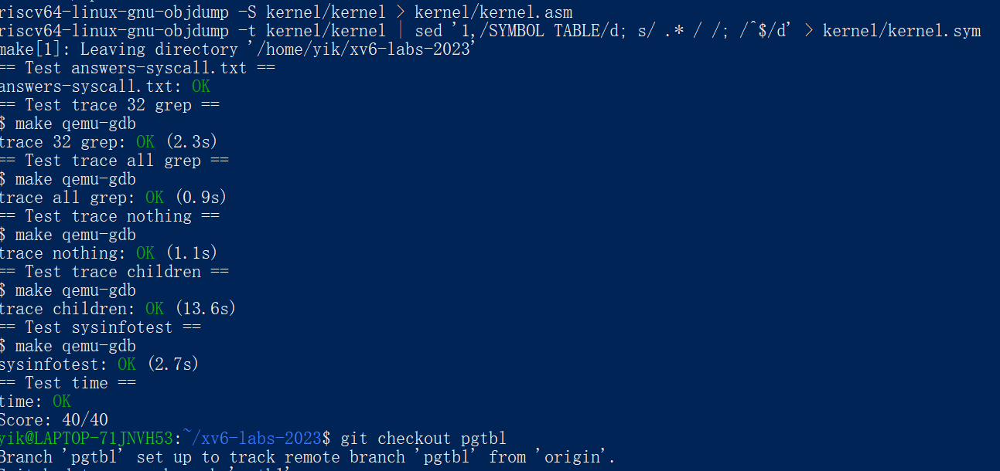

# Lab10 mmap


[TOC]

## 前置知识

## 实验内容

### 任务

* 在本次实验中我们要求实现 `mmap` 和 `munmap` 系统调用，在实现之前，我们首先需要了解一下 `mmap` 系统调用是做什么的。根据 `mmap` 的描述，`mmap` 是用来将文件或设备内容映射到内存的。`mmap` 使用懒加载方法，因为需要读取的文件内容大小很可能要比可使用的物理内存要大，当用户访问页面会造成页错误，此时会产生异常，此时程序跳转到内核态由内核态为错误的页面读入文件并返回用户态继续执行。当文件不再需要的时候需要调用 `munmap` 解除映射，如果存在对应的标志位的话，还需要进行文件写回操作。`mmap` 可以由用户态直接访问文件或者设备的内容而不需要内核态与用户态进行拷贝数据，极大提高了 IO 的性能。


### 实验准备

1. **获取并切换到`mmap`分支：** 打开终端，进入xv6的源代码目录，然后执行以下命令：

   ```bash
   $ git fetch
   $ git checkout mmap
   $ make clean
   ```

2. **理解`mmap`和`munmap`：**

   - `mmap`系统调用的格式如下：

     ```c
     void *mmap(void *addr, size_t len, int prot, int flags, int fd, off_t offset);
     ```
     
     - `addr`为0时，内核决定映射文件的虚拟地址。
     - `len`是要映射的字节数。
     - `prot`表示内存是否应该映射为可读、可写或可执行。
     - `flags`可以是`MAP_SHARED`或`MAP_PRIVATE`。
     - `fd`是要映射的文件的文件描述符。
     - `offset`表示从文件的哪个位置开始映射，可以假设为0。
     
   - `munmap`系统调用的格式如下：

     ```c
     int munmap(void *addr, size_t len);
     ```
     
     - `munmap`应该从指定的地址范围中移除`mmap`映射。

### 实验步骤

#### 1. `syscall.c`新增 `sys_mmap` 和 `sys_munmap` 函数原型的声明

**修改前：**

```c
// 系统调用函数的原型声明
extern uint64 sys_fork(void);
extern uint64 sys_exit(void);
extern uint64 sys_wait(void);
// ... 省略其他函数声明
extern uint64 sys_close(void);
```

**修改后：**

```c
// 系统调用函数的原型声明
extern uint64 sys_fork(void);
extern uint64 sys_exit(void);
extern uint64 sys_wait(void);
// ... 省略其他函数声明
extern uint64 sys_close(void);
extern uint64 sys_mmap(void);
extern uint64 sys_munmap(void);
```

**修改目的和原理：**

- 新增的 `sys_mmap` 和 `sys_munmap` 函数声明是为了引入对这两个新系统调用的支持。在后续的代码中，这两个函数会处理用户发出的 `mmap` 和 `munmap` 系统调用请求。

#### 2. `syscall.c`扩展系统调用映射数组 `syscalls[]`

**修改前：**

```c
// 系统调用号与对应处理函数的映射表
static uint64 (*syscalls[])(void) = {
[SYS_fork]    sys_fork,
[SYS_exit]    sys_exit,
[SYS_wait]    sys_wait,
// ... 省略其他映射
[SYS_close]   sys_close,
};
```

**修改后：**

```c
// 系统调用号与对应处理函数的映射表
static uint64 (*syscalls[])(void) = {
[SYS_fork]    sys_fork,
[SYS_exit]    sys_exit,
[SYS_wait]    sys_wait,
// ... 省略其他映射
[SYS_close]   sys_close,
[SYS_mmap]    sys_mmap,
[SYS_munmap]  sys_munmap,
};
```

**修改目的和原理：**

- 在 `syscalls[]` 数组中新增了 `SYS_mmap` 和 `SYS_munmap` 的映射，这样在系统调用处理时，可以根据调用号正确地找到并执行对应的函数。这一步骤是实现新系统调用的关键，它将 `mmap` 和 `munmap` 系统调用与它们的处理函数关联起来，使得操作系统能够响应这些调用。

#### 3. `syscall.h`添加系统调用号

```c
#define SYS_mmap 22
#define SYS_munmap 23
```

#### 4.  `sysfile.c`新增的 `sys_mmap` 函数

**修改后：**

```c
uint64 sys_mmap(void)
{
  uint64 addr;
  int len, prot, flags, fd, off;
  argaddr(0, &addr);
  argint(1, &len);
  argint(2, &prot);
  argint(3, &flags);
  argint(4, &fd);
  argint(5, &off);

  struct proc* p = myproc();
  struct file* f = p->ofile[fd];
  
  // Check whether this operation is legal
  if((flags==MAP_SHARED && f->writable==0 && (prot&PROT_WRITE))) return -1;

  // Find an empty VMA struct. 
  int idx = 0;
  for(;idx<VMA_MAX;idx++)
    if(p->vma_array[idx].valid==0)
      break;
  if(idx==VMA_MAX)
    panic("All VMA struct is full!");
  
  // Fill this VMA struct.
  struct vma* vp = &p->vma_array[idx];
  vp->valid = 1;
  vp->len = len;
  vp->flags = flags;
  vp->off = off;
  vp->prot = prot;
  vp->f = f;
  filedup(f); // This file's refcnt += 1. 
  p->vma_top_addr-=len;
  vp->addr = p->vma_top_addr; // The usable user virtual address. 
  return vp->addr;
}
```

**修改目的和原理：**

- 该函数实现了 `mmap` 系统调用，允许用户将文件或设备的内容映射到虚拟内存区域。主要逻辑包括检查操作是否合法，查找可用的 VMA 结构体，填充 VMA 结构体信息，更新文件引用计数等。
- 通过此修改，操作系统能够为用户提供高效的内存映射操作，减少用户态和内核态之间的数据拷贝，提高 I/O 性能。

#### 5. `sysfile.c`新增的 `sys_munmap` 函数

**修改后：**

```c
uint64 sys_munmap(void)
{
  uint64 addr;
  int len;
  argaddr(0, &addr);
  argint(1, &len);
  struct proc* p = myproc();

  struct vma* vp = 0;
  // Find the VMA struct that this file belongs to. 
  for(struct vma *now = p->vma_array;now<p->vma_array+VMA_MAX;now++)
  {
    if(now->addr<=addr && addr<now->addr+now->len 
        && now->valid)
    {
      vp = now;
      break;
    }
  }

  if(vp)
  {
    if( walkaddr( p->pagetable , addr ) != 0)
    {
      // Write back and unmap. 
      if(vp->flags==MAP_SHARED) filewrite(vp->f, addr, len);
      uvmunmap(p->pagetable, addr, len/PGSIZE, 1);
      return 0;
    }
    // Update the file's refcnt. 
    vp->refcnt -= 1;
    if(vp->refcnt) // set the vma struct to invalid. 
    {
      fileclose(vp->f);
      vp->valid = 0;
    }
    return 0;
  }
  else
  {
    panic("Cannot find a vma struct representing this file!");
  }
}
```

**修改目的和原理：**

- 该函数实现了 `munmap` 系统调用，用于解除内存映射。主要逻辑包括查找对应的 VMA 结构体，进行写回操作（如果映射是共享的），解除映射并更新 VMA 结构体的状态。
- 通过此修改，操作系统能够正确处理用户请求的内存解除映射操作，释放内存资源并确保数据一致性。

#### 6. ``proc.c在 `allocproc` 函数中初始化 VMA 结构

**修改后：**

```c
// Look in the process table for an UNUSED proc.
// If found, initialize state required to run in the kernel,
// and return with p->lock held.
// If there are no free procs, or a memory allocation fails, return 0.
static struct proc*
allocproc(void)
{
  struct proc *p;

  for(p = proc; p < &proc[NPROC]; p++) {
    acquire(&p->lock);
    if(p->state == UNUSED) {
      goto found;
    } else {
      release(&p->lock);
    }
  }
  return 0;

found:
  p->pid = allocpid();
  p->state = USED;

  // Initialize the vma array and the currently available VMA top address. 
  for(int i = 0;i<VMA_MAX;i++)
  {
     p->vma_array[i].valid = 0;
     p->vma_array[i].refcnt = 0;
  }
  p->vma_top_addr = MAXVA-2*PGSIZE;

  // Allocate a trapframe page.
  if((p->trapframe = (struct trapframe *)kalloc()) == 0){
    freeproc(p);
    release(&p->lock);
    return 0;
  }

  // An empty user page table.
  p->pagetable = proc_pagetable(p);
  if(p->pagetable == 0){
    freeproc(p);
    release(&p->lock);
    return 0;
  }

  // Set up new context to start executing at forkret,
  // which returns to user space.
  memset(&p->context, 0, sizeof(p->context));
  p->context.ra = (uint64)forkret;
  p->context.sp = p->kstack + PGSIZE;

  return p;
}
```

**修改目的和原理：**

- 在 `allocproc` 函数中初始化 VMA 结构 (`vma_array`) 和 VMA 顶部地址 (`vma_top_addr`)，确保每个新创建的进程在分配虚拟内存区域时能够正常工作。这样，进程可以使用 `mmap` 进行文件映射，并在 `munmap` 时正确解除映射。

#### 7. `proc.c`在 `fork` 函数中复制 VMA 结构

**修改后：**

```c
// Create a new process, copying the parent.
// Sets up child kernel stack to return as if from fork() system call.
int
fork(void)
{
  int i, pid;
  struct proc *np;
  struct proc *p = myproc();

  // Allocate process.
  if((np = allocproc()) == 0){
    return -1;
  }

  // Copy user memory from parent to child.
  if(uvmcopy(p->pagetable, np->pagetable, p->sz) < 0){
    freeproc(np);
    release(&np->lock);
    return -1;
  }
  np->sz = p->sz;

  // copy saved user registers.
  *(np->trapframe) = *(p->trapframe);

  // Added by XHZ
  // Copy the struct vma array. 
  np->vma_top_addr = p->vma_top_addr;
  for(int i = 0;i<VMA_MAX;i++)
  {
    if(p->vma_array[i].valid)
    {
      filedup(p->vma_array[i].f);
      memmove(&np->vma_array[i], &p->vma_array[i], sizeof(struct vma));
    }
  }

  // Cause fork to return 0 in the child.
  np->trapframe->a0 = 0;

  // increment reference counts on open file descriptors.
  for(i = 0; i < NOFILE; i++)
    if(p->ofile[i])
      np->ofile[i] = filedup(p->ofile[i]);
  np->cwd = idup(p->cwd);

  safestrcpy(np->name, p->name, sizeof(p->name));

  pid = np->pid;

  release(&np->lock);

  acquire(&wait_lock);
  np->parent = p;
  release(&wait_lock);

  acquire(&np->lock);
  np->state = RUNNABLE;
  release(&np->lock);

  return pid;
}
```

**修改目的和原理：**

- 在 `fork` 函数中，父进程的 VMA 结构被复制到子进程中，以确保子进程继承父进程的所有内存映射。这包括更新 VMA 顶部地址和增加文件引用计数，确保子进程对映射文件的访问权限与父进程相同。

#### 8. `proc.c`在 `exit` 函数中释放 VMA 结构

**修改后：**

```c
// Exit the current process.  Does not return.
// An exited process remains in the zombie state
// until its parent calls wait().
void
exit(int status)
{
  struct proc *p = myproc();

  // Release the mapped files in the virtual memory. 
  for(int i = 0;i<VMA_MAX;i++)
  {
    if(p->vma_array[i].valid)
    {
      struct vma* vp = &p->vma_array[i];
      for(uint64 addr = vp->addr;addr<vp->addr+vp->len;addr+=PGSIZE)
      {
        if(walkaddr(p->pagetable, addr) != 0)
        {
          if(vp->flags==MAP_SHARED) filewrite(vp->f, addr, PGSIZE);
          uvmunmap(p->pagetable, addr, 1, 1);
        }
      }
      fileclose(p->vma_array[i].f);
      p->vma_array[i].valid = 0;
    }
  }

  if(p == initproc)
    panic("init exiting");

  // Close all open files.
  for(int fd = 0; fd < NOFILE; fd++){
    if(p->ofile[fd]){
      struct file *f = p->ofile[fd];
      fileclose(f);
      p->ofile[fd] = 0;
    }
  }

  begin_op();
  iput(p->cwd);
  end_op();
  p->cwd = 0;

  acquire(&wait_lock);

  // Give any children to init.
  reparent(p);

  // Parent might be sleeping in wait().
  wakeup(p->parent);
  
  acquire(&p->lock);

  p->xstate = status;
  p->state = ZOMBIE;

  release(&wait_lock);

  // Jump into the scheduler, never to return.
  sched();
  panic("zombie exit");
}
```

**修改目的和原理：**

- 在 `exit` 函数中，进程退出时需要释放其所有的 VMA 结构。这包括写回共享映射的文件数据、解除映射并关闭文件。这一步骤确保了进程退出后，所有与之关联的内存资源和文件资源都能被正确释放，避免内存泄漏和文件引用计数不正确的问题。


#### 9. `proc.h`新增`struct vma` 的定义

**修改前：**

```c
// 没有 vma 结构的定义
```

**修改后：**

```c
// 虚拟内存映射结构
struct vma {
   int valid;           // 该 VMA 是否有效
   uint64 addr;         // VMA 的起始地址
   int len;             // VMA 的长度
   int prot;            // 保护标志 (PROT_READ, PROT_WRITE 等)
   int flags;           // 映射标志 (MAP_SHARED, MAP_PRIVATE 等)
   int off;             // 文件偏移量
   struct file* f;      // 关联的文件指针
   uint64 refcnt;       // 引用计数
};

#define VMA_MAX 16  // 最大支持的 VMA 数量
```

**修改目的和原理：**

- 新增了 `struct vma` 结构来支持虚拟内存区域的管理。每个进程可以有多个 VMA，这些 VMA 可以映射到文件或设备，或者用于共享内存等。这是实现 `mmap` 和 `munmap` 系统调用所需的关键数据结构。

#### 10. `proc.h`中`struct proc` 中新增 VMA 支持

**修改前：**

```c
// Per-process state
struct proc {
  struct spinlock lock;

  // p->lock must be held when using these:
  enum procstate state;        // Process state
  void *chan;                  // If non-zero, sleeping on chan
  int killed;                  // If non-zero, have been killed
  int xstate;                  // Exit status to be returned to parent's wait
  int pid;                     // Process ID

  // wait_lock must be held when using this:
  struct proc *parent;         // Parent process

  // these are private to the process, so p->lock need not be held.
  uint64 kstack;               // Virtual address of kernel stack
  uint64 sz;                   // Size of process memory (bytes)
  pagetable_t pagetable;       // User page table
  struct trapframe *trapframe; // data page for trampoline.S
  struct context context;      // swtch() here to run process
  struct file *ofile[NOFILE];  // Open files
  struct inode *cwd;           // Current directory
  char name[16];               // Process name (debugging)
};
```

**修改后：**

```c
// Per-process state
struct proc {
  struct spinlock lock;

  // p->lock must be held when using these:
  enum procstate state;        // Process state
  void *chan;                  // If non-zero, sleeping on chan
  int killed;                  // If non-zero, have been killed
  int xstate;                  // Exit status to be returned to parent's wait
  int pid;                     // Process ID

  // wait_lock must be held when using this:
  struct proc *parent;         // Parent process

  // these are private to the process, so p->lock need not be held.
  uint64 kstack;               // Virtual address of kernel stack
  uint64 sz;                   // Size of process memory (bytes)
  pagetable_t pagetable;       // User page table
  struct trapframe *trapframe; // data page for trampoline.S
  struct context context;      // swtch() here to run process
  struct file *ofile[NOFILE];  // Open files
  struct inode *cwd;           // Current directory
  char name[16];               // Process name (debugging)

  // 新增的 VMA 支持
  struct vma vma_array[VMA_MAX];  // 该进程的 VMA 数组
  uint64 vma_top_addr;            // 当前可用的 VMA 顶部地址
};
```

**修改目的和原理：**

- 在 `struct proc` 中新增了 `vma_array` 和 `vma_top_addr` 两个字段。`vma_array` 用于存储进程的所有 VMA 信息，而 `vma_top_addr` 用于管理 VMA 的顶端地址。这些修改允许每个进程管理多个虚拟内存映射，支持更复杂的内存操作。

#### 11. `user.h`新增`mmap`和`munmap`的声明

```c
char *mmap(void *, size_t, int, int, int, off_t);
int munmap(void *, size_t);
```

#### 12. `usys.pl`新增两个新的系统调用的入口

```perl
entry("mmap");
entry("munmap");
```

### 实验得分


