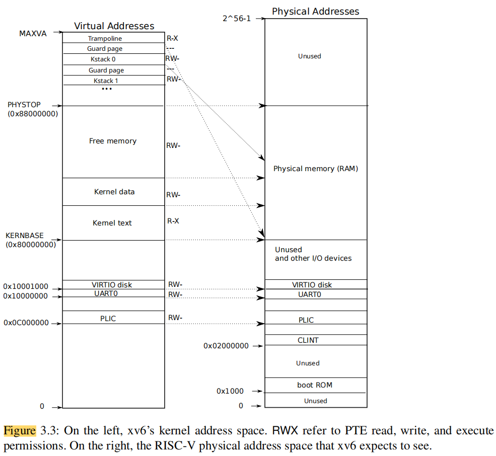

# Lab2 system calls

[TOC]

## 前置知识

### 页表

#### 1. 地址空间隔离

**例子：** 假设我们有两个进程A和B，它们分别有自己的虚拟地址空间。进程A可能在其虚拟地址空间中有一个指向地址`0x1000`的指针，而进程B也可能在它的虚拟地址空间中有一个指向同样`0x1000`的指针。然而，通过页表机制，这两个虚拟地址`0x1000`可以分别映射到不同的物理内存地址，例如`0x2000`和`0x3000`，从而确保进程A和B互不干扰。

**作用：** 通过这种方式，操作系统可以确保每个进程有自己的独立地址空间，从而避免一个进程访问或修改另一个进程的内存数据。这种隔离也有助于提高系统的安全性和稳定性。

#### 2. 共享内存的实现

**例子：** 假设进程A和进程B需要共享一块内存来进行数据交换。操作系统可以在两个进程的页表中将相同的虚拟地址映射到相同的物理内存地址上。例如，进程A的虚拟地址`0x4000`和进程B的虚拟地址`0x5000`都可以映射到物理地址`0x6000`，从而实现共享内存。

**作用：** 这种技巧允许多个进程共享数据，同时每个进程仍然可以有自己的独立的虚拟地址空间。这在需要进程间通信的场景中非常有用。

#### 3. 内核和用户空间的区分

**例子：** 在xv6中，所有的用户进程的内存访问都是通过页表管理的。用户空间和内核空间是通过不同的页表映射来区分的。例如，用户进程的页表只允许它们访问自己的代码和数据，而不允许它们直接访问内核的代码和数据。通过将内核代码映射到用户进程的页表中一个特定的地址空间（通常在高地址部分），同时设置访问权限（只读或不可访问），xv6可以有效地保护内核内存不被用户进程修改。

**作用：** 通过这种方式，操作系统可以保护内核不受用户进程的干扰，确保系统的稳定性和安全性。这也是用户模式和内核模式隔离的基础。

#### 4. 栈保护

**例子：** 为了保护用户进程的栈，操作系统可以在栈的末尾映射一个不可访问的页。如果用户程序试图访问超出栈的有效范围的地址，访问将导致页错误，从而防止栈溢出攻击。

**作用：** 这种页表技巧通过设置一个没有映射的页（即不可访问的页）来防止栈溢出，增强了系统的安全性。栈溢出是常见的安全漏洞，通过这种方式可以有效地防止栈溢出导致的恶意代码执行。

#### 总结

通过页表，操作系统可以实现虚拟内存管理，确保进程之间的隔离，支持内存共享，实现内核和用户空间的分离，并通过一些技巧保护内存安全。每一个这些例子都展示了页表在现代操作系统中的核心作用，以及它们如何通过映射不同的虚拟地址来实现复杂的内存管理功能。

### 分页硬件

#### 地址转换过程和原理

在 x86 架构中，虚拟地址和物理地址之间的转换是通过页表（Page Table）和分页硬件（paging hardware）实现的。下面是一个具体的例子来说明这个过程：

##### 例子：

假设有一个用户程序访问了虚拟地址 `0x12345678`，操作系统需要将这个虚拟地址转换为实际的物理地址，以便读取或写入物理内存。

1. **虚拟地址的拆分：**
   - 虚拟地址 `0x12345678` 在二进制下表示为 `0001 0010 0011 0100 0101 0110 0111 1000`。
   - 高 10 位 `0001 0010 00` 用于在页目录（Page Directory）中找到对应的页目录条目（PDE）。
   - 中间 10 位 `0011 0100 01` 用于在选定的页表页（Page Table）中找到具体的页表条目（PTE）。
   - 最后 12 位 `0101 0110 0111 1000` 表示页内偏移，用于定位页内具体地址。
2. **页目录查找：**
   - 使用虚拟地址的高 10 位（`0001 0010 00`）在页目录中查找对应的页目录条目（PDE）。
   - 该 PDE 指向一个页表页（Page Table Page），其中包含多个页表条目（PTE）。
3. **页表查找：**
   - 使用虚拟地址的中间 10 位（`0011 0100 01`）在选定的页表页中查找对应的页表条目（PTE）。
   - 该 PTE 包含指向物理页框的物理页号（PPN）以及一些控制标志位。
4. **物理地址的生成：**
   - 将 PTE 中的物理页号（PPN）替换虚拟地址的高 20 位。
   - 保留虚拟地址的最后 12 位不变，这部分是页内偏移。
   - 这样，虚拟地址 `0x12345678` 被转换为物理地址，例如 `0x56789078`。

#### PTE、PPN 和 PDE 的含义及关系

- **PTE（Page Table Entry）页表条目：** 每个 PTE 包含指向物理内存的物理页号（PPN）以及一些控制标志位，如 PTE_P、PTE_W、PTE_U 等。这些标志位控制页的权限和状态。
- **PPN（Physical Page Number）物理页号：** PPN 是物理页在物理内存中的编号，它与页内偏移相结合，最终形成物理地址。
- **PDE（Page Directory Entry）页目录条目：** PDE 是页目录中的一个条目，指向一个页表页（Page Table Page）。它用虚拟地址的高 10 位进行索引，找到对应的页表页，然后页表页中的 PTE 再指向具体的物理页。

#### PTE、PPN 和 PDE 的关系

在虚拟地址转换过程中，PDE、PTE 和 PPN 之间的关系如下：

1. **页目录查找 (PDE)：**
   - 虚拟地址的高 10 位用于在页目录中查找对应的 PDE。
   - PDE 指向一个具体的页表页，页表页中包含多个 PTE。
2. **页表查找 (PTE)：**
   - 虚拟地址的中间 10 位用于在选定的页表页中查找对应的 PTE。
   - PTE 包含指向物理内存的物理页号 (PPN) 以及相关的控制标志位。
3. **物理地址生成 (PPN)：**
   - PPN 是 PTE 中保存的物理页号，将其替换虚拟地址的高 20 位。
   - 虚拟地址的低 12 位作为页内偏移，与 PPN 结合生成最终的物理地址。

#### 示意图

```yaml
                虚拟地址 0x12345678
+---------------------------------------------+
|  0001 0010 00  |  0011 0100 01  |  0101 0110 0111 1000  |
|   PDE 索引     |    PTE 索引    |    页内偏移           |
+---------------------------------------------+

                |
                v
              页目录 (Page Directory)
                |
                v
             +--------------------------+
             |   PDE (指向页表页)       |
             +--------------------------+
                       |
                       v
                   页表页 (Page Table Page)
                       |
                       v
                    +--------------------------+
                    |    PTE (包含PPN)         |
                    +--------------------------+
                               |
                               v
                         物理内存页 (Physical Page)
                               |
                               v
                最终物理地址 = PPN + 页内偏移
```


#### 分页硬件

分页硬件（paging hardware）是处理器中的一个组件，它负责根据页表将虚拟地址转换为物理地址。==它会自动完成前述的页目录和页表查找，以及地址的转换。这些操作对程序员和用户程序是透明的，即用户程序只需使用虚拟地址，而不需要关心底层的地址转换过==程。

分页硬件还负责管理页表中的标志位，例如控制某个页是否有效、是否允许写操作、是否只允许内核访问等。这些标志位可以保护内存，确保用户程序不能随意访问或修改内核数据或其他进程的数据。

#### 例子总结和技巧

- **多进程隔离：** 每个进程有自己独立的页表，使得进程之间的地址空间相互隔离，避免一个进程访问另一个进程的数据。
- **共享内存：** 不同的进程可以通过页表将相同的虚拟地址映射到相同的物理内存页，从而实现进程间的数据共享。
- **内核保护：** 操作系统通过设置页表中的标志位，防止用户进程访问内核内存，确保系统的安全性和稳定性。
- **栈保护：** 在栈底部设置一个不可访问的页面（通过PTE的标志位），防止栈溢出攻击。

这些机制和技巧确保了操作系统的稳健性、安全性，以及对内存的高效管理。

### 进程地址空间

#### **entry 与 kvmalloc 的映射差异**

在 `entry` 阶段，系统刚刚启动，页表已经建立了一些基本的映射，使得内核的 C 代码可以正常运行。然而，这些映射只是最低限度的映射，主要是为了确保系统可以启动并执行基础代码。接下来，`main` 调用了 `kvmalloc` 来切换到一个更复杂和完整的页表，这个页表对内存空间进行了更精细的映射。

#### **进程和页表的关系**

- **进程的用户内存：** 每个进程都有自己独立的页表，其用户内存从虚拟地址 `0` 开始，最多可以增长到 `KERNBASE`（即 2GB）。这样，进程能够在这个范围内申请内存并使用。
- **内核内存的映射：** 在每个进程的页表中，除了映射用户内存外，还包含了内核运行所需要的映射。这些映射都在 `KERNBASE` 之上。这意味着即使进程从用户态切换到内核态（例如通过中断或系统调用），也不需要切换页表，因为内核所需的内存已经在进程的页表中进行了映射。

#### **映射的原因**

文中提到，内核将虚拟地址 `KERNBASE:KERNBASE+PHYSTOP` 映射到物理地址 `0:PHYSTOP` 的原因有以下几点：

1. **内核使用自己的指令和数据：** 内核代码需要访问自己的数据和执行自己的指令，这些代码和数据存储在物理内存中。通过将这段虚拟地址映射到对应的物理地址，内核可以轻松访问这些资源。
2. **内核操作物理页：** 在系统中，内核需要直接操作物理内存，特别是在创建页表页时。将 `KERNBASE` 以上的虚拟地址映射到实际的物理内存可以让内核更方便地访问和操作这些物理页。

#### **映射的限制与不足**

这种映射方式的一个主要限制是，xv6 无法使用超过 2GB 的物理内存。这是因为内核的虚拟地址空间被限制在 `KERNBASE` 以上，而这个范围内的地址空间只能映射到 2GB 的物理内存。此外，对于一些使用高地址（如 `0xFE000000` 以上）的 I/O 设备，xv6 采用了直接映射的方式来确保这些设备能够正常工作。

#### **内核和用户内存的映射关系**

每个进程的页表同时包括用户内存和内核内存的映射。这意味着当用户态切换到内核态时，不需要进行页表的转换，从而提高了系统的效率。此外，内核并没有独立的页表，而是借用了用户进程的页表来运行。

#### 示意图

```yaml
+--------------------+                      +--------------------+
|   虚拟地址空间      |                      |   物理地址空间      |
+--------------------+                      +--------------------+
| 用户内存 (0-KERNBASE) |  ----------->  |    用户内存            |
+--------------------+                      +--------------------+
|    KERNBASE 以上    |  ----------->  | 内核代码/数据 (0-PHYSTOP)|
+--------------------+                      +--------------------+
```

#### 什么是 `entry`？

`entry` 是指系统在启动时的最初阶段，它是内核代码的起点。在这个阶段，操作系统从裸机状态（即没有操作系统运行的状态）逐步建立起最基本的系统结构，例如设置页表、初始化硬件设备等，使得后续的复杂操作能够顺利进行。在 `entry` 阶段，系统会设置一些简单的映射和初始化工作，以便能够顺利运行内核的 C 代码。

#### **内核操作物理页**

在操作系统中，内核需要直接管理和操作物理内存，例如在创建和管理页表时。因此，内核必须能够访问系统的物理内存。由于在现代操作系统中，内核和用户程序使用的是不同的虚拟地址空间，内核必须通过特定的映射机制来操作物理内存。

#### **将 `KERNBASE` 以上的虚拟地址映射到实际的物理内存**

在 x86 架构的 xv6 操作系统中，内核的代码和数据通常位于 `KERNBASE` 以上的虚拟地址空间。`KERNBASE` 是一个虚拟地址，它对应的是物理地址的开始（例如物理内存的 `0x0` 地址）。通过将 `KERNBASE` 以上的虚拟地址映射到物理地址 `0x0` 开始的位置，内核可以方便地访问物理内存中的每一页。

#### **例子：创建页表页**

当内核需要创建新的页表页时，必须为该页表页分配物理内存。这个过程可以分为以下几个步骤：

1. **分配物理页：** 内核需要在物理内存中找到一个空闲的页，准备将它用作新的页表页。这一步通常通过一个内存分配器来完成，例如 `kalloc()` 函数。
2. **设置页表条目（PTE）：** 内核会在当前进程的页表中为新的页表页设置一个页表条目（PTE）。这个 PTE 的主要作用是将虚拟地址映射到刚刚分配的物理页。
3. **映射虚拟地址到物理地址：** 内核通过设置 PTE 中的 PPN（物理页号）和其他标志位，将虚拟地址（例如 `KERNBASE` 以上的地址）映射到实际的物理页。例如，如果内核分配了一个物理页号为 `0x200` 的物理页，那么可以将虚拟地址 `KERNBASE + 0x200` 映射到这个物理页。
4. **访问物理页：** 现在，内核就可以通过虚拟地址（如 `KERNBASE + 0x200`）访问物理内存中的该页。这使得内核可以在需要时直接操作物理页，而不必通过复杂的地址转换过程。

#### **示意图**

假设内核需要分配和操作一个物理页，地址为 `0x20000`。通过将虚拟地址 `KERNBASE + 0x20000` 映射到物理地址 `0x20000`，内核可以方便地使用该虚拟地址来访问和操作这个物理页。

```yaml
+----------------------+  映射  +----------------------+
| 虚拟地址: KERNBASE+0x20000 | ----> | 物理地址: 0x20000      |
+----------------------+        +----------------------+

// 内核通过虚拟地址 KERNBASE+0x20000 直接访问物理地址 0x20000 对应的物理页。
```

### 代码：建立一个地址空间

#### 函数作用与调用过程说明

在 xv6 操作系统中，内核需要建立页表以管理虚拟地址到物理地址的映射。以下是 `main` 函数、`kvmalloc`、`setupkvm`、`mappages` 和 `walkpgdir` 函数的详细说明，以及它们的调用过程和作用点。

##### 1. `main` 函数

**作用：** `main` 函数是操作系统启动的入口点。它负责启动和初始化操作系统，包括设置内核的页表、初始化硬件和启动第一个用户进程。

**调用过程和作用点：**
- 在 `main` 函数中，操作系统需要切换到一个拥有内核运行所需的虚拟地址到物理地址映射的页表。为此，`main` 调用了 `kvmalloc` 函数，创建一个新的页表，并切换到这个新的页表中。

##### 2. `kvmalloc` 函数

**作用：** `kvmalloc` 函数用于创建并切换到一个新的页表，该页表包含内核运行所需的虚拟地址到物理地址的映射。它通过调用 `setupkvm` 来完成大部分工作。

**调用过程和作用点：**
- `kvmalloc` 首先调用 `setupkvm` 来创建一个新的页表，`setupkvm` 函数负责为内核建立必要的虚拟地址映射。
- 创建完新的页表后，`kvmalloc` 切换到这个新的页表，使其成为当前活跃的页表。

##### 3. `setupkvm` 函数

**作用：** `setupkvm` 函数负责初始化一个新的页表，并为内核创建一组基本的虚拟地址到物理地址的映射。这些映射包括内核指令和数据所需的内存、物理内存（`PHYSTOP` 以下）以及 I/O 设备所需的内存。

**调用过程和作用点：**
- `setupkvm` 首先分配一页内存，用于存放页目录。
- 然后，它调用 `mappages` 函数，为内核建立所需的映射，这些映射信息存储在 `kmap` 数组中。
- `setupkvm` 只建立内核需要的映射，不会处理用户内存的映射，这些映射在稍后的进程加载时处理。

##### 4. `mappages` 函数

**作用：** `mappages` 函数用于在页表中建立从一段虚拟内存到一段物理内存的映射。它逐页处理，将每个虚拟地址映射到相应的物理地址。

**调用过程和作用点：**
- `mappages` 函数逐页处理待映射的虚拟内存地址。
- 对于每个虚拟地址，它调用 `walkpgdir` 函数，找到对应的 PTE（页表条目）地址。
- 然后，它初始化该 PTE，将物理页号、权限标志（如 PTE_W、PTE_U）以及 PTE_P 位（表示该页是否有效）写入 PTE。

##### 5. `walkpgdir` 函数

**作用：** `walkpgdir` 函数模仿 x86 的分页硬件，查找一个虚拟地址对应的 PTE。它用于在页表中找到给定虚拟地址的页表条目（PTE）。

**调用过程和作用点：**
- `walkpgdir` 使用虚拟地址的前 10 位找到页目录中的对应条目。
- 如果该条目不存在并且 `alloc` 参数被设置为 1，它将分配一个新的页表页，并将其物理地址放入页目录。
- 最后，使用虚拟地址的接下来的 10 位找到页表中的 PTE 地址。

#### 调用关系示意图

```plaintext
main
 ├── kvmalloc
 │    └── setupkvm
 │         ├── mappages
 │         │    └── walkpgdir
 │         └── kmap (映射数组)
 └── ...
```

#### **示例与解释**

- **页表的建立与切换：** 在系统启动时，`main` 函数调用 `kvmalloc`，创建并切换到一个新的页表。该页表包含了内核指令和数据、物理内存、I/O 设备的映射，这些映射由 `setupkvm` 通过调用 `mappages` 函数逐步建立。

- **地址映射过程：** 当内核需要访问某个虚拟地址（如 `KERNBASE + 0x20000`），它首先通过 `walkpgdir` 在页目录中查找对应的 PTE。如果找到了对应的 PTE，内核就可以通过该 PTE 将虚拟地址转换为物理地址，进而访问实际的物理内存。

#### 总结

这些函数的组合实现了操作系统中的虚拟内存管理机制。通过对页表的管理和操作，系统可以将虚拟地址映射到实际的物理内存，并为每个进程提供独立的地址空间。这不仅提高了系统的安全性，还简化了内存管理和资源分配。


### 物理内存的分配和自举问题

在操作系统运行时，内核需要动态分配物理内存，用于存储页表、进程的用户内存、内核栈以及管道缓冲区等数据结构。xv6 操作系统使用从内核结尾到 `PHYSTOP` 之间的物理内存作为运行时的内存资源。每次分配内存时，xv6 会分配一整块大小为 4096 字节的页，并通过维护一个物理页链表来管理和分配空闲页。这个链表记录了所有空闲的物理页，当需要分配内存时，系统会将一个空闲页从链表中移除，而当需要释放内存时，系统会将该页重新加入链表。

#### 自举问题

在这个上下文中，我们遇到了一个典型的**自举问题**（bootstrap problem），这个问题可以简单理解为：在系统初始化的早期阶段，为了进行某项操作，系统需要依赖其自身尚未完全初始化的部分。

**具体问题：**
- **内存分配的依赖关系**：要初始化内存分配器，系统需要创建一个包含所有物理内存页的链表。这个链表需要用页表来管理，而页表本身也需要存储在物理内存中。因此，页表的创建和内存分配存在一个相互依赖的关系——要建立页表需要分配物理内存，而要分配物理内存又需要依赖页表。

#### 解决方法

xv6 通过在系统的初始化阶段使用一个特殊的页分配器来解决这个问题。这个分配器在系统的最早期——内核初始化阶段——进行使用，它的工作原理如下：

1. **特殊的页分配器**：这个分配器直接从内核数据段的末尾开始分配内存，不依赖于标准的页表机制。这意味着它可以在页表尚未完全建立之前使用。
   
2. **限制**：该分配器不支持释放内存，并且只能分配有限的内存（4MB），这是因为它仅依赖于 `entrypgdir` 页表的映射范围。但这个内存量足以支持内核完成最初的页表创建和系统初始化工作。

3. **完整页表的建立**：一旦内核的初始页表建立起来，系统就可以切换到标准的页表机制，并通过标准的页分配器来管理内存。

#### 自举问题的本质

自举问题的本质是系统初始化的互相依赖关系。在这个例子中，为了管理内存需要页表，而为了创建页表需要内存。xv6 通过在系统的早期阶段使用一个特别设计的简化分配器，绕过了这种依赖，从而成功完成系统的初始化。

### 代码：物理内存分配器

1. **数据结构：**
   - 内存分配器使用一个空闲链表来管理可分配的物理内存页。这个链表的每个元素是一个 `struct run` 结构体。
   - `struct run` 结构体保存了链表的下一个节点的指针，即 `r->next`，形成一个链表。
2. **内存获取：**
   - 分配器将 `struct run` 结构体直接存放在空闲页的内存中，因为空闲页没有其他数据，这样每个空闲页本身就是链表中的一个节点。
3. **锁机制：**
   - 分配器使用一个 `spin lock` 来保护这个空闲链表，以避免在多核环境下并发访问时发生冲突。锁和链表都封装在一个结构体中，确保锁保护该结构体的所有成员。
4. **初始化：**
   - `main` 函数通过调用 `kinit1` 和 `kinit2` 两个函数来初始化内存分配器。
   - `kinit1` 用于初始化不超过 4MB 的内存，这部分内存不需要使用锁进行保护。
   - `kinit2` 在初始化后期被调用，允许使用锁，并扩展到更多的内存可用于分配。
   - 由于在 x86 架构上很难准确检测出机器的物理内存量，xv6 假设机器有 240MB 的物理内存，并使用 `PHYSTOP` 作为内存的上限。
5. **内存加入空闲链表：**
   - `kinit1` 和 `kinit2` 调用 `freerange` 函数将指定范围内的内存加入空闲链表中。
   - `freerange` 调用 `kfree` 来释放每一页内存并将其加入空闲链表。
6. **内存对齐：**
   - 由于页表条目（PTE）只能指向 4096 字节对齐的物理地址（即地址必须是 4096 的倍数），`freerange` 使用 `PGROUNDUP` 来确保分配器释放的内存地址是对齐的。
7. **虚拟地址与物理地址：**
   - 分配器通过映射到高内存区域的虚拟地址找到对应的物理页，而非直接使用物理地址。这是因为内核的地址空间在启动时是以高虚拟地址开始的。
   - `kinit` 使用 `p2v(PHYSTOP)` 将物理地址 `PHYSTOP` 转换为对应的虚拟地址。
8. **地址处理：**
   - 分配器中的地址有时被视为整数进行运算（例如在 `kinit` 中遍历所有页），有时被视为指向内存的指针（例如操作页中的 `struct run`）。这种双重用法导致代码中存在大量的类型转换。
9. **释放内存：**
   - `kfree` 函数首先将释放的内存页中的每一字节设为 1，以防止程序错误地访问已释放的内存，确保这样的错误能早期暴露。
   - 然后 `kfree` 将内存地址 `v` 转换为一个指向 `struct run` 的指针，并将这个新释放的页插入到空闲链表的头部。
10. **分配内存：**
    - `kalloc` 函数从空闲链表中移除并返回链表的表头，这意味着它返回了一个已分配的物理页，并从空闲链表中删除该页。

### xv6 地址空间中的用户部分

在 xv6 操作系统中，地址空间被划分为用户部分和内核部分。用户部分包含了运行用户进程所需的所有内存，包括代码、数据、堆、栈等。下面详细介绍 xv6 地址空间中用户部分的结构和特点。

#### 1. **用户内存结构**


- 图表 2-3 展示了一个正在运行的进程在 xv6 中的用户内存结构。这个内存结构通常从较低的虚拟地址开始增长，并且包括以下几个关键部分：
  - **代码段和数据段**：代码段包含可执行程序的指令，数据段包含静态数据。这些段位于用户地址空间的底部。
  - **堆（Heap）**：堆用于动态内存分配，通常位于数据段和栈之间。堆可以通过 `sbrk` 系统调用动态增长，以适应程序运行时的内存需求。
  - **栈（Stack）**：栈是用于函数调用和局部变量存储的区域。在 xv6 中，每个用户进程的栈通常占用一页内存。栈从高地址向低地址增长。

#### 2. **栈的布局**

- 栈的顶部通常保存程序的命令行参数和指向这些参数的指针数组。
- 紧接着，栈中存放了程序入口函数 `main(argc, argv)` 所需的初始值，这些值使得程序可以像刚刚调用 `main` 函数一样开始执行。

#### 3. **保护页**

- 在栈的下方，xv6 引入了一个**保护页（guard page）**。这个保护页没有映射到任何物理内存，即它不对应于实际的物理内存。
- **目的**：保护页的主要作用是防止栈意外地越界使用内存。如果栈增长超过其分配的一页内存，程序将试图访问保护页对应的地址。由于该地址没有映射到物理内存，因此访问时会触发异常。这种机制可以帮助程序在越界访问时快速失败，而不是导致更严重的错误。

#### 4. **堆的增长**

- xv6 允许用户程序通过 `sbrk` 系统调用来扩展堆的大小。堆的增长方向是向上，即从低地址向高地址增长。堆的增长可能会接近栈的区域，因此需要合理管理堆和栈之间的内存使用，以防止两者发生冲突。

### exec 创建地址空间中用户部分的过程

1. **打开二进制文件**：
   - `exec` 通过 `namei` 函数打开指定的二进制文件，该函数用于查找文件系统中的文件。在第 6 章会详细解释 `namei` 的工作原理。
2. **读取 ELF 头**：
   - xv6 应用程序使用 ELF 格式来描述，这种格式在 `elf.h` 中定义。一个 ELF 文件包括一个 ELF 头（`struct elfhdr`）和若干个程序段头（`struct proghdr`）。
   - `exec` 的第一步是检查文件是否包含 ELF 二进制代码。它通过验证 ELF 头中的魔法数字（`ELF_MAGIC`）来判断该文件是否为合法的 ELF 格式。
3. **分配新的页表**：
   - 通过 `setupkvm` 函数，`exec` 分配了一个新的页表，但此时没有任何用户部分的映射。新的页表将用于管理进程的内存映像。
4. **分配和加载内存**：
   - 对于每个 ELF 程序段，`exec` 调用 `allocuvm` 为其分配足够的虚拟内存空间。`allocuvm` 会检查所分配的虚拟地址是否低于 `KERNBASE`，确保这些内存属于用户空间。
   - 然后，`exec` 使用 `loaduvm` 函数将程序段内容从文件中加载到分配的内存中。`loaduvm` 使用 `walkpgdir` 来找到虚拟地址对应的物理地址，并通过 `readi` 函数读取文件内容到内存中。
5. **初始化用户栈**：
   - `exec` 为用户栈分配一页内存，并将程序的命令行参数拷贝到栈顶。它将指向这些参数的指针保存在 `ustack` 中，并在 `argv` 列表的最后放置一个空指针。
   - 在栈的下一页（即栈下方）设置一个无法访问的保护页，以防止栈溢出。当栈增长超过一页时，访问这个页会引发异常，从而保护内存不被非法访问。
6. **处理错误**：
   - 在创建新内存映像的过程中，如果 `exec` 发现了错误（如无效的程序段），它会跳转到 `bad` 标签处，释放已分配的内存，并返回 `-1` 以表示执行失败。
   - `exec` 在确认一切都成功后才会释放旧的内存映像，以避免在发生错误时无法返回 `-1`。
7. **加载新映像并释放旧映像**：
   - 当所有的内存映像和数据都成功加载后，`exec` 将新映像装载到进程中，并释放旧的内存映像，完成内存的切换。
8. **返回成功**：
   - 最后，`exec` 成功返回 `0`，表示系统调用执行成功，并且进程的内存映像已更新。

### 关于xv6

以下是xv6的一些特性总结：

1. **基础分页硬件支持**：
   - xv6 使用分页硬件来保护和映射内存。虽然它与许多现代操作系统一样使用分页技术，但其实现较为简单，缺乏某些高级功能。

2. **简化的内存管理**：
   - xv6 不支持一些高级内存管理技术，如从磁盘请求页、写时复制（copy-on-write）操作、共享内存和惰性分配页（lazily-allocated page）。
   - xv6 也不支持自动扩展栈，当栈溢出时不会自动增加栈的大小。

3. **有限的段式内存转换支持**：
   - x86 支持段式内存转换，但 xv6 只利用段式内存来实现每个CPU的固定地址变量（per-CPU变量），即 `proc` 结构体。段式内存转换允许不同的CPU在相同的地址上有不同的值。对于不支持段式内存的体系结构，通常需要一个额外的寄存器来指向每个CPU的数据区域。

4. **使用“超级页”优化内存管理**：
   - 在内存充足的机器上，xv6 使用4MB大小的“超级页”来减少页表的开销。xv6 在初始页表中使用了超级页，通过设置 %cr4 寄存器中的 CP_PSE 位来通知分页硬件使用超级页。这种做法适用于内存充足的情况，但在内存较小时，使用较小的页以更细的粒度进行分配和换出会更有效率。

5. **对实际内存配置的假设**：
   - xv6 假设系统有240MB的内存，而没有实际检测内存配置。虽然在 x86 上有几种方法可以检测实际的内存布局，但这些方法在 xv6 中没有实现。

6. **简单的内存分配**：
   - xv6 使用固定大小的4096字节页进行内存分配。这种简单的分配方式效率较高，但不如现代内存分配器灵活。现代操作系统通常会处理不同大小的内存分配请求，能够更有效地利用内存资源。

7. **与现代操作系统的对比**：
   - xv6 的内存管理和内存分配机制相对简单，适合教学和理解操作系统的基本概念。相比之下，现代操作系统的内存管理更为复杂，能够处理更多种类的内存请求，并在内存利用率和分配效率之间取得平衡。

## 源码解读

### `usys.S`

这是 `usys.S` 文件的一部分代码，这段代码是由 `usys.pl` 脚本自动生成的，主要功能是为用户空间的系统调用提供汇编代码的包装。下面是对这段代码的详尽注释和解释：

```asm
# 由 usys.pl 自动生成 - 请勿编辑
#include "kernel/syscall.h"  # 包含系统调用号的定义

# 定义全局符号 fork，使其在其他文件中可用
.global fork
fork:
    # 将系统调用号 SYS_fork 加载到寄存器 a7 中
    li a7, SYS_fork
    # 触发系统调用，进入内核模式
    ecall
    # 返回用户模式
    ret

# 定义全局符号 exit，使其在其他文件中可用
.global exit
exit:
    li a7, SYS_exit
    ecall
    ret

# 定义全局符号 wait，使其在其他文件中可用
.global wait
wait:
    li a7, SYS_wait
    ecall
    ret

# 定义全局符号 pipe，使其在其他文件中可用
.global pipe
pipe:
    li a7, SYS_pipe
    ecall
    ret

# 定义全局符号 read，使其在其他文件中可用
.global read
read:
    li a7, SYS_read
    ecall
    ret

# 定义全局符号 write，使其在其他文件中可用
.global write
write:
    li a7, SYS_write
    ecall
    ret

# 定义全局符号 close，使其在其他文件中可用
.global close
close:
    li a7, SYS_close
    ecall
    ret

# 定义全局符号 kill，使其在其他文件中可用
.global kill
kill:
    li a7, SYS_kill
    ecall
    ret

# 定义全局符号 exec，使其在其他文件中可用
.global exec
exec:
    li a7, SYS_exec
    ecall
    ret

# 定义全局符号 open，使其在其他文件中可用
.global open
open:
    li a7, SYS_open
    ecall
    ret

# 定义全局符号 mknod，使其在其他文件中可用
.global mknod
mknod:
    li a7, SYS_mknod
    ecall
    ret

# 定义全局符号 unlink，使其在其他文件中可用
.global unlink
unlink:
    li a7, SYS_unlink
    ecall
    ret

# 定义全局符号 fstat，使其在其他文件中可用
.global fstat
fstat:
    li a7, SYS_fstat
    ecall
    ret

# 定义全局符号 link，使其在其他文件中可用
.global link
link:
    li a7, SYS_link
    ecall
    ret

# 定义全局符号 mkdir，使其在其他文件中可用
.global mkdir
mkdir:
    li a7, SYS_mkdir
    ecall
    ret

# 定义全局符号 chdir，使其在其他文件中可用
.global chdir
chdir:
    li a7, SYS_chdir
    ecall
    ret

# 定义全局符号 dup，使其在其他文件中可用
.global dup
dup:
    li a7, SYS_dup
    ecall
    ret

# 定义全局符号 getpid，使其在其他文件中可用
.global getpid
getpid:
    li a7, SYS_getpid
    ecall
    ret

# 定义全局符号 sbrk，使其在其他文件中可用
.global sbrk
sbrk:
    li a7, SYS_sbrk
    ecall
    ret

# 定义全局符号 sleep，使其在其他文件中可用
.global sleep
sleep:
    li a7, SYS_sleep
    ecall
    ret

# 定义全局符号 uptime，使其在其他文件中可用
.global uptime
uptime:
    li a7, SYS_uptime
    ecall
    ret
```

#### 代码作用

这段代码的主要作用是为每一个系统调用提供汇编级的包装。每个系统调用的包装基本结构如下：
1. **`li a7, SYS_<syscall_name>`**: 将系统调用号加载到寄存器 `a7` 中。
2. **`ecall`**: 触发系统调用指令，切换到内核模式。
3. **`ret`**: 从系统调用返回到用户模式。

#### 系统调用的过程

1. **调用接口**: 用户程序调用一个系统调用，比如 `fork`。
2. **汇编包装**: 对应的汇编包装代码执行，将系统调用号加载到 `a7` 寄存器中，然后通过 `ecall` 指令将控制权交给内核。
3. **内核处理**: 内核根据 `a7` 中的系统调用号执行相应的内核功能（如进程创建、文件操作等）。
4. **返回结果**: 内核完成操作后，通过 `ret` 指令返回用户空间。

#### 系统调用的意义

系统调用是用户程序与操作系统内核交互的唯一接口。通过这些系统调用，用户程序可以执行诸如创建进程、打开文件、读写文件等操作，而无需直接操作硬件或内核数据结构，从而保证了系统的安全性和稳定性。

### `syscall.c`

下面是对这段代码的详尽注释：

```c
#include "types.h"
#include "param.h"
#include "memlayout.h"
#include "riscv.h"
#include "spinlock.h"
#include "proc.h"
#include "syscall.h"
#include "defs.h"

// 从当前进程中获取指定地址 addr 处的 uint64 值，并将其存储在 ip 中。
int
fetchaddr(uint64 addr, uint64 *ip)
{
  struct proc *p = myproc(); // 获取当前进程指针
  if(addr >= p->sz || addr+sizeof(uint64) > p->sz) // 检查地址是否超出进程内存范围，防止越界
    return -1;
  if(copyin(p->pagetable, (char *)ip, addr, sizeof(*ip)) != 0) // 从用户空间复制数据到内核空间
    return -1;
  return 0;
}

// 从当前进程中获取指定地址 addr 处的以空字符 '\0' 结尾的字符串，并将其存储在 buf 中。
// 返回字符串的长度（不包括 '\0'），如果发生错误，返回 -1。
int
fetchstr(uint64 addr, char *buf, int max)
{
  struct proc *p = myproc(); // 获取当前进程指针
  if(copyinstr(p->pagetable, buf, addr, max) < 0) // 从用户空间复制字符串到内核空间
    return -1;
  return strlen(buf); // 返回字符串长度
}

// 获取第 n 个系统调用参数的原始值（不做合法性检查）。
static uint64
argraw(int n)
{
  struct proc *p = myproc(); // 获取当前进程指针
  switch (n) { // 根据 n 的值返回对应寄存器中的值
  case 0:
    return p->trapframe->a0;
  case 1:
    return p->trapframe->a1;
  case 2:
    return p->trapframe->a2;
  case 3:
    return p->trapframe->a3;
  case 4:
    return p->trapframe->a4;
  case 5:
    return p->trapframe->a5;
  }
  panic("argraw"); // 如果 n 的值不在 0 到 5 之间，说明出现了意外情况
  return -1;
}

// 获取第 n 个 32 位的系统调用参数，并将其存储在 ip 中。
void
argint(int n, int *ip)
{
  *ip = argraw(n); // 调用 argraw 获取参数值并存储在 ip 中
}

// 获取第 n 个系统调用参数作为指针，并存储在 ip 中。
void
argaddr(int n, uint64 *ip)
{
  *ip = argraw(n); // 调用 argraw 获取参数值并存储在 ip 中
}

// 获取第 n 个系统调用参数作为字符串，复制到 buf 中，最多复制 max 字节。
// 返回字符串的长度（包括 '\0'），如果发生错误，返回 -1。
int
argstr(int n, char *buf, int max)
{
  uint64 addr;
  argaddr(n, &addr); // 获取第 n 个参数作为地址
  return fetchstr(addr, buf, max); // 获取字符串并返回其长度
}

// 声明系统调用处理函数的原型，这些函数会在系统调用时被执行。
extern uint64 sys_fork(void);
extern uint64 sys_exit(void);
extern uint64 sys_wait(void);
extern uint64 sys_pipe(void);
extern uint64 sys_read(void);
extern uint64 sys_kill(void);
extern uint64 sys_exec(void);
extern uint64 sys_fstat(void);
extern uint64 sys_chdir(void);
extern uint64 sys_dup(void);
extern uint64 sys_getpid(void);
extern uint64 sys_sbrk(void);
extern uint64 sys_sleep(void);
extern uint64 sys_uptime(void);
extern uint64 sys_open(void);
extern uint64 sys_write(void);
extern uint64 sys_mknod(void);
extern uint64 sys_unlink(void);
extern uint64 sys_link(void);
extern uint64 sys_mkdir(void);
extern uint64 sys_close(void);

// 一个数组，将系统调用号映射到对应的系统调用处理函数。
static uint64 (*syscalls[])(void) = {
[SYS_fork]    sys_fork,
[SYS_exit]    sys_exit,
[SYS_wait]    sys_wait,
[SYS_pipe]    sys_pipe,
[SYS_read]    sys_read,
[SYS_kill]    sys_kill,
[SYS_exec]    sys_exec,
[SYS_fstat]   sys_fstat,
[SYS_chdir]   sys_chdir,
[SYS_dup]     sys_dup,
[SYS_getpid]  sys_getpid,
[SYS_sbrk]    sys_sbrk,
[SYS_sleep]   sys_sleep,
[SYS_uptime]  sys_uptime,
[SYS_open]    sys_open,
[SYS_write]   sys_write,
[SYS_mknod]   sys_mknod,
[SYS_unlink]  sys_unlink,
[SYS_link]    sys_link,
[SYS_mkdir]   sys_mkdir,
[SYS_close]   sys_close,
};

// 系统调用处理函数，处理所有系统调用。
void
syscall(void)
{
  int num;
  struct proc *p = myproc(); // 获取当前进程指针

  num = p->trapframe->a7; // 获取系统调用号
  if(num > 0 && num < NELEM(syscalls) && syscalls[num]) { // 检查系统调用号是否有效
    // 调用对应的系统调用处理函数，并将返回值存储在 a0 中
    p->trapframe->a0 = syscalls[num]();
  } else {
    // 如果系统调用号无效，打印错误信息并返回 -1
    printf("%d %s: unknown sys call %d\n",
            p->pid, p->name, num);
    p->trapframe->a0 = -1;
  }
}
```

#### 代码的主要功能和调用点：

- **`fetchaddr` 和 `fetchstr`**：用于从用户进程的地址空间中获取数据（一个整数或一个字符串），并将其拷贝到内核空间。这些函数主要用于处理系统调用参数。
- **`argraw`, `argint`, `argaddr`, `argstr`**：用于提取系统调用的参数。系统调用的参数在用户进程的寄存器中（a0-a5），这些函数将寄存器中的值提取出来并进行类型转换。
- **`syscall`**：是处理所有系统调用的主函数。根据系统调用号，从 `syscalls` 数组中查找对应的处理函数，并调用它来执行实际的系统调用操作。

#### 代码的重要性：

这段代码是操作系统处理系统调用的关键部分。系统调用是用户程序和操作系统内核交互的唯一途径，所有的文件操作、进程管理、内存管理等系统功能都是通过系统调用实现的。这段代码的作用是将用户程序发出的系统调用请求转发给内核中对应的处理函数，从而实现这些操作。

### `proc.c`

下面是对这段代码的详尽注释：

```c
#include "types.h"
#include "param.h"
#include "memlayout.h"
#include "riscv.h"
#include "spinlock.h"
#include "proc.h"
#include "defs.h"

// 每个 CPU 的信息
struct cpu cpus[NCPU];

// 所有进程的全局数组
struct proc proc[NPROC];

// 初始进程的指针
struct proc *initproc;

int nextpid = 1;  // 下一个要分配的进程 ID
struct spinlock pid_lock;  // 保护进程 ID 分配的锁

extern void forkret(void);  // fork 返回后执行的函数
static void freeproc(struct proc *p);  // 释放进程资源的函数

extern char trampoline[];  // trampoline.S 中定义的 trampoline 地址

// 保护 wait 相关的锁，避免父进程在 wait() 时丢失 wakeup 信号。
// 必须在获取任何进程锁之前获取该锁。
struct spinlock wait_lock;

// 为每个进程的内核栈分配一页，并在高地址处映射它，
// 随后是一个无效的保护页。
void
proc_mapstacks(pagetable_t kpgtbl)
{
  struct proc *p;
  
  for(p = proc; p < &proc[NPROC]; p++) {
    char *pa = kalloc();  // 分配一页内存作为内核栈
    if(pa == 0)
      panic("kalloc");
    uint64 va = KSTACK((int) (p - proc));  // 计算内核栈的虚拟地址
    kvmmap(kpgtbl, va, (uint64)pa, PGSIZE, PTE_R | PTE_W);  // 映射内核栈
  }
}

// 初始化进程表
void
procinit(void)
{
  struct proc *p;
  
  initlock(&pid_lock, "nextpid");  // 初始化 PID 分配锁
  initlock(&wait_lock, "wait_lock");  // 初始化等待锁
  for(p = proc; p < &proc[NPROC]; p++) {
      initlock(&p->lock, "proc");  // 初始化每个进程的锁
      p->state = UNUSED;  // 设置进程状态为未使用
      p->kstack = KSTACK((int) (p - proc));  // 设置内核栈的虚拟地址
  }
}

// 必须在禁用中断的情况下调用，以避免与进程被移动到其他 CPU 竞争。
int
cpuid()
{
  int id = r_tp();  // 从线程寄存器读取当前 CPU ID
  return id;
}

// 返回当前 CPU 的 cpu 结构体。
// 中断必须被禁用。
struct cpu*
mycpu(void)
{
  int id = cpuid();  // 获取当前 CPU ID
  struct cpu *c = &cpus[id];  // 返回当前 CPU 的 cpu 结构体
  return c;
}

// 返回当前进程的结构体指针，如果没有进程运行，则返回 0。
struct proc*
myproc(void)
{
  push_off();  // 禁用中断
  struct cpu *c = mycpu();  // 获取当前 CPU 的结构体
  struct proc *p = c->proc;  // 获取当前 CPU 正在运行的进程
  pop_off();  // 启用中断
  return p;
}

// 分配一个新的进程 ID
int
allocpid()
{
  int pid;
  
  acquire(&pid_lock);  // 获取 PID 分配锁
  pid = nextpid;  // 获取当前的 PID
  nextpid = nextpid + 1;  // 增加下一个 PID
  release(&pid_lock);  // 释放锁

  return pid;
}

// 在进程表中查找一个未使用的进程结构体。
// 如果找到，则初始化并返回，锁持有 p->lock。
// 如果没有空闲的进程或内存分配失败，则返回 0。
static struct proc*
allocproc(void)
{
  struct proc *p;

  for(p = proc; p < &proc[NPROC]; p++) {
    acquire(&p->lock);  // 获取进程的锁
    if(p->state == UNUSED) {
      goto found;  // 找到一个未使用的进程
    } else {
      release(&p->lock);  // 释放锁
    }
  }
  return 0;

found:
  p->pid = allocpid();  // 分配一个新的进程 ID
  p->state = USED;  // 设置进程状态为已使用

  // 分配一个陷阱帧页面
  if((p->trapframe = (struct trapframe *)kalloc()) == 0){
    freeproc(p);  // 释放进程资源
    release(&p->lock);  // 释放锁
    return 0;
  }

  // 创建一个空的用户页表
  p->pagetable = proc_pagetable(p);
  if(p->pagetable == 0){
    freeproc(p);  // 释放进程资源
    release(&p->lock);  // 释放锁
    return 0;
  }

  // 设置新的上下文以便在 forkret 处开始执行，并返回用户空间。
  memset(&p->context, 0, sizeof(p->context));
  p->context.ra = (uint64)forkret;
  p->context.sp = p->kstack + PGSIZE;  // 设置内核栈的栈顶指针

  return p;
}

// 释放进程结构体及其相关资源，包括用户页。
// 必须持有 p->lock。
static void
freeproc(struct proc *p)
{
  if(p->trapframe)
    kfree((void*)p->trapframe);  // 释放陷阱帧内存
  p->trapframe = 0;
  if(p->pagetable)
    proc_freepagetable(p->pagetable, p->sz);  // 释放页表和用户内存
  p->pagetable = 0;
  p->sz = 0;
  p->pid = 0;
  p->parent = 0;
  p->name[0] = 0;
  p->chan = 0;
  p->killed = 0;
  p->xstate = 0;
  p->state = UNUSED;  // 设置进程状态为未使用
}

// 为给定进程创建一个用户页表，没有用户内存，但包含 trampoline 和 trapframe 页面。
pagetable_t
proc_pagetable(struct proc *p)
{
  pagetable_t pagetable;

  // 创建一个空的页表
  pagetable = uvmcreate();
  if(pagetable == 0)
    return 0;

  // 映射 trampoline 代码（用于系统调用返回），仅供内核使用。
  if(mappages(pagetable, TRAMPOLINE, PGSIZE,
              (uint64)trampoline, PTE_R | PTE_X) < 0){
    uvmfree(pagetable, 0);  // 释放页表
    return 0;
  }

  // 映射 trapframe 页面（trampoline.S 使用）。
  if(mappages(pagetable, TRAPFRAME, PGSIZE,
              (uint64)(p->trapframe), PTE_R | PTE_W) < 0){
    uvmunmap(pagetable, TRAMPOLINE, 1, 0);  // 取消映射 trampoline
    uvmfree(pagetable, 0);  // 释放页表
    return 0;
  }

  return pagetable;
}

// 释放进程的页表，并释放它引用的物理内存。
void
proc_freepagetable(pagetable_t pagetable, uint64 sz)
{
  uvmunmap(pagetable, TRAMPOLINE, 1, 0);  // 取消映射 trampoline
  uvmunmap(pagetable, TRAPFRAME, 1, 0);  // 取消映射 trapframe
  uvmfree(pagetable, sz);  // 释放页表
}

// 这是一个用户程序，它调用 exec("/init")。
// 该程序是由 ../user/initcode.S 生成的。
uchar initcode[] = {
  0x17, 0x05, 0x00, 0x00, 0x13, 0x05, 0x45, 0x02,
  0x97, 0x05, 0x00, 0x00, 0x93, 0x85, 0x35, 0x02,
  0x93, 0x08, 0x70, 0x00, 0x73, 0x00, 0x00, 0x00,
  0x93, 0x08, 0x20, 0x00, 0x73, 0x00, 0x00, 0x00,
  0xef, 0xf0, 0x9f, 0xff, 0x2f, 0x69, 0x6e, 0x69,
  0x74, 0x00

, 0x00, 0x24, 0x00, 0x00, 0x00, 0x00,
  0x00, 0x00, 0x00, 0x00
};

// 设置第一个用户进程
void
userinit(void)
{
  struct proc *p;

  p = allocproc();  // 分配并初始化第一个进程
  initproc = p;
  
  // 分配一个用户页面，并将 initcode 的指令和数据拷贝到该页面中。
  uvmfirst(p->pagetable, initcode, sizeof(initcode));
  p->sz = PGSIZE;  // 设置进程的大小为一页

  // 准备第一次从内核返回用户态
  p->trapframe->epc = 0;      // 用户程序计数器
  p->trapframe->sp = PGSIZE;  // 用户栈指针

  safestrcpy(p->name, "initcode", sizeof(p->name));
  p->cwd = namei("/");  // 设置当前工作目录

  p->state = RUNNABLE;  // 设置进程状态为可运行

  release(&p->lock);  // 释放进程锁
}

// 增加或减少用户内存 n 字节。
// 成功返回 0，失败返回 -1。
int
growproc(int n)
{
  uint64 sz;
  struct proc *p = myproc();

  sz = p->sz;  // 获取当前进程的大小
  if(n > 0){
    if((sz = uvmalloc(p->pagetable, sz, sz + n, PTE_W)) == 0) {
      return -1;  // 内存分配失败
    }
  } else if(n < 0){
    sz = uvmdealloc(p->pagetable, sz, sz + n);  // 释放内存
  }
  p->sz = sz;  // 更新进程的大小
  return 0;
}

// 创建一个新进程，复制父进程。
// 设置子进程的内核栈，以便从 fork() 系统调用返回。
int
fork(void)
{
  int i, pid;
  struct proc *np;
  struct proc *p = myproc();

  // 分配进程
  if((np = allocproc()) == 0){
    return -1;
  }

  // 将父进程的用户内存复制到子进程
  if(uvmcopy(p->pagetable, np->pagetable, p->sz) < 0){
    freeproc(np);  // 释放进程资源
    release(&np->lock);  // 释放锁
    return -1;
  }
  np->sz = p->sz;  // 设置子进程的大小

  // 复制用户寄存器
  *(np->trapframe) = *(p->trapframe);

  // 在子进程中设置 fork 返回值为 0
  np->trapframe->a0 = 0;

  // 增加打开文件描述符的引用计数
  for(i = 0; i < NOFILE; i++)
    if(p->ofile[i])
      np->ofile[i] = filedup(p->ofile[i]);
  np->cwd = idup(p->cwd);  // 复制当前工作目录

  safestrcpy(np->name, p->name, sizeof(p->name));  // 复制进程名称

  pid = np->pid;  // 获取子进程的 PID

  release(&np->lock);  // 释放子进程的锁

  acquire(&wait_lock);
  np->parent = p;  // 设置子进程的父进程
  release(&wait_lock);

  acquire(&np->lock);
  np->state = RUNNABLE;  // 设置子进程状态为可运行
  release(&np->lock);

  return pid;
}

// 将 p 的孤儿子进程交给 init 进程处理。
// 调用者必须持有 wait_lock。
void
reparent(struct proc *p)
{
  struct proc *pp;

  for(pp = proc; pp < &proc[NPROC]; pp++){
    if(pp->parent == p){
      pp->parent = initproc;  // 将子进程的父进程设置为 init
      wakeup(initproc);  // 唤醒 init 进程
    }
  }
}

// 退出当前进程，不返回。
// 退出的进程将保持在 ZOMBIE 状态，直到其父进程调用 wait()。
void
exit(int status)
{
  struct proc *p = myproc();

  if(p == initproc)
    panic("init exiting");

  // 关闭所有打开的文件
  for(int fd = 0; fd < NOFILE; fd++){
    if(p->ofile[fd]){
      struct file *f = p->ofile[fd];
      fileclose(f);  // 关闭文件
      p->ofile[fd] = 0;
    }
  }

  begin_op();
  iput(p->cwd);  // 释放当前工作目录
  end_op();
  p->cwd = 0;

  acquire(&wait_lock);

  // 将所有子进程交给 init 进程
  reparent(p);

  // 父进程可能在 wait() 中睡眠，唤醒它。
  wakeup(p->parent);
  
  acquire(&p->lock);

  p->xstate = status;  // 设置退出状态
  p->state = ZOMBIE;  // 设置进程状态为 ZOMBIE

  release(&wait_lock);

  // 进入调度器，永远不返回。
  sched();
  panic("zombie exit");
}

// 等待一个子进程退出并返回其 PID。
// 如果该进程没有子进程，返回 -1。
int
wait(uint64 addr)
{
  struct proc *pp;
  int havekids, pid;
  struct proc *p = myproc();

  acquire(&wait_lock);

  for(;;){
    // 扫描进程表，查找已退出的子进程。
    havekids = 0;
    for(pp = proc; pp < &proc[NPROC]; pp++){
      if(pp->parent == p){
        // 确保子进程不在 exit() 或 swtch() 中。
        acquire(&pp->lock);

        havekids = 1;
        if(pp->state == ZOMBIE){
          // 找到了一个已退出的子进程。
          pid = pp->pid;
          if(addr != 0 && copyout(p->pagetable, addr, (char *)&pp->xstate,
                                  sizeof(pp->xstate)) < 0) {
            release(&pp->lock);
            release(&wait_lock);
            return -1;
          }
          freeproc(pp);  // 释放子进程资源
          release(&pp->lock);
          release(&wait_lock);
          return pid;
        }
        release(&pp->lock);
      }
    }

    // 如果没有子进程，则没有必要等待。
    if(!havekids || killed(p)){
      release(&wait_lock);
      return -1;
    }
    
    // 等待一个子进程退出。
    sleep(p, &wait_lock);  // 在 wait_lock 上睡眠
  }
}

// 每个 CPU 的进程调度器。
// 每个 CPU 设置完毕后调用 scheduler()。
// 调度器永远不返回。它循环执行：
//  - 选择一个进程来运行。
//  - 切换到该进程。
//  - 最终该进程通过 swtch 返回调度器。
void
scheduler(void)
{
  struct proc *p;
  struct cpu *c = mycpu();

  c->proc = 0;
  for(;;){
    // 最近运行的进程可能已关闭中断；启用它们，以避免死锁。
    intr_on();

    for(p = proc; p < &proc[NPROC]; p++) {
      acquire(&p->lock);
      if(p->state == RUNNABLE) {
        // 切换到选中的进程。进程有责任释放锁并在返回前重新获取锁。
        p->state = RUNNING;
        c->proc = p;
        swtch(&c->context, &p->context);  // 切换上下文

        // 进程暂时不再运行。
        // 它应该在返回前更改其状态。
        c->proc = 0;
      }
      release(&p->lock);
    }
  }
}

// 切换到调度器。必须仅持有 p->lock，并且已更改 proc->state。
// 保存和恢复 intena，因为 intena 是该内核线程的属性，而不是 CPU 的属性。
void
sched(void)
{
  int intena;
  struct proc *p = myproc();

  if(!holding(&p->lock))
    panic("sched p->lock");
  if(mycpu()->noff != 1)
    panic("sched locks");
  if(p->state == RUNNING)
    panic("sched running");
  if(intr_get())
    panic("sched interruptible");

  intena = mycpu()->intena;
  swtch(&p->context, &mycpu()->context);  // 切换到调度器上下文
  mycpu()->intena = intena;
}

// 放弃 CPU

，一个调度周期。
void
yield(void)
{
  struct proc *p = myproc();
  acquire(&p->lock);
  p->state = RUNNABLE;  // 设置进程状态为可运行
  sched();  // 切换到调度器
  release(&p->lock);
}

// fork 子进程的第一次调度将切换到 forkret。
void
forkret(void)
{
  static int first = 1;

  // 调度器仍然持有 p->lock。
  release(&myproc()->lock);

  if (first) {
    // 文件系统初始化必须在常规进程的上下文中运行（例如，它调用 sleep），
    // 因此不能在 main() 中运行。
    fsinit(ROOTDEV);

    first = 0;
    // 确保其他内核看到 first=0。
    __sync_synchronize();
  }

  usertrapret();  // 返回用户空间
}

// 原子地释放锁并在 chan 上睡眠。
// 被唤醒时重新获取锁。
void
sleep(void *chan, struct spinlock *lk)
{
  struct proc *p = myproc();
  
  // 必须获取 p->lock 以更改 p->state，然后调用 sched。
  // 一旦持有 p->lock，可以保证不会错过任何唤醒（wakeup 锁定 p->lock），
  // 因此可以释放 lk。

  acquire(&p->lock);  // 获取进程锁
  release(lk);  // 释放原锁

  // 进入睡眠状态。
  p->chan = chan;
  p->state = SLEEPING;  // 设置进程状态为睡眠

  sched();  // 调度其他进程

  // 清理工作。
  p->chan = 0;

  // 重新获取原始锁。
  release(&p->lock);
  acquire(lk);
}

// 唤醒在 chan 上睡眠的所有进程。
// 必须在没有持有任何 p->lock 的情况下调用。
void
wakeup(void *chan)
{
  struct proc *p;

  for(p = proc; p < &proc[NPROC]; p++) {
    if(p != myproc()){
      acquire(&p->lock);
      if(p->state == SLEEPING && p->chan == chan) {
        p->state = RUNNABLE;  // 将进程状态设置为可运行
      }
      release(&p->lock);
    }
  }
}

// 终止给定 pid 的进程。
// 受害者在尝试返回用户空间之前不会退出（见 trap.c 中的 usertrap()）。
int
kill(int pid)
{
  struct proc *p;

  for(p = proc; p < &proc[NPROC]; p++){
    acquire(&p->lock);
    if(p->pid == pid){
      p->killed = 1;  // 设置进程的杀死标志
      if(p->state == SLEEPING){
        // 唤醒睡眠中的进程。
        p->state = RUNNABLE;
      }
      release(&p->lock);
      return 0;
    }
    release(&p->lock);
  }
  return -1;
}

// 设置进程的杀死标志
void
setkilled(struct proc *p)
{
  acquire(&p->lock);
  p->killed = 1;
  release(&p->lock);
}

// 检查进程是否被标记为杀死
int
killed(struct proc *p)
{
  int k;
  
  acquire(&p->lock);
  k = p->killed;
  release(&p->lock);
  return k;
}

// 复制到用户地址或内核地址，
// 取决于 usr_dst 标志。
// 成功返回 0，错误返回 -1。
int
either_copyout(int user_dst, uint64 dst, void *src, uint64 len)
{
  struct proc *p = myproc();
  if(user_dst){
    return copyout(p->pagetable, dst, src, len);  // 复制到用户地址
  } else {
    memmove((char *)dst, src, len);  // 复制到内核地址
    return 0;
  }
}

// 从用户地址或内核地址复制，
// 取决于 usr_src 标志。
// 成功返回 0，错误返回 -1。
int
either_copyin(void *dst, int user_src, uint64 src, uint64 len)
{
  struct proc *p = myproc();
  if(user_src){
    return copyin(p->pagetable, dst, src, len);  // 从用户地址复制
  } else {
    memmove(dst, (char*)src, len);  // 从内核地址复制
    return 0;
  }
}

// 打印进程列表到控制台。用于调试。
// 当用户在控制台上键入 ^P 时运行。
// 不使用锁，以避免进一步卡住已经被卡住的机器。
void
procdump(void)
{
  static char *states[] = {
  [UNUSED]    "unused",  // 未使用
  [USED]      "used",    // 已使用
  [SLEEPING]  "sleep ",  // 睡眠
  [RUNNABLE]  "runble",  // 可运行
  [RUNNING]   "run   ",  // 运行中
  [ZOMBIE]    "zombie"   // 僵尸
  };
  struct proc *p;
  char *state;

  printf("\n");
  for(p = proc; p < &proc[NPROC]; p++){
    if(p->state == UNUSED)
      continue;
    if(p->state >= 0 && p->state < NELEM(states) && states[p->state])
      state = states[p->state];  // 设置状态字符串
    else
      state = "???";
    printf("%d %s %s", p->pid, state, p->name);  // 打印进程 ID、状态和名称
    printf("\n");
  }
}
```

这段代码实现了 xv6 操作系统中的进程管理模块，包括进程的创建、调度、退出、等待、内存管理等功能。主要流程包括：

1. 初始化进程表和 CPU 结构体。
2. 为每个进程分配内核栈和页表。
3. 实现了进程的创建（`fork`）、退出（`exit`）和等待子进程（`wait`）。
4. 通过调度器（`scheduler`）管理进程的执行。
5. 实现了进程间的唤醒和睡眠机制。

## 实验内容

### Using gdb(easy)

#### 步骤

* 在终端输入：`make qemu-gdb`。然后再打开一个终端，运行 `gdb-multiarch -x .gdbinit`。这将运行 `.gdbinit` 中的命令，也就是开启远程调试功能，并设置`arch`架构为 `riscv64`。


* 在GDB中运行以下指令：

  ```bash
  (gdb) b syscall
  Breakpoint 1 at 0x80001fe0: file kernel/syscall.c, line 133.
  (gdb) c
  Continuing.
  [Switching to Thread 1.3]
  
  Thread 3 hit Breakpoint 1, syscall () at kernel/syscall.c:133
  133     {
  (gdb) layout src
  (gdb) backtrace
  ```

  `b syscall` 将在函数 `syscall` 处设置断点； `c` 将会运行到此断点时等待调试指令；`layout src` 将会开启一个窗口展示调试时的源代码；`backtrace` 将会打印堆栈回溯（stack backtrace)。

  

* ==Q1：Looking at the backtrace output, which function called `syscall`?==

* A: 通过堆栈回溯可以看到，函数 `usertrap()` 调用了 `syscall()` 函数。

* 输入几个`n` 命令，使其执行 `struct proc *p = myproc();` 并打印 `*p` 的值，它是一个 `proc` 结构体。

  ```bash
  (gdb) n
  (gdb) n
  (gdb) p/x *p
  ```

  

  

* ==Q2: What is the value of `p->trapframe->a7` and what does that value represent? (Hint: look `user/initcode.S`, the first user program xv6 starts.)==

* A: 根据参考教材 [xv6 book](https://pdos.csail.mit.edu/6.828/2022/xv6/book-riscv-rev1.pdf) 第二章和 `user/initcode.S` 中的代码可知，这个 `a7` 寄存器中保存了将要执行的系统调用号。这里的系统调用号为 `7`，在 `kernel/syscall.h` 中可以找到，这个系统调用为 `SYS_exec` 。

* 输入 GDB 命令来查看 `sstatus` 寄存器。通过 `p/t` 以二进制打印。

  ```
  (gdb) p/t $sstatus
  $4 = 100010
  (gdb)
  ```


##### 分析

`sstatus` 寄存器的二进制值包含了多个标志位，这些标志位用于表示 CPU 的当前模式以及其他状态信息。以下是主要相关标志位的说明：

- **位 1 (`SPP`)**：Supervisor Previous Privilege，表示 CPU 在进入当前模式前所处的模式。`0` 表示用户模式（User Mode），`1` 表示监督模式（Supervisor Mode）。
- **位 5 (`SIE`)**：Supervisor Interrupt Enable，表示是否启用了监督模式下的中断。

##### 解释

输出 `100010` 可以分解为以下位：

- 位 5 (`SIE`) = `1`：表示启用了监督模式下的中断。
- 位 1 (`SPP`) = `0`：表示 CPU 在进入当前模式之前处于用户模式。
- 其他位为 `0`。

##### 结论

根据 `SPP` 位的值 `0`，CPU 之前处于 **用户模式** (User Mode)。当前 CPU 正处于监督模式 (Supervisor Mode)，因为 `SIE` 位启用了中断。

这意味着程序执行发生了模式切换，例如从用户模式切换到内核模式（通过系统调用或异常），CPU 进入了监督模式以处理系统调用或异常。在内核模式下，`sstatus` 显示之前的模式为用户模式，这就是 `SPP` 位为 `0` 的原因。

* ==Q3: What was the previous mode that the CPU was in?==
* 用户模式（User Mode）。

* 将位于`kernel/syscall.c`中的`syscall`函数修改，替换 `syscall()` 函数中的 `num = p->trapframe->a7;` 为 `num = * (int *) 0;`，然后运行 `make qemu`。这样会看到一个 panic 信息。

  

  

* 这里的 `sepc` 指代内核发生 panic 的代码地址。可以在 `kernel/kernel.asm` 中查看编译后的完整内核汇编代码，在其中搜索这个地址既可以找到使内核 panic 的代码。`sepc` 的值不是固定不变的。

  

* 可以看到，果然是 `num = * (int *) 0;` 使内核 panic。对应的汇编则是 `lw a3,0(zero)`。

* 所以这条汇编代码代表：将内存中地址从 0 开始的一个字 word （2 bytes) 大小的数据加载到寄存器 `a3` 中。

* ==Q4: Write down the assembly instruction the kernel is panicing at. Which register corresponds to the varialable `num`?==

* A: 内核 panic 在 `lw a3,0(zero)`。`num` 代表 `a3` 寄存器。

* 再次运行虚拟器和 GDB 调试。将断点设置在发生 panic 处。

* 再次输入 `n` 之后会发生 panic，此时输入 `Ctrl + C` 结束。查看 `scase` 寄存器，它代指内核 panic 的原因，查看文档[RISC-V privileged instructions](https://pdos.csail.mit.edu/6.828/2022/labs/n//github.com/riscv/riscv-isa-manual/releases/download/Priv-v1.12/riscv-privileged-20211203.pdf) 4.1.8 章节。

  

* 所以这里的 `13` 代表 `Load page fault` 。就是从内存地址 0 中 加载数据到寄存器 `a3` 时出错。

  

* 可以看到，在左侧 Virtual Address 中的地址 0 处对应右侧 Physical Address 的 Unused，表示这个地址没有被使用。而 Kernel 是从虚拟地址的 `0x80000000` 处开始的。
* ==Q5: Why does the kernel crash? Hint: look at figure 3-3 in the text; is address 0 mapped in the kernel address space? Is that confirmed by the value in `scause` above? (See description of `scause` in [RISC-V privileged instructions](https://pdos.csail.mit.edu/6.828/2022/labs/n//github.com/riscv/riscv-isa-manual/releases/download/Priv-v1.12/riscv-privileged-20211203.pdf))==

* A: 内核因为加载了一个未使用的地址 0 处的内存数据而崩溃（Load page fault）。地址 0 并不映射到内核空间中（从 `0x80000000` 开始）。`scause` 中的异常代码证实了上述观点。