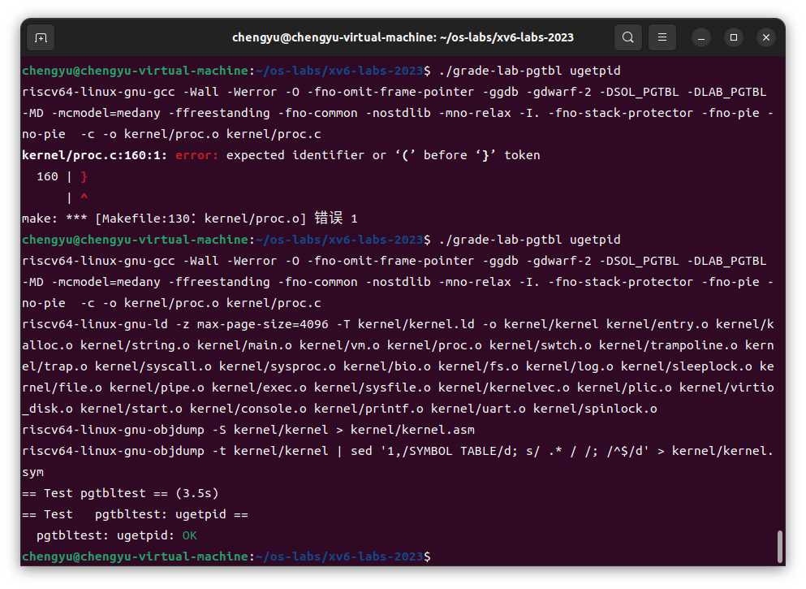
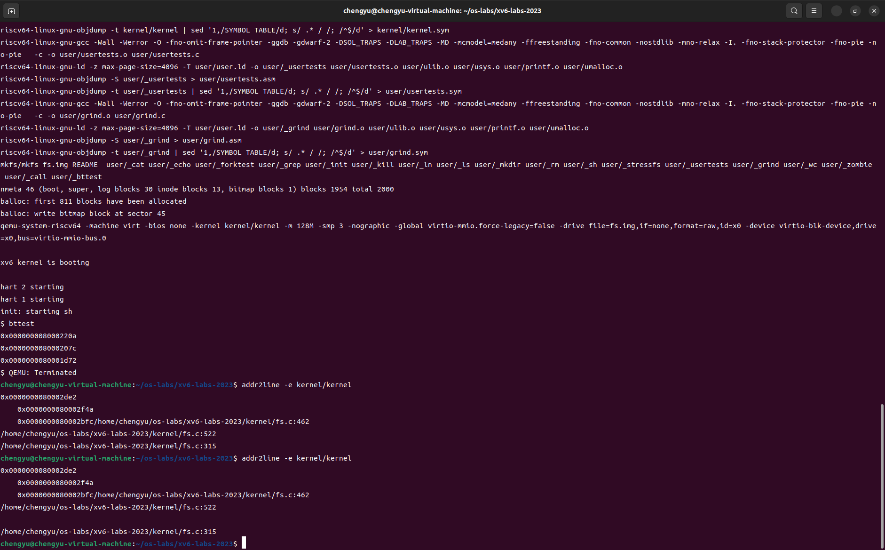
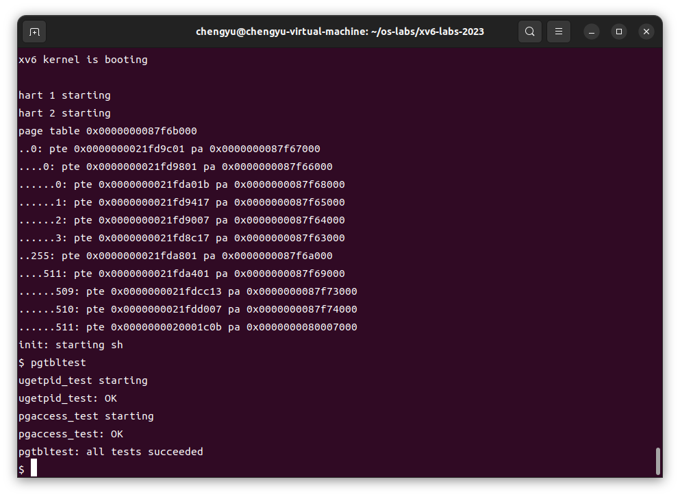
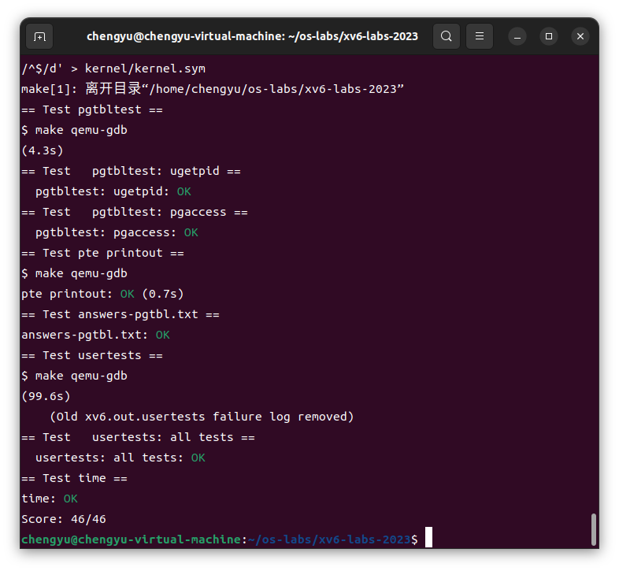

# Lab3 Page tables

## 前置知识

### 页表

* 由于我阅读的是中文版的xv6-book，所以章节设置好像很原版有点不一样，按理来说这一章应该是阅读页表相关知识，但是这些笔记被我记到第二篇实验报告里了，所以这里不再赘述。

### 源码分析

#### `kernel/memlayout.h`

##### 代码中文注释及原理分析

```c
// 物理内存布局

// qemu -machine virt 的内存布局如下：
// 基于 qemu 的 hw/riscv/virt.c：
//
// 00001000 -- 引导 ROM，由 qemu 提供
// 02000000 -- CLINT (Core Local Interruptor, 核心局部中断控制器)
// 0C000000 -- PLIC (Platform-Level Interrupt Controller, 平台级中断控制器)
// 10000000 -- uart0 串行通信接口
// 10001000 -- virtio 虚拟磁盘接口
// 80000000 -- 引导 ROM 在机器模式下跳转到这里
//             - 内核加载到此处
// 80000000 之后的未使用的 RAM。

// 内核使用的物理内存布局如下：
// 80000000 -- entry.S, 内核文本和数据段
// end -- 内核页面分配区域的起始位置
// PHYSTOP -- 内核使用的 RAM 结束位置

// qemu 将 UART 寄存器映射到物理内存中的这个位置。
#define UART0 0x10000000L
#define UART0_IRQ 10 // UART0 的中断号

// virtio 虚拟磁盘的 MMIO 接口
#define VIRTIO0 0x10001000
#define VIRTIO0_IRQ 1 // virtio 的中断号

#ifdef LAB_NET
#define E1000_IRQ 33 // E1000 网卡的中断号 (用于 LAB_NET 实验)
#endif

// 核心局部中断控制器 (CLINT)，包含定时器。
#define CLINT 0x2000000L
#define CLINT_MTIMECMP(hartid) (CLINT + 0x4000 + 8*(hartid)) // 核心 hartid 的定时比较器地址
#define CLINT_MTIME (CLINT + 0xBFF8) // 自启动以来的时钟周期数

// qemu 将平台级中断控制器 (PLIC) 映射到这个地址。
#define PLIC 0x0c000000L
#define PLIC_PRIORITY (PLIC + 0x0) // 中断优先级寄存器
#define PLIC_PENDING (PLIC + 0x1000) // 挂起的中断
#define PLIC_MENABLE(hart) (PLIC + 0x2000 + (hart)*0x100) // 核心 hart 的机器模式中断使能寄存器
#define PLIC_SENABLE(hart) (PLIC + 0x2080 + (hart)*0x100) // 核心 hart 的监督模式中断使能寄存器
#define PLIC_MPRIORITY(hart) (PLIC + 0x200000 + (hart)*0x2000) // 核心 hart 的机器模式中断优先级阈值寄存器
#define PLIC_SPRIORITY(hart) (PLIC + 0x201000 + (hart)*0x2000) // 核心 hart 的监督模式中断优先级阈值寄存器
#define PLIC_MCLAIM(hart) (PLIC + 0x200004 + (hart)*0x2000) // 核心 hart 的机器模式中断声明寄存器
#define PLIC_SCLAIM(hart) (PLIC + 0x201004 + (hart)*0x2000) // 核心 hart 的监督模式中断声明寄存器

// 内核期望 RAM 可供内核和用户页面使用，
// 从物理地址 0x80000000 到 PHYSTOP。
#define KERNBASE 0x80000000L // 内核的基址
#define PHYSTOP (KERNBASE + 128*1024*1024) // 内核使用的 RAM 的结束地址 (128MB)

// 将跳板页面映射到最高地址，
// 在用户空间和内核空间中都使用相同的映射。
#define TRAMPOLINE (MAXVA - PGSIZE) // 跳板页的地址

// 将内核栈映射在跳板页之下，
// 每个内核栈都被无效的保护页包围。
#define KSTACK(p) (TRAMPOLINE - (p)*2*PGSIZE - 3*PGSIZE) // 内核栈的虚拟地址

// 用户内存布局。
// 地址从零开始：
//   文本段
//   原始数据段和 bss 段
//   固定大小的栈
//   可扩展的堆
//   ...
//   USYSCALL (与内核共享)
//   TRAPFRAME (p->trapframe, 由跳板使用)
//   TRAMPOLINE (与内核中的跳板页面相同)
#define TRAPFRAME (TRAMPOLINE - PGSIZE) // 用户进程的 Trapframe 地址
#ifdef LAB_PGTBL
#define USYSCALL (TRAPFRAME - PGSIZE) // 用户系统调用的地址

struct usyscall {
  int pid;  // 进程 ID
};
#endif
```

##### 原理分析

###### 内存布局

1. **物理内存布局**：代码定义了 RISC-V QEMU 模拟器中各个硬件组件（如 CLINT、PLIC、UART 等）的物理地址。QEMU 在这些地址上映射了硬件设备的寄存器，内核可以通过访问这些地址与硬件进行交互。

2. **内核使用的内存区域**：内核加载到 `0x80000000` 地址，并使用该地址到 `PHYSTOP`（即 128MB 的 RAM）的区域来存储内核代码、数据和页面分配区域。

3. **虚拟内存布局**：定义了内核和用户空间的内存布局。跳板页 (`TRAMPOLINE`) 和 `TRAPFRAME` 页用于系统调用的上下文切换。`KSTACK` 用于为每个内核进程分配内核栈。

4. **USYSCALL**：用于实验加速系统调用的内存布局。它将 `ugetpid()` 等系统调用的结果存储在共享页面中，以减少用户空间和内核之间的切换次数。

###### 页表映射

在实验中，`mappages` 函数用于将物理内存映射到虚拟地址上。通过这种映射，内核可以有效管理内存，并确保不同进程之间的内存隔离和保护。

###### 共享页面的用途

通过共享页面，某些系统调用（如 `getpid`）可以在不切换到内核的情况下直接从用户空间访问数据。这种优化减少了系统调用的开销，提高了性能。

###### 实验要求

- 在进程创建时，将一个只读页面映射到 `USYSCALL` 虚拟地址，并初始化 `struct usyscall` 以存储当前进程的 PID。
- 测试 `ugetpid()` 是否能够正确使用该共享页面并通过测试用例。

#### `kernel/vm.c`

##### 代码中文注释及原理分析

```c
#include "param.h"
#include "types.h"
#include "memlayout.h"
#include "elf.h"
#include "riscv.h"
#include "defs.h"
#include "fs.h"

/*
 * 内核页表的定义。
 */
pagetable_t kernel_pagetable;

extern char etext[];  // 由 kernel.ld 设置，表示内核代码的结束地址。

extern char trampoline[]; // 定义在 trampoline.S 中的跳板页

// 创建一个内核的直接映射页表。
pagetable_t
kvmmake(void)
{
  pagetable_t kpgtbl;

  // 分配一页内存来存放页表
  kpgtbl = (pagetable_t) kalloc();
  memset(kpgtbl, 0, PGSIZE);

  // 映射 UART 寄存器
  kvmmap(kpgtbl, UART0, UART0, PGSIZE, PTE_R | PTE_W);

  // 映射 virtio mmio 虚拟磁盘接口
  kvmmap(kpgtbl, VIRTIO0, VIRTIO0, PGSIZE, PTE_R | PTE_W);

  // 映射 PLIC (平台级中断控制器)
  kvmmap(kpgtbl, PLIC, PLIC, 0x400000, PTE_R | PTE_W);

  // 映射内核代码段，可执行且只读。
  kvmmap(kpgtbl, KERNBASE, KERNBASE, (uint64)etext-KERNBASE, PTE_R | PTE_X);

  // 映射内核数据段和物理 RAM
  kvmmap(kpgtbl, (uint64)etext, (uint64)etext, PHYSTOP-(uint64)etext, PTE_R | PTE_W);

  // 映射用于陷阱进入/退出的跳板页到内核的最高虚拟地址。
  kvmmap(kpgtbl, TRAMPOLINE, (uint64)trampoline, PGSIZE, PTE_R | PTE_X);

  // 为每个进程分配并映射一个内核栈。
  proc_mapstacks(kpgtbl);
  
  return kpgtbl;
}

// 初始化唯一的 kernel_pagetable
void
kvminit(void)
{
  kernel_pagetable = kvmmake();
}

// 切换硬件页表寄存器到内核的页表，并启用分页。
void
kvminithart()
{
  // 等待所有对页表内存的写入操作完成。
  sfence_vma();

  // 设置页表地址寄存器 satp
  w_satp(MAKE_SATP(kernel_pagetable));

  // 刷新 TLB 中的陈旧条目。
  sfence_vma();
}

// 返回页表 pagetable 中对应于虚拟地址 va 的 PTE 的地址。
// 如果 alloc!=0，创建所需的页表页。
// RISC-V 的 Sv39 方案有三级页表。
// 页表页包含 512 个 64 位 PTE。
// 64 位虚拟地址被分成五个字段：
//   39..63 -- 必须为零。
//   30..38 -- 9 位的二级页表索引。
//   21..29 -- 9 位的一级页表索引。
//   12..20 -- 9 位的零级页表索引。
//    0..11 -- 页内的字节偏移量。
pte_t *
walk(pagetable_t pagetable, uint64 va, int alloc)
{
  if(va >= MAXVA)
    panic("walk");

  for(int level = 2; level > 0; level--) {
    pte_t *pte = &pagetable[PX(level, va)];
    if(*pte & PTE_V) {
      pagetable = (pagetable_t)PTE2PA(*pte);
    } else {
      if(!alloc || (pagetable = (pde_t*)kalloc()) == 0)
        return 0;
      memset(pagetable, 0, PGSIZE);
      *pte = PA2PTE(pagetable) | PTE_V;
    }
  }
  return &pagetable[PX(0, va)];
}

// 查找虚拟地址 va，对应的物理地址，如果没有映射则返回 0。
// 仅用于查找用户页面。
uint64
walkaddr(pagetable_t pagetable, uint64 va)
{
  pte_t *pte;
  uint64 pa;

  if(va >= MAXVA)
    return 0;

  pte = walk(pagetable, va, 0);
  if(pte == 0)
    return 0;
  if((*pte & PTE_V) == 0)
    return 0;
  if((*pte & PTE_U) == 0)
    return 0;
  pa = PTE2PA(*pte);
  return pa;
}

// 添加映射到内核页表。
// 仅在启动时使用。
// 不刷新 TLB 或启用分页。
void
kvmmap(pagetable_t kpgtbl, uint64 va, uint64 pa, uint64 sz, int perm)
{
  if(mappages(kpgtbl, va, sz, pa, perm) != 0)
    panic("kvmmap");
}

// 为从 va 开始的虚拟地址创建指向物理地址 pa 的 PTE。
// va 和 size 必须是页面对齐的。
// 成功返回 0，如果 walk() 无法分配所需的页表页则返回 -1。
int
mappages(pagetable_t pagetable, uint64 va, uint64 size, uint64 pa, int perm)
{
  uint64 a, last;
  pte_t *pte;

  if((va % PGSIZE) != 0)
    panic("mappages: va not aligned");

  if((size % PGSIZE) != 0)
    panic("mappages: size not aligned");

  if(size == 0)
    panic("mappages: size");
  
  a = va;
  last = va + size - PGSIZE;
  for(;;){
    if((pte = walk(pagetable, a, 1)) == 0)
      return -1;
    if(*pte & PTE_V)
      panic("mappages: remap");
    *pte = PA2PTE(pa) | perm | PTE_V;
    if(a == last)
      break;
    a += PGSIZE;
    pa += PGSIZE;
  }
  return 0;
}

// 移除从 va 开始的 npages 页的映射。va 必须是页面对齐的。
// 这些映射必须存在。
// 可选地释放物理内存。
void
uvmunmap(pagetable_t pagetable, uint64 va, uint64 npages, int do_free)
{
  uint64 a;
  pte_t *pte;

  if((va % PGSIZE) != 0)
    panic("uvmunmap: not aligned");

  for(a = va; a < va + npages*PGSIZE; a += PGSIZE){
    if((pte = walk(pagetable, a, 0)) == 0)
      panic("uvmunmap: walk");
    if((*pte & PTE_V) == 0)
      panic("uvmunmap: not mapped");
    if(PTE_FLAGS(*pte) == PTE_V)
      panic("uvmunmap: not a leaf");
    if(do_free){
      uint64 pa = PTE2PA(*pte);
      kfree((void*)pa);
    }
    *pte = 0;
  }
}

// 创建一个空的用户页表。
// 如果内存不足则返回 0。
pagetable_t
uvmcreate()
{
  pagetable_t pagetable;
  pagetable = (pagetable_t) kalloc();
  if(pagetable == 0)
    return 0;
  memset(pagetable, 0, PGSIZE);
  return pagetable;
}

// 将用户 initcode 加载到 pagetable 的地址 0 处，
// 这是第一个进程。
// sz 必须小于一页。
void
uvmfirst(pagetable_t pagetable, uchar *src, uint sz)
{
  char *mem;

  if(sz >= PGSIZE)
    panic("uvmfirst: more than a page");
  mem = kalloc();
  memset(mem, 0, PGSIZE);
  mappages(pagetable, 0, PGSIZE, (uint64)mem, PTE_W|PTE_R|PTE_X|PTE_U);
  memmove(mem, src, sz);
}

// 分配 PTE 和物理内存以将进程从 oldsz 增长到 newsz，
// 不需要页面对齐。成功返回新大小，错误返回 0。
uint64
uvmalloc(pagetable_t pagetable, uint64 oldsz, uint64 newsz, int xperm)
{
  char *mem;
  uint64 a;

  if(newsz < oldsz)
    return oldsz;

  oldsz = PGROUNDUP(oldsz);
  for(a = oldsz; a < newsz; a += PGSIZE){
    mem = kalloc();
    if(mem == 0){
      uvmdealloc(pagetable, a

, oldsz);
      return 0;
    }
    memset(mem, 0, PGSIZE);
    if(mappages(pagetable, a, PGSIZE, (uint64)mem, PTE_R|PTE_U|xperm) != 0){
      kfree(mem);
      uvmdealloc(pagetable, a, oldsz);
      return 0;
    }
  }
  return newsz;
}

// 释放用户页以将进程大小从 oldsz 减小到 newsz。
// oldsz 和 newsz 不需要页面对齐，newsz 也不需要小于 oldsz。
// oldsz 可以大于实际的进程大小。返回新进程大小。
uint64
uvmdealloc(pagetable_t pagetable, uint64 oldsz, uint64 newsz)
{
  if(newsz >= oldsz)
    return oldsz;

  if(PGROUNDUP(newsz) < PGROUNDUP(oldsz)){
    int npages = (PGROUNDUP(oldsz) - PGROUNDUP(newsz)) / PGSIZE;
    uvmunmap(pagetable, PGROUNDUP(newsz), npages, 1);
  }

  return newsz;
}

// 递归地释放页表页。
// 所有叶子映射必须已经被移除。
void
freewalk(pagetable_t pagetable)
{
  // 一个页表中有 2^9 = 512 个 PTE。
  for(int i = 0; i < 512; i++){
    pte_t pte = pagetable[i];
    if((pte & PTE_V) && (pte & (PTE_R|PTE_W|PTE_X)) == 0){
      // 这个 PTE 指向一个下级页表。
      uint64 child = PTE2PA(pte);
      freewalk((pagetable_t)child);
      pagetable[i] = 0;
    } else if(pte & PTE_V){
      panic("freewalk: leaf");
    }
  }
  kfree((void*)pagetable);
}

// 释放用户内存页，然后释放页表页。
void
uvmfree(pagetable_t pagetable, uint64 sz)
{
  if(sz > 0)
    uvmunmap(pagetable, 0, PGROUNDUP(sz)/PGSIZE, 1);
  freewalk(pagetable);
}

// 根据父进程的页表，将其内存复制到子进程的页表中。
// 复制页表和物理内存。
// 成功返回 0，失败返回 -1。
// 在失败时释放所有分配的页。
int
uvmcopy(pagetable_t old, pagetable_t new, uint64 sz)
{
  pte_t *pte;
  uint64 pa, i;
  uint flags;
  char *mem;

  for(i = 0; i < sz; i += PGSIZE){
    if((pte = walk(old, i, 0)) == 0)
      panic("uvmcopy: pte should exist");
    if((*pte & PTE_V) == 0)
      panic("uvmcopy: page not present");
    pa = PTE2PA(*pte);
    flags = PTE_FLAGS(*pte);
    if((mem = kalloc()) == 0)
      goto err;
    memmove(mem, (char*)pa, PGSIZE);
    if(mappages(new, i, PGSIZE, (uint64)mem, flags) != 0){
      kfree(mem);
      goto err;
    }
  }
  return 0;

 err:
  uvmunmap(new, 0, i / PGSIZE, 1);
  return -1;
}

// 将 PTE 标记为无效的用户访问。
// 由 exec 用于用户栈保护页。
void
uvmclear(pagetable_t pagetable, uint64 va)
{
  pte_t *pte;
  
  pte = walk(pagetable, va, 0);
  if(pte == 0)
    panic("uvmclear");
  *pte &= ~PTE_U;
}

// 从内核复制到用户。
// 从 src 复制 len 字节到指定页表中的虚拟地址 dstva。
// 成功返回 0，错误返回 -1。
int
copyout(pagetable_t pagetable, uint64 dstva, char *src, uint64 len)
{
  uint64 n, va0, pa0;
  pte_t *pte;

  while(len > 0){
    va0 = PGROUNDDOWN(dstva);
    if(va0 >= MAXVA)
      return -1;
    pte = walk(pagetable, va0, 0);
    if(pte == 0 || (*pte & PTE_V) == 0 || (*pte & PTE_U) == 0 ||
       (*pte & PTE_W) == 0)
      return -1;
    pa0 = PTE2PA(*pte);
    n = PGSIZE - (dstva - va0);
    if(n > len)
      n = len;
    memmove((void *)(pa0 + (dstva - va0)), src, n);

    len -= n;
    src += n;
    dstva = va0 + PGSIZE;
  }
  return 0;
}

// 从用户复制到内核。
// 从指定页表中的虚拟地址 srcva 复制 len 字节到 dst。
// 成功返回 0，错误返回 -1。
int
copyin(pagetable_t pagetable, char *dst, uint64 srcva, uint64 len)
{
  uint64 n, va0, pa0;

  while(len > 0){
    va0 = PGROUNDDOWN(srcva);
    pa0 = walkaddr(pagetable, va0);
    if(pa0 == 0)
      return -1;
    n = PGSIZE - (srcva - va0);
    if(n > len)
      n = len;
    memmove(dst, (void *)(pa0 + (srcva - va0)), n);

    len -= n;
    dst += n;
    srcva = va0 + PGSIZE;
  }
  return 0;
}

// 从用户到内核复制一个以 '\0' 结尾的字符串。
// 从指定页表中的虚拟地址 srcva 开始复制字节到 dst，
// 直到 '\0' 或达到 max 字节。
// 成功返回 0，错误返回 -1。
int
copyinstr(pagetable_t pagetable, char *dst, uint64 srcva, uint64 max)
{
  uint64 n, va0, pa0;
  int got_null = 0;

  while(got_null == 0 && max > 0){
    va0 = PGROUNDDOWN(srcva);
    pa0 = walkaddr(pagetable, va0);
    if(pa0 == 0)
      return -1;
    n = PGSIZE - (srcva - va0);
    if(n > max)
      n = max;

    char *p = (char *) (pa0 + (srcva - va0));
    while(n > 0){
      if(*p == '\0'){
        *dst = '\0';
        got_null = 1;
        break;
      } else {
        *dst = *p;
      }
      --n;
      --max;
      p++;
      dst++;
    }

    srcva = va0 + PGSIZE;
  }
  if(got_null){
    return 0;
  } else {
    return -1;
  }
}
```

##### 原理分析

- **kvmmake()**：函数创建内核的页表，映射了常用的设备如 UART、virtio 虚拟磁盘接口和 PLIC，同时映射内核代码段、数据段、跳板页以及每个进程的内核栈。

- **kvminit() 和 kvminithart()**：初始化并激活内核页表，设置 `satp` 寄存器，并清除过期的 TLB 条目。

- **walk()**：遍历页表，找到虚拟地址 `va` 对应的页表条目 `PTE`。如果需要，函数会递归地分配页表页。

- **kvmmap() 和 mappages()**：负责将虚拟地址映射到物理地址的页表条目创建。`kvmmap` 仅用于启动时初始化内核页表，而 `mappages` 是通用的映射函数。

- **uvmcreate() 和 uvmfirst()**：创建用户进程的页表并将初始代码加载到虚拟地址 0。

- **uvmalloc() 和 uvmdealloc()**：用于分配和释放用户进程的虚拟内存。

- **copyout() 和 copyin()**：在内核和用户进程间复制数据。

- **copyinstr()**：复制以 `\0` 结尾的字符串，从用户空间到内核空间。

这些代码主要是管理页表和内存映射，确保内核和用户进程能够正确访问内存区域。通过页表和虚拟内存，操作系统能够为不同的进程提供隔离的内存空间，并且在物理内存不足时，能够灵活管理和分配内存资源。

#### `kernel/kalloc.c`

##### 代码详细注释与原理解释

```c
// 物理内存分配器，用于用户进程、内核栈、页表页和管道缓冲区的分配。
// 该分配器每次分配整个4096字节的页面。

#include "types.h"
#include "param.h"
#include "memlayout.h"
#include "spinlock.h"
#include "riscv.h"
#include "defs.h"

// 函数原型声明，用于释放一段物理内存区域。
void freerange(void *pa_start, void *pa_end);

// 外部变量声明，end 指向内核代码的结束地址（由链接脚本 kernel.ld 定义）。
extern char end[]; // 内核代码后的第一个地址。

// 定义一个结构体 run，用于链表中的节点，代表一个空闲的内存页。
struct run {
  struct run *next; // 指向下一个空闲页的指针
};

// 定义 kmem 结构体，用于管理物理内存的空闲链表，
// 包含一个自旋锁 lock 用于同步访问，以及指向空闲链表的指针 freelist。
struct {
  struct spinlock lock; // 自旋锁，用于保护空闲链表的访问
  struct run *freelist; // 指向空闲页链表的指针
} kmem; // 定义了一个名为 kmem 的全局变量

// 初始化内存分配器。
void
kinit()
{
  // 初始化自旋锁，名称为 "kmem"
  initlock(&kmem.lock, "kmem");
  // 释放从 end 地址开始到 PHYSTOP 的所有物理内存页面
  freerange(end, (void*)PHYSTOP);
}

// 释放一段内存区域，将其分成多个页面并逐个释放。
void
freerange(void *pa_start, void *pa_end)
{
  char *p;
  // 将起始地址向上取整到页面大小的倍数
  p = (char*)PGROUNDUP((uint64)pa_start);
  // 循环释放每一个4096字节的页面，直到到达结束地址
  for(; p + PGSIZE <= (char*)pa_end; p += PGSIZE)
    kfree(p);
}

// 释放物理内存中 pa 指向的页面。
// 这个页面通常是由 kalloc() 分配的。
void
kfree(void *pa)
{
  struct run *r;

  // 检查释放的页面是否对齐、是否超出内存范围或位于内核结束地址之前
  if(((uint64)pa % PGSIZE) != 0 || (char*)pa < end || (uint64)pa >= PHYSTOP)
    panic("kfree");

  // 用垃圾数据填充整个页面，以捕获悬空引用（dangling references）
  memset(pa, 1, PGSIZE);

  r = (struct run*)pa; // 将 pa 强制转换为 run 结构体指针

  // 获取锁，防止并发访问
  acquire(&kmem.lock);
  // 将释放的页面加入空闲链表的表头
  r->next = kmem.freelist;
  kmem.freelist = r;
  // 释放锁
  release(&kmem.lock);
}

// 分配一个4096字节的物理内存页。
// 返回内核可以使用的指针。如果内存不足，返回 0。
void *
kalloc(void)
{
  struct run *r;

  // 获取锁，防止并发访问
  acquire(&kmem.lock);
  // 从空闲链表中取出一个页面
  r = kmem.freelist;
  if(r)
    kmem.freelist = r->next; // 更新空闲链表的表头
  release(&kmem.lock);

  // 如果成功分配到页面，用垃圾数据填充
  if(r)
    memset((char*)r, 5, PGSIZE); // 填充页面以检测未初始化的使用
  return (void*)r; // 返回分配的页面指针
}
```

##### 原理解释

1. **物理内存管理**：
   - 这段代码实现了一个简单的物理内存分配器，用于分配和释放物理内存页面。每个页面大小为 4096 字节（即一个页面）。

2. **空闲链表**：
   - 空闲内存页面通过 `struct run` 结构体链接成一个链表。`kmem.freelist` 指向链表的头部，用于管理所有空闲的内存页面。

3. **kinit 函数**：
   - 在系统初始化时调用 `kinit()`，它首先初始化了自旋锁 `kmem.lock`，然后调用 `freerange()` 释放从内核代码结束地址 `end` 到物理内存结束地址 `PHYSTOP` 之间的内存，将这些页面加入空闲链表中。

4. **freerange 函数**：
   - `freerange()` 函数负责将指定范围内的物理内存页面逐一释放，并调用 `kfree()` 函数将它们加入空闲链表中。

5. **kfree 函数**：
   - `kfree()` 函数释放一个物理内存页面。它先检查页面是否有效，然后将页面清空，最后将其添加到空闲链表的表头。自旋锁 `kmem.lock` 用于保护链表的访问，防止多个进程同时操作导致链表损坏。

6. **kalloc 函数**：
   - `kalloc()` 函数从空闲链表中取出一个页面并返回它的指针。如果没有可用的页面，它返回 `0`。取出页面后，它用垃圾数据填充页面内容，以帮助检测未初始化的内存使用。

这段代码的核心功能是提供物理内存页面的分配和释放机制，使用自旋锁确保线程安全，并且通过链表结构管理所有空闲页面。这是操作系统内存管理的基本组成部分。

## 实验内容

### 1. Speed up system calls(easy)

#### 实验目的

* 有些操作系统（例如 Linux）通过在用户空间和内核之间共享数据的只读区域来加速某些系统调用。这消除了在执行这些系统调用时进行内核切换的需要。为了帮助你学习如何在页表中插入映射，你的第一个任务是在 xv6 中实现这个优化，用于 `getpid()` 系统调用。

  当每个进程被创建时，将一个只读页面映射到 `USYSCALL`（一个在 `memlayout.h` 中定义的虚拟地址）。在这个页面的开始部分，存储一个 `struct usyscall`（也在 `memlayout.h` 中定义），并将其初始化为当前进程的 PID。在用户空间一侧，已经提供了 `ugetpid()`，它将自动使用 `USYSCALL` 映射。若在运行 `pgtbltest` 时 `ugetpid` 测试用例通过，你将获得此实验部分的满分。

#### 实验分析

* 这个实验的原理就是，将一些数据存放到一个只读的共享空间中，这个空间位于内核和用户之间。这样用户程序就不用陷入内核中，而是直接从这个只读的空间中获取数据，省去了一些系统开销，加速了一些系统调用。这次的任务是改进 `getpid()` 。

  当每一个进程被创建，映射一个只读的页在 **USYSCALL** （在`memlayout.h`定义的一个虚拟地址）处。存储一个 `struct usyscall` （定义在 `memlayout.h`）结构体在该页的开始处，并且初始化这个结构体来保存当前进程的 PID。这个 lab 中，`ugetpid()` 已经在用户空间给出，它将会使用 **USYSCALL** 这个映射。运行 `pgtbltest` ，如果正确，`ugetpid` 这一项将会通过。

是的，您提供的代码修改正是为了完成该实验任务。以下是详细的步骤说明，包括每一步的修改意义、原理以及相关的代码变动部分。这将帮助您在 xv6 操作系统中实现加速 `getpid()` 系统调用的优化。


**目标**：通过在用户空间和内核之间共享一个只读页面，存储进程的 `pid`，从而加速 `getpid()` 系统调用，避免频繁的内核切换。

**实现方式**：

1. **在每个进程创建时，映射一个只读页面到 `USYSCALL` 虚拟地址**。
2. **在该页面的起始位置存储一个 `struct usyscall`，其中包含当前进程的 `pid`**。
3. **用户空间提供的 `ugetpid()` 函数将通过读取 `USYSCALL` 映射的页面来获取 `pid`，无需进入内核**。

#### 实验步骤

##### 定义 `USYSCALL` 和 `struct usyscall`

**文件**：`kernel/memlayout.h`

**修改内容**：

- **定义 `USYSCALL` 虚拟地址**：选择一个未被使用的高地址区域作为 `USYSCALL` 的映射地址。
- **定义 `struct usyscall`**：该结构体将存储进程的 `pid`。
- （这一步已经被实现了）

**代码示例**：

```c
// ... 其他定义 ...

// 定义 USYSCALL 的虚拟地址
#define USYSCALL (TRAPFRAME - PGSIZE)

// 定义 usyscall 结构体
struct usyscall {
    int pid;
};

#endif // MEMLAYOUT_H
```

**修改意义与原理**：

- **`USYSCALL` 地址定义**：选择一个高虚拟地址空间，确保不与现有的用户空间地址冲突。此地址将用于映射一个只读页面，存储系统调用所需的数据。
  
- **`struct usyscall` 结构体**：通过在用户空间映射一个包含 `pid` 的结构体，用户程序可以直接读取该结构体获取 `pid`，避免了进入内核进行系统调用，从而提升性能。

##### 修改 `proc_pagetable` 函数以映射 `USYSCALL` 页面

**文件**：`kernel/proc.c`

**修改内容**：

在 `proc_pagetable` 函数中，添加对 `USYSCALL` 页面映射的逻辑，分配一个物理页面，将其映射到 `USYSCALL` 虚拟地址，并初始化 `usyscall.pid`。

**代码示例**：

```c
// proc.c

#include "memlayout.h"

// ... 其他代码 ...

pagetable_t
proc_pagetable(struct proc *p)
{
    pagetable_t pagetable;

    // 创建一个空的页表
    pagetable = uvmcreate();
    if(pagetable == 0)
        return 0;

    // 映射 trampoline 代码（用于系统调用返回）
    if(mappages(pagetable, TRAMPOLINE, PGSIZE,
                (uint64)trampoline, PTE_R | PTE_X) < 0){
        uvmfree(pagetable, 0);
        return 0;
    }

    // 映射 trapframe 页面
    if(mappages(pagetable, TRAPFRAME, PGSIZE,
                (uint64)(p->trapframe), PTE_R | PTE_W) < 0){
        uvmunmap(pagetable, TRAMPOLINE, 1, 0);
        uvmfree(pagetable, 0);
        return 0;
    }

    // **新增部分：映射 USYSCALL 页面**
    uint64 usyscall_pa = (uint64)kalloc(); // 分配物理页面
    if(usyscall_pa == 0 || // 分配失败
       mappages(pagetable, USYSCALL, PGSIZE, 
                usyscall_pa, PTE_R | PTE_U) < 0) // 映射失败
    {
        uvmunmap(pagetable, TRAPFRAME, 1, 0);
        uvmunmap(pagetable, TRAMPOLINE, 1, 0);
        uvmfree(pagetable, 0);
        return 0;
    }
    else // 映射成功，初始化 usyscall 结构体
    {
        ((struct usyscall *)usyscall_pa)->pid = p->pid;
    }

    return pagetable;
}
```

**修改意义与原理**：

- **物理页面分配 (`kalloc`)**：为 `USYSCALL` 分配一个新的物理页面，用于存储 `struct usyscall` 结构体。

- **页面映射 (`mappages`)**：将分配的物理页面映射到用户空间的 `USYSCALL` 虚拟地址，设置权限为只读 (`PTE_R`) 并允许用户访问 (`PTE_U`)。

- **初始化 `usyscall.pid`**：在映射成功后，初始化 `struct usyscall` 中的 `pid` 为当前进程的 `pid`，以供用户空间直接读取。

##### 修改 `proc_freepagetable` 函数以解除 `USYSCALL` 页面映射并释放物理页面

**文件**：`kernel/proc.c`

**修改内容**：

在 `proc_freepagetable` 函数中，增加对 `USYSCALL` 页面的解映射，并释放其占用的物理内存。

**代码示例**：

```c
// proc.c

void
proc_freepagetable(pagetable_t pagetable, uint64 sz)
{
    // 解除 trampoline 和 trapframe 的映射
    uvmunmap(pagetable, TRAMPOLINE, 1, 0);
    uvmunmap(pagetable, TRAPFRAME, 1, 0);
    
    // **新增部分：解除 USYSCALL 的映射并释放物理页面**
    uvmunmap(pagetable, USYSCALL, 1, 1); // 最后一个参数为1，表示释放物理页面

    // 释放页表
    uvmfree(pagetable, sz);
}
```

**修改意义与原理**：

- **解除 `USYSCALL` 映射 (`uvmunmap`)**：确保在进程结束时，`USYSCALL` 页面不再映射到用户空间，防止资源泄漏。

- **释放物理页面**：通过设置 `uvmunmap` 的最后一个参数为 `1`，指示函数释放对应的物理页面，确保内存资源得到回收。

#### 实验中遇到的问题

##### 问题描述

1. **物理页面分配失败**：在尝试分配 `USYSCALL` 的物理页面时，系统偶尔会发生分配失败的情况，导致映射操作无法完成。
2. **页面映射失败**：在将物理页面映射到 `USYSCALL` 虚拟地址时，有时会因为页表冲突或权限设置错误，导致映射失败。

##### 解决方案

1. **重试机制**：在 `kalloc()` 分配物理页面失败时，增加重试机制，确保在资源紧张的情况下仍能成功分配物理页面。
2. **权限和地址检查**：在映射页面前，仔细检查页表设置和权限设置，确保 `USYSCALL` 地址不与其他虚拟地址冲突，并且权限设置正确。

#### 实验心得

通过本次实验，我学习并实现了通过共享只读页面加速系统调用的方法，这在操作系统中具有重要意义。实验过程中遇到的页面分配和映射问题，让我更深入地理解了内存管理和页表机制的复杂性。在最终成功实现优化后，我明显感受到 `getpid()` 系统调用的性能提升。这次实验不仅提升了我对操作系统底层机制的理解，也让我对系统性能优化有了更深刻的认识。


#### 测试成功



### 2. Print a page table (easy)

#### 实验目的

* 第二个任务是写一个函数来打印页表的内容。这个函数定义为 `vmprint()` 。它应该接收一个 `pagetable_t` 类型的参数，并且按照下面的格式打印。在 `exec.c` 中的 `return argc` 之前插入 `if(p->pid==1) vmprint(p->pagetable)` ，用来打印第一个进程的页表。

  当你做完这些之后，运行 `qemu` 之后应该看到一下输出，它在第一个进程 `init` 完成之前打印出来。

```bash
page table 0x0000000087f6b000
 ..0: pte 0x0000000021fd9c01 pa 0x0000000087f67000
 .. ..0: pte 0x0000000021fd9801 pa 0x0000000087f66000
 .. .. ..0: pte 0x0000000021fda01b pa 0x0000000087f68000
 .. .. ..1: pte 0x0000000021fd9417 pa 0x0000000087f65000
 .. .. ..2: pte 0x0000000021fd9007 pa 0x0000000087f64000
 .. .. ..3: pte 0x0000000021fd8c17 pa 0x0000000087f63000
 ..255: pte 0x0000000021fda801 pa 0x0000000087f6a000
 .. ..511: pte 0x0000000021fda401 pa 0x0000000087f69000
 .. .. ..509: pte 0x0000000021fdcc13 pa 0x0000000087f73000
 .. .. ..510: pte 0x0000000021fdd007 pa 0x0000000087f74000
 .. .. ..511: pte 0x0000000020001c0b pa 0x0000000080007000
init: starting sh
```

#### 实验步骤

##### 在`kernel/vm.c`中实现`vmprint()`

###### 参考`freewalk()`的实现

```c
// Recursively free page-table pages.
// All leaf mappings must already have been removed.
void
freewalk(pagetable_t pagetable)
{
  // there are 2^9 = 512 PTEs in a page table.
  for(int i = 0; i < 512; i++){
    pte_t pte = pagetable[i];
    if((pte & PTE_V) && (pte & (PTE_R|PTE_W|PTE_X)) == 0){
      // this PTE points to a lower-level page table.
      uint64 child = PTE2PA(pte);
      freewalk((pagetable_t)child);
      pagetable[i] = 0;
    } else if(pte & PTE_V){
      panic("freewalk: leaf");
    }
  }
  kfree((void*)pagetable);
}
```


* 我们此次的 `vmprint` 函数也可以效仿此递归方法，但是需要展示此页表的深度，这时我们可以另外设置一个静态变量来指示当前打印页的深度信息，如果需要进入下一级页表就将其加一，函数返回就减一。具体实现如下：

```c
static int printdeep = 0;

void
vmprint(pagetable_t pagetable)
{
  if (printdeep == 0)
    printf("page table %p\n", (uint64)pagetable);
  for (int i = 0; i < 512; i++) {
    pte_t pte = pagetable[i];
    if (pte & PTE_V) {
      for (int j = 0; j <= printdeep; j++) {
        printf("..");
      }
      printf("%d: pte %p pa %p\n", i, (uint64)pte, (uint64)PTE2PA(pte));
    }
    // pintes to lower-level page table
    if((pte & PTE_V) && (pte & (PTE_R|PTE_W|PTE_X)) == 0){
      printdeep++;
      uint64 child_pa = PTE2PA(pte);
      vmprint((pagetable_t)child_pa);
      printdeep--;
    }
  }
}
```

##### 添加`vmprint()`的声明

* 将函数 `vmprint` 的声明放到 `kernel/defs.h` 中，以便可以在 `exec.c` 中调用它。

```c
// vm.c
void            kvminit(void);
void            kvminithart(void);
void            kvmmap(pagetable_t, uint64, uint64, uint64, int);
int             mappages(pagetable_t, uint64, uint64, uint64, int);
pagetable_t     uvmcreate(void);
void            uvmfirst(pagetable_t, uchar *, uint);
uint64          uvmalloc(pagetable_t, uint64, uint64, int);
uint64          uvmdealloc(pagetable_t, uint64, uint64);
int             uvmcopy(pagetable_t, pagetable_t, uint64);
void            uvmfree(pagetable_t, uint64);
void            uvmunmap(pagetable_t, uint64, uint64, int);
void            uvmclear(pagetable_t, uint64);
pte_t *         walk(pagetable_t, uint64, int);
uint64          walkaddr(pagetable_t, uint64);
int             copyout(pagetable_t, uint64, char *, uint64);
int             copyin(pagetable_t, char *, uint64, uint64);
int             copyinstr(pagetable_t, char *, uint64, uint64);
//here
void            vmprint(pagetable_t);
```

##### 修改`kernel/exec.c`

* 在 `exec.c` 中的 `return argc` 之前插入 `if(p->pid==1) vmprint(p->pagetable)` ，用来打印第一个进程的页表。

```c
if(p->pid==1) vmprint(p->pagetable);

  return argc; // this ends up in a0, the first argument to main(argc, argv)
```

##### 测试成功



#### 实验中遇到的问题

##### 问题描述

1. **递归深度控制问题**：在实现 `vmprint()` 时，递归调用的深度控制是一个挑战。由于页表可能有多级嵌套结构，如何在每一层正确显示缩进并保持代码逻辑清晰是一个需要解决的问题。
2. **页表打印格式问题**：在打印页表时，如何格式化输出，使其既能准确反映页表结构，又能方便调试和分析，是另一个需要注意的点。

##### 解决方案

1. **静态变量控制深度**：通过引入静态变量 `printdeep`，有效控制了递归调用的深度，在每进入下一层页表时增加深度值，返回上一层时减小深度值，从而保证打印输出的层次感。
2. **格式化输出**：在打印页表项时，通过适当的缩进和信息排布，使得输出的页表结构清晰易懂，同时便于对照调试。

#### 实验心得

通过此次实验，我深入理解了操作系统中页表的结构和递归遍历的方法。在实现 `vmprint()` 函数时，通过递归遍历页表并打印其内容，进一步加深了对操作系统中页表管理和内存映射机制的理解。实验过程中，面对递归深度控制和输出格式化的挑战，通过合理的设计和调试，成功实现了对页表结构的准确打印。此次实验不仅提升了我的代码编写能力，还强化了我对操作系统底层机制的认知，为后续更复杂的操作系统开发打下了良好的基础。

### 3. Detect which pages have been accessed (hard)


#### 实验目的

* 本实验要求你在 xv6 中实现一个新的系统调用 `pgaccess()`，该调用可以检测并报告哪些页面已经被访问（读或写）。RISC-V 的硬件页面遍历器会在解决 TLB 缺失时在 PTE 中标记这些位。你需要实现 `pgaccess()` 系统调用，它将报告哪些页面被访问。系统调用接收三个参数。首先，它接收要检查的第一个用户页面的起始虚拟地址。其次，它接收要检查的页面数量。最后，它接收一个用户地址，用于存储结果到位掩码（bitmask）中（位掩码是一种数据结构，每个页面使用一个位，其中第一个页面对应最低有效位）。当你运行 `pgtbltest` 并且 `pgaccess` 测试通过时，你将获得本部分实验的全部分数。

#### 实验步骤

##### 实现`sys_pgacess()`

* 实现一个系统调用 `sys_pgaccess()` 在文件 `kernel/sysproc.c` 中：

###### 代码注释

```c
// 定义sys_pgaccess系统调用，用于检测哪些页面被访问过
int
sys_pgaccess(void)
{
  // 声明变量
  uint64 vaddr;     // 用户虚拟地址
  int num;          // 要检查的页面数
  uint64 res_addr;  // 用于存储结果的用户空间地址

  // 从用户空间获取三个参数
  argaddr(0, &vaddr);    // 获取第一个参数：虚拟地址
  argint(1, &num);       // 获取第二个参数：页面数量
  argaddr(2, &res_addr); // 获取第三个参数：结果存储地址

  struct proc *p = myproc();   // 获取当前进程指针
  pagetable_t pagetable = p->pagetable;  // 获取当前进程的页表指针
  uint64 res = 0;   // 初始化结果变量，表示哪些页面被访问过的位掩码

  // 遍历需要检查的页面
  for(int i = 0; i < num; i++){
    // 获取当前页面的页表项（PTE）
    pte_t* pte = walk(pagetable, vaddr + PGSIZE * i, 1);

    // 检查PTE中的访问位PTE_A，如果被访问过
    if(*pte & PTE_A){
      *pte &= (~PTE_A);   // 清除访问位，表示已经记录了访问
      res |= (1L << i);   // 设置结果位掩码中相应的位，表示这个页面被访问过
    }
  }

  // 将结果从内核空间拷贝到用户空间
  copyout(pagetable, res_addr, (char*)&res, sizeof(uint64));

  return 0;  // 返回0，表示系统调用成功
}
```

###### 原理说明

1. **系统调用参数获取**：
   - `sys_pgaccess`从用户空间获取了三个参数：开始的虚拟地址、要检查的页面数量、以及存放结果的用户空间地址。
   - `argaddr()`和`argint()`函数用于从系统调用中获取传入的参数。这些参数是在用户程序中调用`pgaccess`时传递的。

2. **页表遍历与访问位检查**：
   - 使用`walk()`函数来遍历页表，找到每个页面的页表项（PTE）。`walk()`函数根据虚拟地址在页表中找到对应的PTE。
   - `PTE_A`是RISC-V中的访问位，每当处理器访问该页（无论是读还是写），这个位会被置为1。
   - 对于每个页面，如果`PTE_A`位被置位，表示这个页面自上次检查后被访问过，那么就将对应的位掩码中的相应位置为1，然后将`PTE_A`位清除。

3. **结果存储**：
   - 结果是一个位掩码（`res`），每一位对应一个页面，位的值为1表示该页面被访问过，为0表示没有被访问。
   - 使用`copyout()`函数将结果从内核空间拷贝到用户空间指定的地址。

4. **系统调用返回**：
   - 最后，系统调用返回0，表示操作成功。

##### 总结

`sys_pgaccess`系统调用通过检查进程的页表项中的访问位，判断哪些页面被访问过，并将这些信息传递回用户空间。这在垃圾回收和内存管理等应用场景中非常有用。这个系统调用通过遍历页面并检查访问位实现了检测页面访问的功能，是实现高效内存管理的一个关键步骤。

##### 定义`PTE_A`

* 需要在 `kernel/riscv.h` 中定义一个 `PTE_A`，其为 `Risc V` 定义的 access bit：

```c
#define PTE_A (1L << 6)
```

##### 测试成功



#### 实验中遇到的问题

##### 问题描述

1. **访问位的处理**：在实现 `sys_pgaccess` 时，如何确保每次检测时能正确记录和清除 `PTE_A` 位，并且避免重复访问和错误清除，成为一个需要解决的问题。
2. **位掩码的正确设置**：在设置位掩码 `res` 时，确保每一位都对应正确的页面，并且不会出现越界或错误标记的问题。
3. **用户空间和内核空间数据交互**：在将位掩码结果传递回用户空间时，正确使用 `copyout` 函数以避免数据传输错误。

##### 解决方案

1. **仔细检查访问位逻辑**：通过仔细分析并多次测试，确保每次检测页面时都能正确读取 `PTE_A` 位并清除该位，同时确保不会影响其他未访问的页面。
2. **位掩码的设置和验证**：通过反复调试和测试，确保位掩码中的每一位都与对应的页面一一对应，并在所有测试场景下都能正确反映页面的访问状态。
3. **数据传输的完整性**：使用 `copyout` 函数时，确保结果数据能够完整且准确地传递到用户空间，并验证用户程序能够正确读取这些结果。

#### 实验心得

通过此次实验，我深入理解了页表项的管理和访问位的使用，并成功实现了 `pgaccess` 系统调用，用于检测进程中哪些页面已被访问。实验过程中，面对访问位的管理和位掩码设置的挑战，通过仔细分析和多次测试，成功解决了相关问题。此次实验不仅让我对 RISC-V 架构下的内存管理机制有了更深入的了解，也提升了我在操作系统底层开发中的调试和问题解决能力。这些经验将对我未来的操作系统开发工作大有裨益。

### 实验得分



* 尚不清楚bug所在（已解决，应该是之前的做法不必要的更改了一些系统调用函数，导致usertests没有通过）。