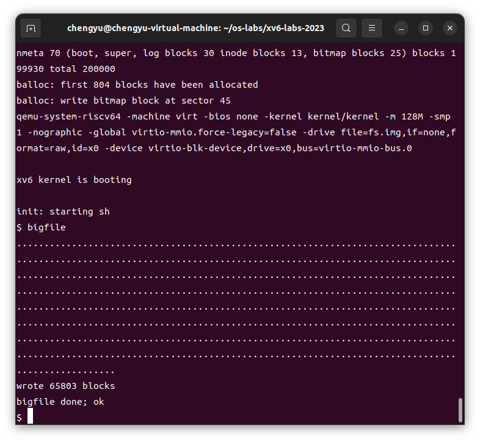
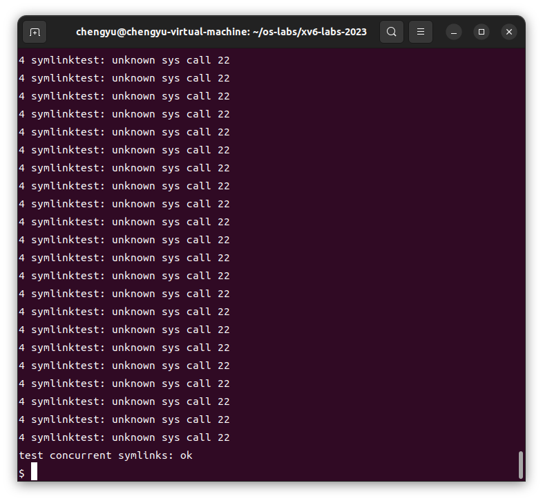

# Lab4 Traps

## 前置知识

## 实验内容

### 1. RISC-V assembly (easy)

#### 实验目的

* 理解RISC-V汇编代码。

* 分析函数调用中的寄存器使用情况。

* 理解little-endian和big-endian的差异及其在编程中的影响。

#### 实验步骤

##### 生成汇编代码

在你的xv6仓库中，`user/call.c` 文件已经存在。运行以下命令：

```bash
make fs.img
```

这个命令会编译代码并生成程序的可读汇编版本，文件位于 `user/call.asm`。

##### 阅读`call.asm`

```c
void main(void) {
  1c:	1141                	addi	sp,sp,-16
  1e:	e406                	sd	ra,8(sp)
  20:	e022                	sd	s0,0(sp)
  22:	0800                	addi	s0,sp,16
  printf("%d %d\n", f(8)+1, 13);
  24:	4635                	li	a2,13
  26:	45b1                	li	a1,12
  28:	00000517          	auipc	a0,0x0
  2c:	7b850513          	addi	a0,a0,1976 # 7e0 <malloc+0xe6>
  30:	00000097          	auipc	ra,0x0
  34:	612080e7          	jalr	1554(ra) # 642 <printf>
  exit(0);
  38:	4501                	li	a0,0
  3a:	00000097          	auipc	ra,0x0
  3e:	28e080e7          	jalr	654(ra) # 2c8 <exit>
```

* ==Q1: Which registers contain arguments to functions? For example, which register holds 13 in main's call to `printf`?==

* A: 通过阅读 `call.asm` 文件中的 `main` 函数可知，调用 `printf` 函数时，`13` 被寄存器 `a2` 保存。`a1`, `a2`, `a3` 等通用寄存器；`13` 被寄存器 `a2` 保存。

```c
int g(int x) {
   0:	1141                	addi	sp,sp,-16
   2:	e422                	sd	s0,8(sp)
   4:	0800                	addi	s0,sp,16
  return x+3;
}
   6:	250d                	addiw	a0,a0,3
   8:	6422                	ld	s0,8(sp)
   a:	0141                	addi	sp,sp,16
   c:	8082                	ret

000000000000000e <f>:

int f(int x) {
   e:	1141                	addi	sp,sp,-16
  10:	e422                	sd	s0,8(sp)
  12:	0800                	addi	s0,sp,16
  return g(x);
}
  14:	250d                	addiw	a0,a0,3
  16:	6422                	ld	s0,8(sp)
  18:	0141                	addi	sp,sp,16
  1a:	8082                	ret
```

* ==Q2: Where is the call to function `f` in the assembly code for main? Where is the call to `g`? (Hint: the compiler may inline functions.)==

* 通过阅读函数 `f` 和 `g` 得知：函数 `f` 调用函数 `g` ；函数 `g` 使传入的参数加 3 后返回。

* 所以总结来说，函数 `f` 就是使传入的参数加 3 后返回。考虑到编译器会进行内联优化，这就意味着一些显而易见的，编译时可以计算的数据会在编译时得出结果，而不是进行函数调用。

  查看 `main` 函数可以发现，`printf` 中包含了一个对 `f` 的调用。

```c
 printf("%d %d\n", f(8)+1, 13);
  24:	4635                	li	a2,13
  26:	45b1                	li	a1,12
```

* 但是对应的会汇编代码却是直接将 `f(8)+1` 替换为 `12` 。这就说明编译器对这个函数调用进行了优化，所以对于 `main` 函数的汇编代码来说，其并没有调用函数 `f` 和 `g` ，而是在运行之前由编译器对其进行了计算。
* A: `main` 的汇编代码没有调用 `f` 和 `g` 函数。编译器对其进行了优化。

```c
void
printf(const char *fmt, ...)
{
 642:	711d                	addi	sp,sp,-96
 644:	ec06                	sd	ra,24(sp)
 646:	e822                	sd	s0,16(sp)
 648:	1000                	addi	s0,sp,32
 64a:	e40c                	sd	a1,8(s0)
 64c:	e810                	sd	a2,16(s0)
 64e:	ec14                	sd	a3,24(s0)
 650:	f018                	sd	a4,32(s0)
 652:	f41c                	sd	a5,40(s0)
 654:	03043823          	sd	a6,48(s0)
 658:	03143c23          	sd	a7,56(s0)
  va_list ap;

  va_start(ap, fmt);
 65c:	00840613          	addi	a2,s0,8
 660:	fec43423          	sd	a2,-24(s0)
  vprintf(1, fmt, ap);
 664:	85aa                	mv	a1,a0
 666:	4505                	li	a0,1
 668:	00000097          	auipc	ra,0x0
 66c:	dce080e7          	jalr	-562(ra) # 436 <vprintf>
}
```

* ==Q3: At what address is the function `printf` located?==
* A: `0x642`

* `auipc` 和 `jalr` 的配合，可以跳转到任意 32 位的地址。

```c
30:	00000097          	auipc	ra,0x0
34:	612080e7          	jalr	1554(ra) # 642 <printf>
```

* 第 49 行，使用 `auipc ra,0x0` 将当前程序计数器 `pc` 的值存入 `ra` 中。

  第 50 行，`jalr 1554(ra)` 跳转到偏移地址 `printf` 处，也就是 `0x642` 的位置。

  根据 [reference1](https://xiayingp.gitbook.io/build_a_os/hardware-device-assembly/risc-v-assembly) 中的信息，在执行完这句命令之后， 寄存器 `ra` 的值设置为 `pc + 4` ，也就是 `return address` 返回地址 `0x38`。

* ==Q4: What value is in the register `ra` just after the `jalr` to `printf` in `main`?==

* A: `0x38`

##### 运行指定代码


* 观察输出：


```bash
He110 World
```

* 首先，`57616` 转换为 16 进制为 `e110`，所以格式化描述符 `%x` 打印出了它的 16 进制值。

  其次，如果在小端（little-endian）处理器中，数据`0x00646c72` 的**高字节存储在内存的高位**，那么从**内存低位**，也就是**低字节**开始读取，对应的 ASCII 字符为 `rld`。

  如果在 大端（big-endian）处理器中，数据 `0x00646c72` 的**高字节存储在内存的低位**，那么从**内存低位**，也就是**高字节**开始读取其 ASCII 码为 `dlr`。

  所以如果大端序和小端序输出相同的内容 `i` ，那么在其为大端序的时候，`i` 的值应该为 `0x726c64`，这样才能保证从内存低位读取时的输出为 `rld` 。

  无论 `57616` 在大端序还是小端序，它的二进制值都为 `e110` 。大端序和小端序只是改变了多字节数据在内存中的存放方式，并不改变其真正的值的大小，所以 `57616` 始终打印为二进制 `e110` 。

* ==Q5: The output depends on that fact that the RISC-V is little-endian. If the RISC-V were instead big-endian what would you set `i` to in order to yield the same output? Would you need to change `57616` to a different value?==

* A: 如果在大端序，`i` 的值应该为 `0x726c64` 才能保证与小端序输出的内容相同。不用该变 `57616` 的值。

* ==Q6: In the following code, what is going to be printed after `'y='`? (note: the answer is not a specific value.) Why does this happen?==

```c
printf("x=%d y=%d", 3);
```

* 通过之前的章节可知，函数的参数是通过寄存器`a1`, `a2` 等来传递。如果 `prinf` 少传递一个参数，那么其仍会从一个确定的寄存器中读取其想要的参数值，但是我们并没有给出这个确定的参数并将其存储在寄存器中，所以函数将从此寄存器中获取到一个随机的不确定的值作为其参数。故而此例中，`y=`后面的值我们不能够确定，它是一个垃圾值。
* A: `y=` 之后的值为一个不确定的垃圾值。

#### 实验中遇到的问题

##### 问题描述

1. **理解寄存器的分配**：分析汇编代码时，如何确定哪些寄存器用于保存函数参数，哪些寄存器保存返回地址等，这需要一定的汇编知识。
2. **字节序影响**：在理解little-endian和big-endian对数据存储和读取的影响时，特别是在处理字符串或多字节整数时，容易混淆不同字节序下数据的表现形式。
3. **编译器优化的影响**：由于编译器优化，某些函数调用可能在汇编代码中被内联或完全消除，导致汇编代码与源代码不完全对应，增加了分析的复杂性。

##### 解决方案

1. **深入学习汇编语言**：通过阅读相关的RISC-V汇编语言文档和资料，逐步理解不同寄存器的用途，以及如何通过汇编代码跟踪函数调用和返回。
2. **实际操作验证**：通过反复实验，修改代码并观察汇编输出，逐步加深对字节序的理解。结合实际的编程实验，帮助理解在不同字节序下，数据如何被存储和读取。
3. **利用调试工具**：使用调试工具（如gdb）逐步跟踪汇编代码的执行，结合源代码理解编译器优化的具体影响。

#### 实验心得

通过此次实验，我深入理解了RISC-V汇编代码的执行流程，特别是在函数调用中的寄存器分配和数据传递。在分析汇编代码的过程中，我认识到字节序对数据存储的影响，以及编译器优化对代码结构的改变。这次实验不仅增强了我对低级编程和硬件架构的理解，也提高了我分析和调试复杂系统的能力。通过应对实验中遇到的各种问题，我进一步认识到扎实的汇编语言基础和调试技巧在操作系统开发中的重要性。


### 2. Backtrace (moderate)

#### 实验目的

* 实现一个 `backtrace()` 函数，该函数用于调试时输出函数调用栈的回溯信息。这有助于理解程序在出现错误时的执行路径。我们将通过遍历栈帧并打印每个栈帧中的保存的返回地址来实现这个功能。

#### 实验步骤

##### 添加 `backtrace()` 函数原型

* 首先，在 `kernel/defs.h` 文件中添加 `backtrace()` 函数的原型声明，以便在其他地方调用它：

```c
// printf.c
void            printf(char*, ...);
void            panic(char*) __attribute__((noreturn));
void            printfinit(void);
void 			backtrace(void);
```

* GCC 编译器将当前正在执行的函数的帧指针（frame pointer）存储到寄存器 `s0` 中。在 `kernel/riscv.h` 中添加以下代码：

```c
static inline uint64
r_fp()
{
  uint64 x;
  asm volatile("mv %0, s0" : "=r" (x) );
  return x;
}
```

* 在 `backtrace` 中调用此函数，将会读取当前帧指针。`r_fp()` 使用[内联汇编](https://gcc.gnu.org/onlinedocs/gcc/Using-Assembly-Language-with-C.html)读取 `s0`。

##### 在`kernel/printf.c`中添加函数

```c
void
backtrace(void)
{
  uint64 fp_address = r_fp();
  while(fp_address != PGROUNDDOWN(fp_address)) {
    printf("%p\n", *(uint64*)(fp_address-8));
    fp_address = *(uint64*)(fp_address - 16);
  }
}
```

* `PGROUNDDOWN(fp)` 总是表示 `fp` 所在的这一页的起始位置。

##### 在`kernel/sysproc.c`中的`sys_sleep`函数中调用

```c
void sys_sleep(void){
    ...
    backtrace();
    ...
}
```

##### 编译并运行`bttest`



##### 使用 `addr2line` 命令查看代码位置



#### 实验中遇到的问题

##### 问题描述

在实现 `backtrace()` 函数时，主要遇到了以下几个问题：

1. **栈帧边界判断**：在循环中判断何时停止回溯，尤其是如何正确识别栈帧的边界，以避免无限循环或访问非法内存地址。
2. **打印返回地址**：理解如何正确地解引用栈帧指针以获取保存的返回地址，以及正确地使用 `printf` 输出这些地址。
3. **地址转换**：通过 `addr2line` 将返回地址转换为源码中的行号时，理解如何使用工具以及生成的地址是否准确对应源代码。

##### 解决方案

1. **栈帧边界判断**：通过使用 `PGROUNDDOWN(fp)` 确保在跨越页边界时停止回溯，避免了无限循环的问题。
2. **打印返回地址**：通过仔细分析栈帧结构，理解每个函数调用保存的返回地址在栈中的位置，从而正确地解引用并打印。
3. **地址转换**：通过 `addr2line` 转换后的地址，使用调试工具验证输出的准确性，并确认回溯信息确实对应于源码中的函数调用位置。

#### 实验心得

在此次实验中，`backtrace()` 函数的实现让我对栈帧结构以及函数调用在栈中的布局有了更深的理解。尤其是通过遍历栈帧来打印函数调用的回溯信息，这一过程让我对程序执行路径的调试有了新的认识。尽管在实现过程中遇到了一些问题，但通过分析和调试，我逐步掌握了如何正确地获取并打印返回地址。最终，使用 `addr2line` 工具将地址转换为源代码行号，也进一步帮助我验证了回溯信息的准确性。此次实验不仅加深了我对汇编代码和栈操作的理解，也让我在调试技巧上得到了提升。

### 3. Alarm (hard)

#### 实验目的

* 在这个实验中，你将为 xv6 添加一个功能，定期向进程发出 CPU 时间警告。这个功能可以帮助计算密集型进程限制其使用的 CPU 时间，或者让进程在计算时也能执行一些周期性操作。本质上，你将实现一种原始的用户级中断/故障处理程序。实验的目的是让 `alarmtest` 通过，并且 `usertests -q` 成功运行。

#### 实验步骤

##### 修改`struct proc`

* 首先在 `kernel/proc.h` 中的 `proc` 结构体中添加需要的内容。

```c
struct proc {
    ...
  // the virtual address of alarm handler function in user page
  uint64 handler_va;
  int alarm_interval;
  int passed_ticks;
  // save registers so that we can re-store it when return to interrupted code.   
  struct trapframe saved_trapframe;
  // the bool value which show that is or not we have returned from alarm handler.
  int have_return;
    ...
}
```

#### 实现两个函数

* 在 `kernel/sysproc.c` 中实现 `sys_sigalarm` 和 `sys_sigreturn` ：

```c
uint64
sys_sigreturn(void)
{
  struct proc* proc = myproc();
  // re-store trapframe so that it can return to the interrupt code before.
  *proc->trapframe = proc->saved_trapframe;
  proc->have_return = 1; // true
  return proc->trapframe->a0;
}

uint64
sys_sigalarm(void)
{
  int ticks;
  uint64 handler_va;

  argint(0, &ticks);
  argaddr(1, &handler_va);
  struct proc* proc = myproc();
  proc->alarm_interval = ticks;
  proc->handler_va = handler_va;
  proc->have_return = 1; // true
  return 0;
}
```

* 注意到一点，`sys_sigreturn(void)` 的返回值不是 0，而是 `proc->trapframe->a0`。这是因为我们想要完整的恢复所有寄存器的值，包括 `a0`。但是一个系统调用返回的时候，它会将其返回值存到 `a0` 寄存器中，那这样就改变了之前 `a0` 的值。所以，我们干脆让其返回之前想要恢复的 `a0` 的值，那这样在其返回之后 `a0` 的值仍没有改变。

#### 修改`usertrap()`函数

* 然后修改 `kernel/trap.c` 中的 `usertrap` 函数。

```c
void
usertrap(void) {
  ...
    // give up the CPU if this is a timer interrupt.
  if(which_dev == 2) {
    struct proc *proc = myproc();
    // if proc->alarm_interval is not zero
    // and alarm handler is returned.
    if (proc->alarm_interval && proc->have_return) {
      if (++proc->passed_ticks == 2) {
        proc->saved_trapframe = *p->trapframe;
        // it will make cpu jmp to the handler function
        proc->trapframe->epc = proc->handler_va;
        // reset it
        proc->passed_ticks = 0;
        // Prevent re-entrant calls to the handler
        proc->have_return = 0;
      }
    }
    yield();
  }
  ...
}
```

* 从内核跳转到用户空间中的 alarm handler 函数的关键一点就是：修改 `epc` 的值，使 trap 在返回的时候将 pc 值修改为该 alarm handler 函数的地址。这样，我们就完成了从内核调转到用户空间中的 alarm handler 函数。但是同时，我们也需要保存之前寄存器栈帧，因为后来 alarm handler 调用系统调用 `sys_sigreturn` 时会破坏之前保存的寄存器栈帧(p->trapframe)。

#### 修改`Makefile`和添加系统调用

##### `Makefile`

```makefile
UPROGS=\
	$U/_cat\
	$U/_echo\
	$U/_forktest\
	$U/_grep\
	$U/_init\
	$U/_kill\
	$U/_ln\
	$U/_ls\
	$U/_mkdir\
	$U/_rm\
	$U/_sh\
	$U/_stressfs\
	$U/_usertests\
	$U/_grind\
	$U/_wc\
	$U/_zombie\
	$U/_alarmtest\
```


##### `user/user.h`

```c
int sigalarm(int ticks, void (*handler)());
int sigreturn(void);
```

##### 更新 `user/usys.pl`

* 在 `usys.pl` 文件中，添加 `sigalarm` 和 `sigreturn` 的系统调用入口，以便生成 `usys.S`。

```c
entry("sigalarm");
entry("sigreturn");
```


##### 更新 `kernel/syscall.h` 和 `kernel/syscall.c`

* 在 `syscall.h` 中添加 `SYS_sigalarm` 和 `SYS_sigreturn` 的定义。

* 在 `syscall.c` 中，将 `sys_sigalarm` 和 `sys_sigreturn` 添加到 `syscalls` 数组中。

```c
#define SYS_sigalarm 22
#define SYS_sigreturn 23
```

```c
extern uint64 sys_sigalarm(void);
extern uint64 sys_sigreturn(void);

[SYS_sigalarm]  sys_sigalarm,
[SYS_sigreturn] sys_sigreturn
```

#### 测试成功


#### 涉及到的文件


### 实验得分

