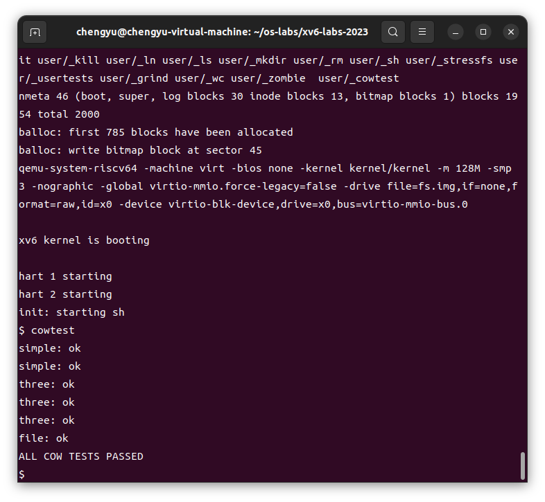

# Lab5 Copy-on-Write Fork for xv6

[TOC]

## 实验内容

### Implement copy-on-write fork(hard)

#### 任务

* 在这个实验中，你的任务是为 xv6 实现 Copy-on-Write (COW) 的 `fork()` 系统调用。COW `fork()` 的目标是延迟物理内存页的分配和复制，直到这些页面真正需要时才执行，从而优化内存使用。
* xv6 操作系统中原来对于 fork()的实现是将父进程的用户空间全部复制到子进程的用户空间。但如果父进程地址空间太大，那这个复制过程将非常耗时。另外，现实中经常出现 fork() + exec() 的调用组合，这种情况下 fork()中进行的复制操作完全是浪费。基于此，我们可以利用页表实现写时复制机制。

#### 思路

* COW `fork()` 的实现思路是：在 `fork()` 时不立即复制物理内存页，而是让子进程的页表指向父进程的物理页，并将这些页标记为只读。当父进程或子进程尝试写这些页时，会触发页面错误，内核会在页面错误处理程序中分配一个新页，复制原来的页到新页，并更新页表，使其指向新页并允许写入。

#### 步骤

##### 1. 新增了 `kalloc.c: page_refcnt` 数组：

**修改后**：

```c
// 新增了页面引用计数数组
volatile int page_refcnt[PHYSTOP/PGSIZE]; // COW reference count. 
```

**修改前**：

```c
// 无此部分内容
```

**意义与目的**：

- **`page_refcnt` 数组**：用于记录每个物理页面的引用计数。当多个进程共享同一物理页面时，引用计数可以帮助跟踪页面是否被其他进程使用，确保在执行 `kfree` 时只释放不再被任何进程使用的页面。

##### 2. 修改了 `kalloc.c: kfree` 函数：

**修改后**：

```c
void
kfree(void *pa)
{
  if(page_refcnt[(uint64)pa/PGSIZE]>0)
  {
    page_refcnt[(uint64)pa/PGSIZE] -= 1;
    // 如果页面仍有引用，直接返回，不释放页面
  }
  if(page_refcnt[(uint64)pa/PGSIZE]>0) return;
  
  struct run *r;

  if(((uint64)pa % PGSIZE) != 0 || (char*)pa < end || (uint64)pa >= PHYSTOP)
    panic("kfree");

  // 用垃圾数据填充内存，以捕捉悬挂引用
  memset(pa, 1, PGSIZE);

  r = (struct run*)pa;

  acquire(&kmem.lock);
  r->next = kmem.freelist;
  kmem.freelist = r;
  release(&kmem.lock);
}
```

**修改前**：

```c
void
kfree(void *pa)
{
  struct run *r;

  if(((uint64)pa % PGSIZE) != 0 || (char*)pa < end || (uint64)pa >= PHYSTOP)
    panic("kfree");

  // 用垃圾数据填充内存，以捕捉悬挂引用
  memset(pa, 1, PGSIZE);

  r = (struct run*)pa;

  acquire(&kmem.lock);
  r->next = kmem.freelist;
  kmem.freelist = r;
  release(&kmem.lock);
}
```

**意义与目的**：

- 在执行 `kfree` 时，首先检查该页面的引用计数是否大于0。如果引用计数大于0，则只减少引用计数，而不真正释放该页面。当引用计数降为0时，才将页面归还给内存池。这是实现 COW 的关键，确保只有在页面不再被任何进程引用时才释放内存。

##### 3. 修改了 `kalloc.c: kalloc` 函数：

**修改后**：

```c
void *
kalloc(void)
{
  struct run *r;

  acquire(&kmem.lock);
  r = kmem.freelist;
  if(r)
    kmem.freelist = r->next;
  release(&kmem.lock);

  if(r)
    memset((char*)r, 5, PGSIZE); // 用垃圾数据填充内存
  page_refcnt[(uint64)r/PGSIZE] = 1; // 设置引用计数为1
  return (void*)r;
}
```

**修改前**：

```c
void *
kalloc(void)
{
  struct run *r;

  acquire(&kmem.lock);
  r = kmem.freelist;
  if(r)
    kmem.freelist = r->next;
  release(&kmem.lock);

  if(r)
    memset((char*)r, 5, PGSIZE); // 用垃圾数据填充内存
  return (void*)r;
}
```

**意义与目的**：

- 当分配新页面时，初始化 `page_refcnt` 为1，表示该页面初次被分配使用，且只有一个引用者。这确保了在分配页面时，引用计数正确设置，为后续的 COW 机制提供了支持。


##### 4. `riscv.h`新增了 `PTE_COW` 宏定义：

**修改后**：

```c
#define PTE_COW (1L << 8) // Represents the COW page. The RSW (reserved) flag is No.8~9.
```

**修改前**：

```c
// 无此部分内容
```

**意义与目的**：

- **`PTE_COW` 标志**：这是一个新的页表项标志，用于标识该页面是一个写时复制页面 (COW)。当系统检测到对该页面的写操作时，会触发页面错误，并执行复制操作。使用 `PTE_COW` 标志有助于实现这种机制，并通过标志位区分哪些页面需要在写入时复制。

##### 5. 新增 `page_refcnt` 和 `end` 的外部声明：

**修改后**：

```c
//trap.c
extern int page_refcnt[PHYSTOP/PGSIZE];
extern char end[]; // first address after kernel.
                   // defined by kernel.ld.
```

**修改前**：

```c
// 无此部分内容
```

**意义与目的**：

- **`page_refcnt` 的声明**：这是一个数组，用于跟踪每个页面的引用计数，这是实现 COW 机制的关键。通过引用计数，系统可以判断一个页面是否需要复制。
- **`end` 的声明**：`end` 是内核结束的地址，通常用于内存分配和释放的边界检查。

##### 6. 在 `trap.c/usertrap` 函数中处理写时复制的页面错误：

**修改后**：

```c
else // Encountered a fault here. 
{
  // Handle COW page writing here. --XHZ
  if(r_scause()==15) // Store/AMO page fault
  {
    // printf("Encountered exception: Store/AMO page fault\n");
    uint64 write_va = r_stval();
    if(write_va>=MAXVA) goto unexpected_scause; // Should not access virtual address beyond MAXVA! (In usertests)
    pagetable_t pagetable = myproc()->pagetable;
    pte_t *pte = walk(pagetable, write_va, 0);
    if(*pte & PTE_COW) // This page is a COW page
    {
      // Allocates memory for the new page. 
      char *mem;
      if((mem = kalloc()) == 0)
      {
        not_enough_physical_memory_error:
        // On kalloc() error, what to do? The lab requires to kill this process. 
        printf("Not enough physical memory when copy-on-write! pid=%d\n", p->pid);
        setkilled(p);
      }

      // Copy the page. 
      memmove(mem, (char*)PTE2PA(*pte), PGSIZE);

      // Remap the new page to the page table. 
      uint flags = PTE_FLAGS(*pte);
      flags = (flags & (~PTE_COW)) | PTE_W; // Give it permission to write, and mark as not COW. 
      uvmunmap(pagetable, PGROUNDDOWN(write_va), 1, 1); // Unmap the old COW page from the pagetable, and kfree() it. 
      if(mappages(pagetable, PGROUNDDOWN(write_va), PGSIZE, (uint64)mem, flags) != 0){
        kfree(mem);
        printf("This should never happen! The page SHOULD exist. mappages() won't fail!!! \n");
        goto not_enough_physical_memory_error;
      }
    }
    else // This page is not a COW page
    {
      goto unexpected_scause;
    }
  }
  else
  {
    unexpected_scause:
    printf("usertrap(): unexpected scause %p pid=%d\n", r_scause(), p->pid);
    printf("            sepc=%p stval=%p\n", r_sepc(), r_stval());
    setkilled(p);
  }
}
```

**修改前**：

```c
else {
  printf("usertrap(): unexpected scause %p pid=%d\n", r_scause(), p->pid);
  printf("            sepc=%p stval=%p\n", r_sepc(), r_stval());
  setkilled(p);
}
```

**意义与目的**：

- **处理 Store/AMO 页面错误**：当 `r_scause()` 返回 15 时，表示发生了写时复制相关的页面错误。此时，系统需要为该页面分配新的物理内存，复制原有页面的内容，并更新页表项以指向新页面，同时解除 `COW` 标志，允许写入。
- **错误处理与恢复**：如果内存分配失败，则终止当前进程以避免系统崩溃。此外，新增的代码还包括对非 `COW` 页面的处理，防止意外的页面错误导致系统不稳定。

##### 7. `vm.c/uvmcopy` 函数的修改：

**修改后**：

```c
extern int page_refcnt[PHYSTOP/PGSIZE];

int
uvmcopy(pagetable_t old, pagetable_t new, uint64 sz)
{
  pte_t *pte;
  uint64 pa, i;

  for(i = 0; i < sz; i += PGSIZE){
    if((pte = walk(old, i, 0)) == 0)
      panic("uvmcopy: pte should exist");
    if((*pte & PTE_V) == 0)
      panic("uvmcopy: page not present");
    pa = PTE2PA(*pte);

    // COW机制，不再复制页面，而是共享，并设置COW标志
    if(*pte & PTE_W) *pte = (*pte ^ PTE_W) | PTE_COW; 
    if(mappages(new, i, PGSIZE, pa, PTE_FLAGS(*pte)) != 0) goto err;
    page_refcnt[(uint64)pa/PGSIZE] += 1;
  }
  return 0;

 err:
  uvmunmap(new, 0, i / PGSIZE, 1);
  return -1;
}
```

**修改前**：

```c
int
uvmcopy(pagetable_t old, pagetable_t new, uint64 sz)
{
  pte_t *pte;
  uint64 pa, i;
  uint flags;
  char *mem;

  for(i = 0; i < sz; i += PGSIZE){
    if((pte = walk(old, i, 0)) == 0)
      panic("uvmcopy: pte should exist");
    if((*pte & PTE_V) == 0)
      panic("uvmcopy: page not present");
    pa = PTE2PA(*pte);
    flags = PTE_FLAGS(*pte);
    if((mem = kalloc()) == 0)
      goto err;
    memmove(mem, (char*)pa, PGSIZE);
    if(mappages(new, i, PGSIZE, (uint64)mem, flags) != 0){
      kfree(mem);
      goto err;
    }
  }
  return 0;

 err:
  uvmunmap(new, 0, i / PGSIZE, 1);
  return -1;
}
```

**意义与目的**：

- **COW实现**：原始代码在复制内存时会为子进程分配新内存，并将父进程的内容复制过去。而在修改后的代码中，使用写时复制的机制，通过共享父进程的页面，并设置COW标志，而不再直接复制页面。这样可以有效节省内存。

##### 8. `vm.c/copyout` 函数的修改：

**修改后**：

```c
int
copyout(pagetable_t pagetable, uint64 dstva, char *src, uint64 len)
{
  uint64 n, va0, pa0;
  pte_t *pte;

  while(len > 0){
    va0 = PGROUNDDOWN(dstva);
    if(va0 >= MAXVA)
      return -1;
    pte = walk(pagetable, va0, 0);
    if(pte == 0 || (*pte & PTE_V) == 0 || (*pte & PTE_U) == 0
       || (((*pte & PTE_W) == 0) && ((*pte & PTE_COW) == 0))) // 既不可写也不是COW
      return -1;
    if((*pte & PTE_W) == 0 && (*pte & PTE_COW)) // 遇到COW页面
    {
      // 为新页面分配内存，并复制内容
      char *mem;
      if((mem = kalloc()) == 0)
      {
        printf("物理内存不足，无法处理COW写入。\n");
        return -1;
      }

      // 复制页面内容，并解除COW标志
      memmove(mem, (char*)PTE2PA(*pte), PGSIZE);
      uint flags = PTE_FLAGS(*pte);
      flags = (flags & (~PTE_COW)) | PTE_W; 
      uvmunmap(pagetable, va0, 1, 1);
      if(mappages(pagetable, va0, PGSIZE, (uint64)mem, flags) != 0){
        kfree(mem);
        printf("意外错误：mappages失败。\n");
        return -1;
      }
    }
    pa0 = PTE2PA(*pte);
    n = PGSIZE - (dstva - va0);
    if(n > len)
      n = len;
    memmove((void *)(pa0 + (dstva - va0)), src, n);

    len -= n;
    src += n;
    dstva = va0 + PGSIZE;
  }
  return 0;
}
```

**修改前**：

```c
int
copyout(pagetable_t pagetable, uint64 dstva, char *src, uint64 len)
{
  uint64 n, va0, pa0;
  pte_t *pte;

  while(len > 0){
    va0 = PGROUNDDOWN(dstva);
    if(va0 >= MAXVA)
      return -1;
    pte = walk(pagetable, va0, 0);
    if(pte == 0 || (*pte & PTE_V) == 0 || (*pte & PTE_U) == 0 ||
       (*pte & PTE_W) == 0)
      return -1;
    pa0 = PTE2PA(*pte);
    n = PGSIZE - (dstva - va0);
    if(n > len)
      n = len;
    memmove((void *)(pa0 + (dstva - va0)), src, n);

    len -= n;
    src += n;
    dstva = va0 + PGSIZE;
  }
  return 0;
}
```

**意义与目的**：

- **处理COW页面**：在 `copyout` 中，修改后的代码会检测页表项中是否设置了 COW 标志，如果是，则为该页面分配新内存并复制内容，然后更新页表以允许写入。这是实现COW机制的核心步骤。

##### 9. `vm.c`新增的 `page_refcnt` 数组声明：

**修改后**：

```c
extern int page_refcnt[PHYSTOP/PGSIZE];
```

**修改前**：

```c
// 无此部分内容
```

**意义与目的**：

- **引用计数管理**：`page_refcnt` 数组用于跟踪每个页面的引用计数，这在COW机制中非常重要。通过引用计数，系统可以决定是否需要实际执行页面的复制操作。

#### 测试成功



### 实验得分

