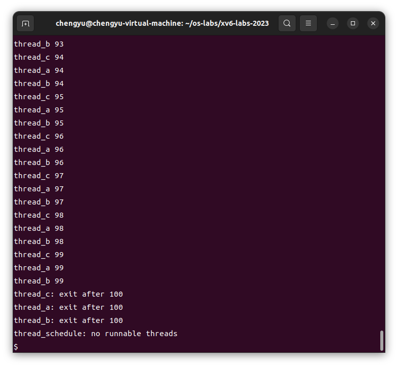

# Lab6: Multithreading

[TOC]

## 前置知识


## 实验内容

### Uthread: switching between threads (moderate)

#### 任务

* 本实验旨在让你熟悉多线程技术。你将实现用户级线程包中的线程上下文切换机制，使用多个线程加速程序，并实现一个屏障同步机制。

#### 添加`struct context`

* 根据xv6-book，切换线程需要保存和恢复CPU上下文（也就是寄存器）的相关信息，所以在 struct thread 中，需要有CPU寄存器的相关信息，你手动添加它；
*  `user/uthread.c` 中定义一个 struct context 来保存 callee-save registers 的信息。

```c
struct context {
  uint64 ra; // return address
  uint64 sp; // stack pointer

  // callee-saved
  uint64 s0;
  uint64 s1;
  uint64 s2;
  uint64 s3;
  uint64 s4;
  uint64 s5;
  uint64 s6;
  uint64 s7;
  uint64 s8;
  uint64 s9;
  uint64 s10;
  uint64 s11;
};

struct thread {
  char       stack[STACK_SIZE]; /* the thread's stack */
  int        state;             /* FREE, RUNNING, RUNNABLE */
  struct context context;       // register context
};
```

#### 添加函数`thread_switch`

* `user/uthread_switch.S` 中，需要用asm编写保存和恢复寄存器的汇编代码，如果你做过前面的lab，或者认真读了xv6 book，那么这个函数 `thread_switch(uint64, uint64)` 和 `kernel/swtch.S` 中的`swtch`函数不能说一模一样，简直是没什么区别。

```c
	.text

	/*
         * save the old thread's registers,
         * restore the new thread's registers.
         */

	.globl thread_switch
thread_switch:
	/* YOUR CODE HERE */
	sd ra, 0(a0)
	sd sp, 8(a0)
	sd s0, 16(a0)
	sd s1, 24(a0)
	sd s2, 32(a0)
	sd s3, 40(a0)
	sd s4, 48(a0)
	sd s5, 56(a0)
	sd s6, 64(a0)
	sd s7, 72(a0)
	sd s8, 80(a0)
	sd s9, 88(a0)
	sd s10, 96(a0)
	sd s11, 104(a0)

	ld ra, 0(a1)
	ld sp, 8(a1)
	ld s0, 16(a1)
	ld s1, 24(a1)
	ld s2, 32(a1)
	ld s3, 40(a1)
	ld s4, 48(a1)
	ld s5, 56(a1)
	ld s6, 64(a1)
	ld s7, 72(a1)
	ld s8, 80(a1)
	ld s9, 88(a1)
	ld s10, 96(a1)
	ld s11, 104(a1)
	ret    /* return to ra */
```

#### 修改`thread_schedule`(`user/uthread.c`)

* 在 `thread_schedule` 中，很显然需要调用 `thread_swtich` 函数来保存寄存器和恢复CPU上下文为即将运行的进程的上下文信息。

  xv6 book 中说道，thread switch 的原理就是通过保存原本的CPU上下文，然后恢复想要调度运行的进程的CPU上下文信息，其中最重要的就是寄存器 `ra` 的值，因为它保存着函数将要返回的地址 return address. 所以此时 `ra` 中的地址是什么，CPU就会跳转到这个地址进行运行。这就是所谓的 thread switch. 不过为了保持原本线程中的数据的完整性，需要一并恢复它所需要的寄存器的信息，也就是 callee-save resigers.

```c
void 
thread_schedule(void)
{
  ...
  if (current_thread != next_thread) {         /* switch threads?  */
    ...
    /* YOUR CODE HERE
     * Invoke thread_switch to switch from t to next_thread:
     * thread_switch(??, ??);
     */
    // switch old to new thread
    // save old thread context and restore new thread context
    thread_switch(&t->context, &current_thread->context);
  } else
    next_thread = 0;
}
```

* 修改了 `thread_switch` 函数的参数原型：

```c
extern void thread_switch(struct context *old, struct context *new);
```

#### 修改`thread_create`(`user/uthread.c`)

* 在 `thread_create` 的时候，提前将对应的 thread 的 `ra` 寄存器设置为对应的函数地址。

```c
void 
thread_create(void (*func)())
{
  struct thread *t;

  for (t = all_thread; t < all_thread + MAX_THREAD; t++) {
    if (t->state == FREE) break;
  }
  t->state = RUNNABLE;
  // YOUR CODE HERE
  // save stack pointer to stack address
  t->context.sp = (uint64)&t->stack[STACK_SIZE-1];
  t->context.ra = (uint64)(*func);
}
```

#### 测试成功



### Using threads (moderate)

* 本实验的目标是通过多线程和锁来探索并行编程。在实验中，你将使用一个哈希表，并在多线程环境下操作它。你需要确保在多线程情况下哈希表的操作是线程安全的，并在此基础上优化性能。

#### 修改`ph.c/put`

```c
pthread_mutex_t lock[NBUCKET]; // lock for puts

static 
void put(int key, int value)
{
  int i = key % NBUCKET;

  // is the key already present?
  struct entry *e = 0;
  for (e = table[i]; e != 0; e = e->next) {
    if (e->key == key)
      break;
  }
  if(e){
    // update the existing key.
    e->value = value;
  } else {
  pthread_mutex_lock(&lock[i]);
    // the new is new.
    //  重要的是 table[i] 的值，如果 thread_1 刚进入，但是 thread_2 刚好完成修改了 table[i] 的操作，此时就会丢失后面的所有node
  insert(key, value, &table[i], table[i]);
  pthread_mutex_unlock(&lock[i]);
  }

}
```

* ==Q1: Why are there missing keys with 2 threads, but not with 1 thread? Identify a sequence of events with 2 threads that can lead to a key being missing. Submit your sequence with a short explanation in `answers-thread.txt`.==

* A: 

  为什么两个线程会有丢失的键，而一个线程不会？

  在多线程环境中，由于缺乏对共享数据结构的同步保护，可能会出现竞态条件。竞态条件是指多个线程同时访问和修改共享资源的情况下，由于操作的交错顺序不同，导致程序行为不可预测。在这段代码中，`put()` 函数存在竞态条件，当两个线程同时执行 `put()` 函数时，会导致丢失键的问题。

  

  事件序列导致键丢失

  假设有两个线程 `Thread 1` 和 `Thread 2`，它们同时调用 `put()` 函数来插入不同的键 `key1` 和 `key2`。由于没有适当的同步机制保护对 `table[i]` 的访问，可能会出现以下情况：

  1. **线程 1** 计算 `i = key1 % NBUCKET` 并进入 `put()` 函数。它开始检查 `table[i]` 是否已经存在 `key1`，此时 `table[i]` 为空（即 `e == 0`）。
    
  2. **线程 2** 计算 `i = key2 % NBUCKET` 并进入 `put()` 函数。它也开始检查 `table[i]` 是否已经存在 `key2`，此时 `table[i]` 仍然为空（即 `e == 0`），因为线程 1 还没有完成插入操作。

  3. **线程 1** 进入 `else` 分支，准备将 `key1` 插入 `table[i]`。它调用 `insert()` 函数，但此时还没有更新 `table[i]`。

  4. **线程 2** 在几乎同一时间也进入 `else` 分支，准备将 `key2` 插入 `table[i]`。它也调用 `insert()` 函数，并且还没有更新 `table[i]`。

  5. **线程 2** 完成 `insert()` 操作，成功将 `key2` 插入 `table[i]` 并更新了 `table[i]`。

  6. **线程 1** 现在完成了它的 `insert()` 操作，但是 `table[i]` 已经被线程 2 修改过了。线程 1 的 `insert()` 操作会覆盖线程 2 对 `table[i]` 的更改，从而导致 `key2` 丢失。

  简短解释

  当两个线程几乎同时调用 `put()` 函数并尝试在相同的哈希桶中插入不同的键时，可能会发生竞态条件。由于缺乏对 `table[i]` 的适当同步保护，两个线程可能会相互覆盖彼此的修改，从而导致一个键丢失。这种情况在单线程环境中不会发生，因为只有一个线程会修改 `table[i]`。

  你可以在 `answers-thread.txt` 中记录下这个分析和事件序列：

  ```
  在两个线程同时执行 put() 操作时，由于缺乏同步保护，可能会导致键丢失。具体的竞态条件如下：
  
  1. Thread 1 和 Thread 2 同时检查相同的哈希桶（table[i]），发现没有该键存在。
  2. Thread 1 和 Thread 2 准备插入不同的键，并且几乎同时调用 insert() 函数。
  3. Thread 2 完成插入，并更新 table[i]。
  4. Thread 1 随后完成插入，但覆盖了 Thread 2 的修改，导致键丢失。
  
  这种情况在单线程环境中不会发生，因为只有一个线程会修改哈希桶。
  ```

  解决方法

  要解决这个问题，你需要在 `put()` 函数中对对哈希桶的操作进行加锁和解锁，确保在多线程环境下的安全性。你可以在适当的地方插入 `pthread_mutex_lock(&lock[i])` 和 `pthread_mutex_unlock(&lock[i])`。这样可以防止两个线程同时访问和修改同一个哈希桶，从而避免键丢失的问题。

### Barrier(moderate)

#### 任务

* 本实验的目标是实现一个屏障（Barrier），即所有参与的线程在某一点上都必须等待，直到所有其他参与的线程也到达这一点。你将使用 `pthread` 的条件变量来实现这一点，这类似于 `xv6` 中的 `sleep` 和 `wakeup`。

#### 思路

* 首先我们需要使用 mutex lock 保护 `bstate.nthread` 的递增。因为如果不保护它，那么在多线程中会导致其结果最后不正确。如果其本来是 0，此时刚好计算到 `bstate.nthread + 1` 结束，结果是 1，但是还没有被赋值给 `bstate.nthread`，但是此时另一个线程刚好在此之前完成了对 `bstate.nthread` 的递增和赋值，此时 `bstate.nthread` = 1，然后回到刚才线程，执行赋值操作 `bstate.nthread = 1` 最终， `bstate.nthread` 的值为 1，显然是错误的，应该是 2.

```c
static void 
barrier()
{
  pthread_mutex_lock(&bstate.barrier_mutex); // Lock the mutex

  // Increment the number of threads that have reached this round
  bstate.nthread++;

  // If not all threads have reached the barrier, wait
  if (bstate.nthread < nthread) {
      pthread_cond_wait(&bstate.barrier_cond, &bstate.barrier_mutex);
  }

  // If all threads have reached the barrier, increment the round and reset the counter
  if (bstate.nthread == nthread) {
      bstate.round++;
      bstate.nthread = 0;
      pthread_cond_broadcast(&bstate.barrier_cond); // Notify all waiting threads
  }

  pthread_mutex_unlock(&bstate.barrier_mutex); // Unlock the mutex
}
```

### 实验得分

