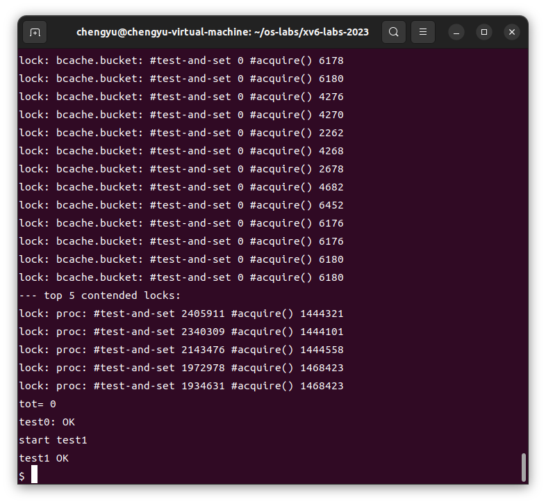

# Lab8 locks

[TOC]

## 前置知识

## 实验内容

### Memory allocator ([moderate](https://pdos.csail.mit.edu/6.828/2023/labs/guidance.html))

#### 任务

**问题描述：** 当前的xv6内存分配器使用了单一的自由列表和单一的锁（kmem.lock），在多核机器上会造成严重的锁竞争。实验程序`user/kalloctest`会测试xv6的内存分配器，测量在获取kmem锁时的循环次数（即`acquire`调用的循环次数）作为锁竞争的粗略衡量指标。你需要通过重构内存分配器，减少kmem锁的竞争次数。

**解决方案：** 你的任务是为每个CPU维护一个自由列表（freelist），每个列表有各自的锁。这样，不同CPU上的分配和释放操作可以并行进行，因为每个CPU操作的是不同的列表。

- 当一个CPU的自由列表为空，而另一个CPU的列表中有空闲内存时，CPU需要从另一个CPU的自由列表中“偷取”内存。虽然这种“偷取”可能会引入锁竞争，但通常会比较少见。
- 所有的锁名称都应以“kmem”开头，你应该调用`initlock`并传递一个以“kmem”开头的名称。

#### 步骤（只涉及`kernel/kalloc.c`）

##### 1. `kernel/kalloc.c`结构体修改

- **修改前**:

  ```c
  struct {
    struct spinlock lock;
    struct run *freelist;
  } kmem;
  ```

  - 原始代码中，`kmem` 结构体包含一个 `spinlock` 和一个 `freelist`。这意味着所有的 CPU 都共用一个自由列表和一个锁。

- **修改后**:

  ```c
  struct {
    struct spinlock lock;
    struct run *freelist;
  } kmems[NCPU];
  ```

  - 修改后的代码将 `kmem` 改为 `kmems[NCPU]`，为每个 CPU 分配了一个独立的 `freelist` 和 `spinlock`。这样每个 CPU 都有自己的内存分配和锁机制，减少了多个 CPU 同时访问同一锁时的竞争。

  **目的**: 通过为每个 CPU 配置独立的 `freelist` 和锁，减少多核系统中对单一锁的竞争，从而提高系统的并行处理能力。

##### 2. 初始化逻辑

- **修改前**:

  ```c
  void
  kinit()
  {
    initlock(&kmem.lock, "kmem");
    freerange(end, (void*)PHYSTOP);
  }
  ```

  - 原始代码中，`kinit()` 只为 `kmem.lock` 初始化，并没有考虑多核情况下的锁竞争问题。

- **修改后**:

  ```c
  void
  kinit()
  {
    for(int id = 0;id<NCPU;id++)
    {
      char name_buf[16] = {0};
      snprintf(name_buf, sizeof(name_buf), "kmem_lock_%d", id);
      printf("kmem lock name: %s\n", name_buf);
      initlock(&kmems[id].lock, name_buf);
    }
    printf("kinit(): initlock() complete. \n");
    freerange(end, (void*)PHYSTOP);
  }
  ```

  - 修改后的代码中，`kinit()` 会为每个 CPU 初始化自己的锁，并命名为 `kmem_lock_<CPU_ID>`，这使得每个 CPU 都有自己的锁，可以独立操作自己的 `freelist`。

  **目的**: 通过独立初始化每个 CPU 的锁，进一步减少锁的竞争，提高系统的并发性。

##### 3. 内存释放逻辑

- **修改前**:

  ```c
  void
  kfree(void *pa)
  {
    struct run *r;
    ...
    acquire(&kmem.lock);
    r->next = kmem.freelist;
    kmem.freelist = r;
    release(&kmem.lock);
  }
  ```

  - 原始代码中，`kfree()` 操作会获取全局的 `kmem.lock`，将释放的内存块添加到全局的 `freelist` 中。

- **修改后**:

  ```c
  void
  kfree(void *pa)
  {
    struct run *r;
    ...
    int cpu_id = cpuid(); // 获取当前 CPU ID
    acquire(&kmems[cpu_id].lock);
    r->next = kmems[cpu_id].freelist;
    kmems[cpu_id].freelist = r;
    release(&kmems[cpu_id].lock);
  }
  ```

  - 修改后的代码中，`kfree()` 通过 `cpuid()` 获取当前 CPU 的 ID，然后在对应的 `kmems[cpu_id]` 上进行操作，这样每个 CPU 都能独立管理自己的内存释放。

  **目的**: 让每个 CPU 独立管理自己的内存释放，减少多个 CPU 对同一锁的竞争。

##### 4. 内存分配逻辑

- **修改前**:

  ```c
  void *
  kalloc(void)
  {
    struct run *r;
    ...
    acquire(&kmem.lock);
    r = kmem.freelist;
    if(r)
      kmem.freelist = r->next;
    release(&kmem.lock);
    ...
    return (void*)r;
  }
  ```

  - 原始代码中，`kalloc()` 直接从全局的 `kmem.freelist` 中分配内存，这意味着所有 CPU 都必须竞争同一把锁。

- **修改后**:

  ```c
  void *
  kalloc(void)
  {
    struct run *r;
    int cpu_id = cpuid(); // 获取当前 CPU ID
    acquire(&kmems[cpu_id].lock);
    r = kmems[cpu_id].freelist;
    if(r)
      kmems[cpu_id].freelist = r->next;
    release(&kmems[cpu_id].lock);
    for(int id = 0;!r && id<NCPU;id++)
    {
      if(id==cpu_id) continue;
      acquire(&kmems[id].lock);
      r = kmems[id].freelist;
      if(r)
        kmems[id].freelist = r->next;
      release(&kmems[id].lock);
    }
    ...
    return (void*)r;
  }
  ```

  - 修改后的代码中，`kalloc()` 首先尝试从当前 CPU 的 `freelist` 中分配内存。如果失败，会尝试从其他 CPU 的 `freelist` 中“偷取”内存。

  **目的**: 优先从本地 CPU 的 `freelist` 分配内存，减少跨 CPU 的内存操作，降低锁竞争的概率，并在必要时通过“偷取”机制保持灵活性。

#### 测试成功


### Buffer cache ([hard](https://pdos.csail.mit.edu/6.828/2023/labs/guidance.html))

#### 任务

* 这个实验的目标是减少xv6操作系统中的块缓存（block cache）的锁争用，从而提高系统在多核环境下的并行性能。具体来说，你需要重构`kernel/bio.c`中的块缓存管理代码，降低多个进程同时访问块缓存时的锁竞争;

* 当多个进程密集使用文件系统时，可能会争用`bcache.lock`，导致性能下降。实验程序`bcachetest`会创建多个进程，反复读取不同的文件，以生成对`bcache.lock`的争用。你需要修改块缓存的实现，使得`bcache.lock`的争用次数大幅降低。

#### 设计方案：

- **使用哈希表：** 使用哈希表来查找缓存块，并为每个哈希桶（bucket）分配一个锁。这样可以减少全局锁`bcache.lock`的争用，因为不同的进程可以并行访问不同的哈希桶。
- **哈希表设计：**
  - 选择一个合适的哈希函数，根据块号（block number）将块映射到不同的哈希桶中。
  - 使用固定数量的哈希桶，建议使用一个素数（如13）作为桶的数量，以减少哈希冲突的可能性。
- **移除全局缓存块列表：** 移除`bcache.head`等全局缓存块列表，并且不再实现LRU（最近最少使用）算法。这样可以避免在`brelse`函数中获取`bcache.lock`。
- **选择缓存块：**
  - 在`bget`中，你可以选择任何引用计数为0的块，而不需要选择最近最少使用的块。
  - 如果查找缓存块失败，需要找到一个未使用的块来替换，这个过程可能需要放弃当前所有锁，并重新开始。
- **处理死锁：** 在某些情况下，可能需要同时持有两个锁（例如在进行块替换时，可能需要同时持有`bcache.lock`和哈希桶的锁）。你需要确保在这些情况下不会发生死锁。

#### 步骤

##### 1. 缓存结构的变化

- **改动前**:

  ```c
  //kernrl/bio.c
  struct {
    struct spinlock lock;
    struct buf buf[NBUF];
  
    // 链表，用于维护所有缓存块的顺序。
    struct buf head;
  } bcache;
  ```

  - 原始代码中，整个缓存系统使用一个全局的 `bcache` 结构体，其中包括一个全局锁 `lock` 和一个包含所有缓存块的链表 `head`。所有对缓存的操作都需要获取这个全局锁，这在多核环境下容易产生锁竞争。

- **改动后**:

  ```c
  struct {
    struct spinlock lock;
    struct buf buf[NBUF];
  
    // 链表，用于维护每个哈希桶中的缓存块顺序。
    struct buf head;
  } bcaches[BCACHE_NUM]; // 哈希表
  ```

  - 改动后的代码将缓存系统分成多个小的缓存池 `bcaches[BCACHE_NUM]`，每个缓存池都有自己的锁 `lock` 和缓存块链表 `head`。这些缓存池通过哈希表进行管理，不同的块号会被映射到不同的缓存池中，这样可以显著减少锁的争用。

  **目的**: 通过引入哈希表结构，减少多个进程对同一个全局锁的争用，允许多个进程同时对不同的缓存池进行操作，从而提高系统在多核环境下的并行性能。

##### 2. 初始化函数的变化

- **改动前**:

  ```c
  //kernel/bio.c
  void
  binit(void)
  {
    struct buf *b;
  
    initlock(&bcache.lock, "bcache");
  
    // 创建缓存块的链表
    bcache.head.prev = &bcache.head;
    bcache.head.next = &bcache.head;
    for(b = bcache.buf; b < bcache.buf+NBUF; b++){
      b->next = bcache.head.next;
      b->prev = &bcache.head;
      initsleeplock(&b->lock, "buffer");
      bcache.head.next->prev = b;
      bcache.head.next = b;
    }
  }
  ```

  - 原始代码中，只初始化了一个全局锁 `bcache.lock` 和一个包含所有缓存块的链表 `bcache.head`。

- **改动后**:

  ```c
  //kernel/bio.c
  void
  binit(void)
  {
    struct buf *b;
  
    for(int id = 0; id < BCACHE_NUM; id++) {
      char name_buf[16] = {0};
      snprintf(name_buf, sizeof(name_buf), "bcache_lock_%d", id);
      printf("kmem lock name: %s\n", name_buf);
      initlock(&bcaches[id].lock, name_buf);
  
      // 创建每个哈希桶的缓存块链表
      bcaches[id].head.prev = &bcaches[id].head;
      bcaches[id].head.next = &bcaches[id].head;
      for(b = bcaches[id].buf; b < bcaches[id].buf+NBUF; b++){
        b->next = bcaches[id].head.next;
        b->prev = &bcaches[id].head;
        initsleeplock(&b->lock, "buffer");
        bcaches[id].head.next->prev = b;
        bcaches[id].head.next = b;
      }
    }
    printf("binit(): Complete. \n");
  }
  ```

  - 改动后的代码为每个哈希桶（`bcaches` 数组中的每个元素）初始化自己的锁和缓存块链表。这允许多个进程在不同的哈希桶中并行操作缓存块。

  **目的**: 通过初始化多个缓存池并为每个缓存池分配独立的锁，进一步减少全局锁的争用，从而提高并行性能。

##### 3. 缓冲区获取函数 bget 的变化

- **改动前**:

  ```c
  //kernel/bio.c
  static struct buf*
  bget(uint dev, uint blockno)
  {
    struct buf *b;
  
    acquire(&bcache.lock);
  
    // 查找缓存中是否存在目标块
    for(b = bcache.head.next; b != &bcache.head; b = b->next){
      if(b->dev == dev && b->blockno == blockno){
        b->refcnt++;
        release(&bcache.lock);
        acquiresleep(&b->lock);
        return b;
      }
    }
  
    // 未缓存，需要回收最近最少使用的缓存块
    for(b = bcache.head.prev; b != &bcache.head; b = b->prev){
      if(b->refcnt == 0) {
        b->dev = dev;
        b->blockno = blockno;
        b->valid = 0;
        b->refcnt = 1;
        release(&bcache.lock);
        acquiresleep(&b->lock);
        return b;
      }
    }
    panic("bget: no buffers");
  }
  ```

  - 原始代码使用一个全局锁 `bcache.lock` 来保护对整个缓存链表的访问。

- **改动后**:

  ```c
  static struct buf*
  bget(uint dev, uint blockno)
  {
    struct buf *b;
    int id = blockno % BCACHE_NUM;
  
    acquire(&bcaches[id].lock);
  
    // 查找缓存中是否存在目标块
    for(b = bcaches[id].head.next; b != &bcaches[id].head; b = b->next){
      if(b->dev == dev && b->blockno == blockno){
        b->refcnt++;
        release(&bcaches[id].lock);
        acquiresleep(&b->lock);
        return b;
      }
    }
  
    // 未缓存，需要回收最近最少使用的缓存块
    for(b = bcaches[id].head.prev; b != &bcaches[id].head; b = b->prev){
      if(b->refcnt == 0) {
        b->dev = dev;
        b->blockno = blockno;
        b->valid = 0;
        b->refcnt = 1;
        release(&bcaches[id].lock);
        acquiresleep(&b->lock);
        return b;
      }
    }
    panic("bget: no buffers");
  }
  ```

  - 改动后的代码根据 `blockno` 计算哈希值，并将缓存块映射到对应的哈希桶中。然后，`bget` 函数只需要获取对应哈希桶的锁，而不是全局锁。

  **目的**: 通过使用哈希表，减少对单一全局锁的依赖，允许不同的进程并行操作不同的哈希桶，从而提高并发性能。

##### 4. 缓冲区释放函数 brelse 的变化

- **改动前**:

  ```c
  //kernel/bio.c
  void
  brelse(struct buf *b)
  {
    if(!holdingsleep(&b->lock))
      panic("brelse");
  
    releasesleep(&b->lock);
  
    acquire(&bcache.lock);
    b->refcnt--;
    if (b->refcnt == 0) {
      // 没有人在等待它
      b->next->prev = b->prev;
      b->prev->next = b->next;
      b->next = bcache.head.next;
      b->prev = &bcache.head;
      bcache.head.next->prev = b;
      bcache.head.next = b;
    }
  
    release(&bcache.lock);
  }
  ```

  - 原始代码在释放缓存块时，需要获取全局锁 `bcache.lock`，以更新全局缓存链表。

- **改动后**:

  ```c
  void
  brelse(struct buf *b)
  {
    if(!holdingsleep(&b->lock))
      panic("brelse");
  
    releasesleep(&b->lock);
  
    int id = b->blockno % BCACHE_NUM;
    acquire(&bcaches[id].lock);
    b->refcnt--;
    if (b->refcnt == 0) {
      // 没有人在等待它
      b->next->prev = b->prev;
      b->prev->next = b->next;
      b->next = bcaches[id].head.next;
      b->prev = &bcaches[id].head;
      bcaches[id].head.next->prev = b;
      bcaches[id].head.next = b;
    }
  
    release(&bcaches[id].lock);
  }
  ```

  - 改动后的代码通过使用哈希表中的锁 `bcaches[id].lock`，只在对应的哈希桶内操作缓存块链表，而不再需要获取全局锁。

  **目的**: 减少对全局锁的依赖，通过哈希桶的锁机制，实现更细粒度的并发控制。

#### 测试成功



### 实验得分


