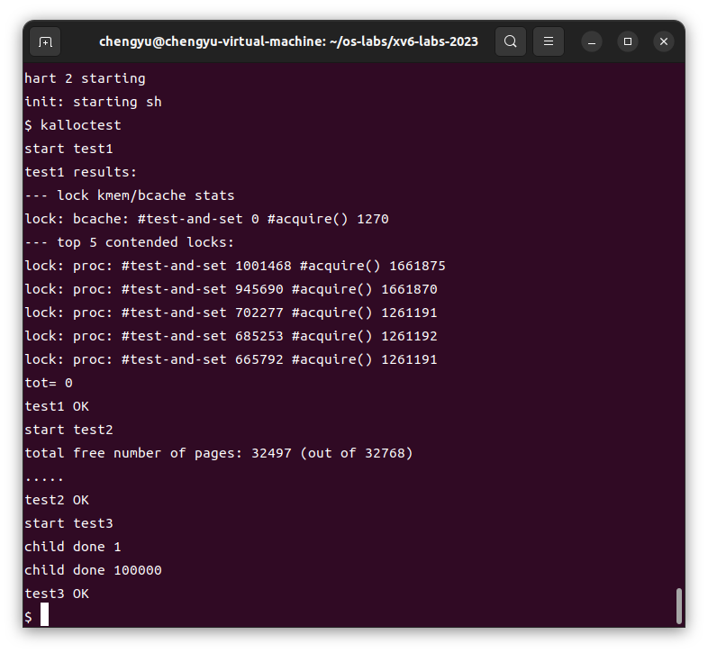

# Lab8 locks

[TOC]

## 前置知识

## 实验内容

### Memory allocator ([moderate](https://pdos.csail.mit.edu/6.828/2023/labs/guidance.html))

#### 任务

**问题描述：** 当前的xv6内存分配器使用了单一的自由列表和单一的锁（kmem.lock），在多核机器上会造成严重的锁竞争。实验程序`user/kalloctest`会测试xv6的内存分配器，测量在获取kmem锁时的循环次数（即`acquire`调用的循环次数）作为锁竞争的粗略衡量指标。你需要通过重构内存分配器，减少kmem锁的竞争次数。

**解决方案：** 你的任务是为每个CPU维护一个自由列表（freelist），每个列表有各自的锁。这样，不同CPU上的分配和释放操作可以并行进行，因为每个CPU操作的是不同的列表。

- 当一个CPU的自由列表为空，而另一个CPU的列表中有空闲内存时，CPU需要从另一个CPU的自由列表中“偷取”内存。虽然这种“偷取”可能会引入锁竞争，但通常会比较少见。
- 所有的锁名称都应以“kmem”开头，你应该调用`initlock`并传递一个以“kmem”开头的名称。

#### 添加`lock`

* 第一部分涉及到内存分配的代码，xv6 将空闲的物理内存 kmem 组织成一个空闲链表 kmem.freelist，同时用一个锁 kmem.lock 保护 freelist，所有对 kmem.freelist 的访问都需要先取得锁，所以会产生很多竞争。解决方案也很直观，给每个 CPU 单独开一个 freelist 和对应的 lock，这样只有同一个 CPU 上的进程同时获取对应锁才会产生竞争。

```c
//kernel/kalloc.c
struct {
  struct spinlock lock;
  struct run *freelist;
} kmem[NCPU];
```

#### 修改`freerange`函数(kernel/kalloc.c)

* 改前：

```c
void
freerange(void *pa_start, void *pa_end)
{
  char *p;
  p = (char*)PGROUNDUP((uint64)pa_start);
  for(; p + PGSIZE <= (char*)pa_end; p += PGSIZE)
    kfree(p);
}
```

* 改后：

```c
void
freerange(void *pa_start, void *pa_end)
{
  char *p;
  p = (char*)PGROUNDUP((uint64)pa_start);
  for(; p + PGSIZE <= (char*)pa_end; p += PGSIZE)
    kfree(p);
}
```

* 哈哈没什么区别！

#### 修改`kalloc`和`kfree`函数

* 修改`kalloc`和`kfree`函数，使它们操作当前CPU的自由列表：

```c
// Free the page of physical memory pointed at by v,
// which normally should have been returned by a
// call to kalloc().  (The exception is when
// initializing the allocator; see kinit above.)
void
kfree(void *pa)
{
  struct run *r;

  if(((uint64)pa % PGSIZE) != 0 || (char*)pa < end || (uint64)pa >= PHYSTOP)
    panic("kfree");

  // Fill with junk to catch dangling refs.
  memset(pa, 1, PGSIZE);

  r = (struct run*)pa;

  // Ensure not interrupted while getting the CPU ID
  push_off();
  // Get the ID of the current CPU
  int cpu = cpuid();
  pop_off();

  acquire(&kmem[cpu].lock);
  r->next = kmem[cpu].freelist;
  kmem[cpu].freelist = r;
  release(&kmem[cpu].lock);
}

// Allocate one 4096-byte page of physical memory.
// Returns a pointer that the kernel can use.
// Returns 0 if the memory cannot be allocated.
void *
kalloc(void)
{
  struct run *r;

  push_off();
  int cpu = cpuid();
  pop_off();

  acquire(&kmem[cpu].lock);
  r = kmem[cpu].freelist;
  if(r)
    kmem[cpu].freelist = r->next;
  else // add: steal page from other CPU
  {
    struct run* tmp;

    // Loop over all other CPUs in NCPU range
    for (int i = 0; i < NCPU; ++i)
    {
      if (i == cpu) // can't be itself
        continue;

      // Acquire a lock on its freelist to prevent contention.
      acquire(&kmem[i].lock);
      tmp = kmem[i].freelist;
      // no page to steal
      if (tmp == 0) {
        release(&kmem[i].lock);
        continue;
      } else {
        for (int j = 0; j < 1024; j++) {
          // steal 1024 pages
          if (tmp->next)
            tmp = tmp->next;
          else
            break;
        }

        // change freelist
        kmem[cpu].freelist = kmem[i].freelist;
        kmem[i].freelist = tmp->next;
        tmp->next = 0;

        release(&kmem[i].lock);
        break;
      }
    }
    r = kmem[cpu].freelist;
    if (r)
      kmem[cpu].freelist = r->next;
  } // end steal page from other CPU
  release(&kmem[cpu].lock);

  if(r)
    memset((char*)r, 5, PGSIZE); // fill with junk
  return (void*)r;
}
```

#### 测试成功



### Buffer cache ([hard](https://pdos.csail.mit.edu/6.828/2023/labs/guidance.html))

#### 任务

* 这个实验的目标是减少xv6操作系统中的块缓存（block cache）的锁争用，从而提高系统在多核环境下的并行性能。具体来说，你需要重构`kernel/bio.c`中的块缓存管理代码，降低多个进程同时访问块缓存时的锁竞争;

* 当多个进程密集使用文件系统时，可能会争用`bcache.lock`，导致性能下降。实验程序`bcachetest`会创建多个进程，反复读取不同的文件，以生成对`bcache.lock`的争用。你需要修改块缓存的实现，使得`bcache.lock`的争用次数大幅降低。

#### 设计方案：

- **使用哈希表：** 使用哈希表来查找缓存块，并为每个哈希桶（bucket）分配一个锁。这样可以减少全局锁`bcache.lock`的争用，因为不同的进程可以并行访问不同的哈希桶。
- **哈希表设计：**
  - 选择一个合适的哈希函数，根据块号（block number）将块映射到不同的哈希桶中。
  - 使用固定数量的哈希桶，建议使用一个素数（如13）作为桶的数量，以减少哈希冲突的可能性。
- **移除全局缓存块列表：** 移除`bcache.head`等全局缓存块列表，并且不再实现LRU（最近最少使用）算法。这样可以避免在`brelse`函数中获取`bcache.lock`。
- **选择缓存块：**
  - 在`bget`中，你可以选择任何引用计数为0的块，而不需要选择最近最少使用的块。
  - 如果查找缓存块失败，需要找到一个未使用的块来替换，这个过程可能需要放弃当前所有锁，并重新开始。
- **处理死锁：** 在某些情况下，可能需要同时持有两个锁（例如在进行块替换时，可能需要同时持有`bcache.lock`和哈希桶的锁）。你需要确保在这些情况下不会发生死锁。

#### 修改`buf.h`

```c
struct buf {
  char used;
  int valid;   // has data been read from disk?
  int disk;    // does disk "own" buf?
  uint dev;
  uint blockno;
  struct sleeplock lock;
  uint refcnt;
  struct buf *prev; // LRU cache list
  struct buf *next;
  uchar data[BSIZE];
};
```

#### 实现哈希表和桶锁：

- 在`kernel/bio.c`中定义一个哈希表结构，包含哈希桶和对应的锁。
- 修改`bget`和`brelse`函数以使用哈希表，而不是全局缓存块列表。

```c
struct bucket {
  struct spinlock lock;
  // Linked list of all buffers, through prev/next.
  // Sorted by how recently the buffer was used.
  // head.next is most recent, head.prev is least.
  struct buf head;
};

struct {
  struct buf buf[NBUF];
  struct bucket bucket[NBUCKET];
} bcache;

static uint hash_v(uint key) {
  return key % NBUCKET;
}
```

```c
// Look through buffer cache for block on device dev.
// If not found, allocate a buffer.
// In either case, return locked buffer.
static struct buf*
bget(uint dev, uint blockno)
{
  uint v = hash_v(blockno);
  struct bucket* bucket = &bcache.bucket[v];
  acquire(&bucket->lock);

  // Is the block already cached?
  for (struct buf *buf = bucket->head.next; buf != &bucket->head;
       buf = buf->next) {
    if(buf->dev == dev && buf->blockno == blockno){
      buf->refcnt++;
      release(&bucket->lock);
      acquiresleep(&buf->lock);
      return buf;
    }
  }

  // Not cached.
  // Recycle the least recently used (LRU) unused buffer.
  for (int i = 0; i < NBUF; ++i) {
    if (!bcache.buf[i].used &&
        !__atomic_test_and_set(&bcache.buf[i].used, __ATOMIC_ACQUIRE)) {
      struct buf *buf = &bcache.buf[i];
      buf->dev = dev;
      buf->blockno = blockno;
      buf->valid = 0;
      buf->refcnt = 1;

      buf->next = bucket->head.next;
      buf->prev = &bucket->head;
      bucket->head.next->prev = buf;
      bucket->head.next = buf;
      release(&bucket->lock);
      acquiresleep(&buf->lock);
      return buf;
    }
  }
  panic("bget: no buffers");
}
```

```c
// Release a locked buffer.
// Move to the head of the most-recently-used list.
void
brelse(struct buf *b)
{
  if(!holdingsleep(&b->lock))
    panic("brelse");

  releasesleep(&b->lock);

  uint v = hash_v(b->blockno);
  struct bucket* bucket = &bcache.bucket[v];
  acquire(&bucket->lock);

  b->refcnt--;
  if (b->refcnt == 0) {
    // no one is waiting for it.
    b->next->prev = b->prev;
    b->prev->next = b->next;
    __atomic_clear(&b->used, __ATOMIC_RELEASE);
  }
  
  release(&bucket->lock);
}
```

```c
void
binit(void)
{
  for (int i = 0; i < NBUF; ++i) {
    initsleeplock(&bcache.buf[i].lock, "buffer");
  }
  for (int i = 0; i < NBUCKET; ++i) {
    initbucket(&bcache.bucket[i]);
  }
}
```

#### 添加参数`kernel/param.h`

```c
#define NPROC        64  // maximum number of processes
#define NCPU          8  // maximum number of CPUs
#define NOFILE       16  // open files per process
#define NFILE       100  // open files per system
#define NINODE       50  // maximum number of active i-nodes
#define NDEV         10  // maximum major device number
#define ROOTDEV       1  // device number of file system root disk
#define MAXARG       32  // max exec arguments
#define MAXOPBLOCKS  10  // max # of blocks any FS op writes
#define LOGSIZE      (MAXOPBLOCKS*3)  // max data blocks in on-disk log
#define NBUF         (MAXOPBLOCKS*3)  // size of disk block cache

//#define FSSIZE       1000  // size of file system in blocks
#ifdef LAB_FS
#define FSSIZE       200000  // size of file system in blocks
#else
#ifdef LAB_LOCK
#define FSSIZE       10000  // size of file system in blocks
#else
#define FSSIZE       2000   // size of file system in blocks
#endif
#endif

#define MAXPATH      128   // maximum file path name
#define NBUCKET      13    // a prime number of buckets
```

#### 测试成功


### 实验得分

